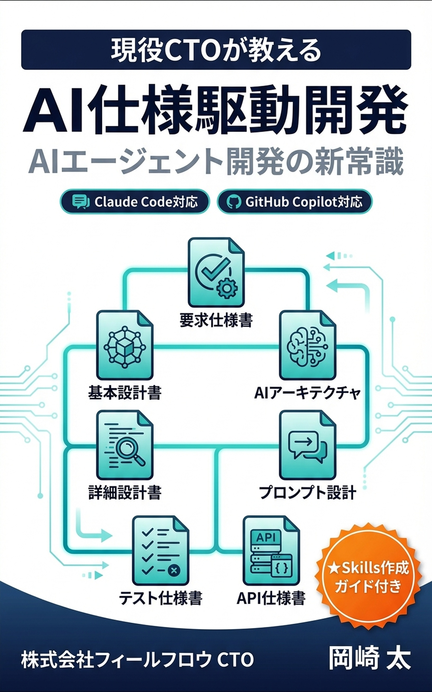

# AI Spec-Driven Development

AI開発ツール（Claude Code、GitHub Copilot、Cursor）に最適化された**7文書構造**によるドキュメント戦略フレームワーク。

従来の60+文書から**7つの必須文書**へ ── AIが迷わず理解できる、最小限の高品質ドキュメントでプロジェクトを駆動します。

## 導入方法

3つの方法でプロジェクトに導入できます。

### 方法A: テンプレートをコピー（最もシンプル）

[`docs-template/`](./docs-template/) から7ドキュメントをプロジェクトにコピー:

```bash
# テンプレートをコピー
cp -r docs-template/MASTER.md your-project/docs/
cp -r docs-template/01-context/ your-project/docs/
cp -r docs-template/02-design/ your-project/docs/
cp -r docs-template/03-implementation/ your-project/docs/
cp -r docs-template/04-quality/ your-project/docs/
cp -r docs-template/05-operations/ your-project/docs/
cp -r docs-template/06-reference/ your-project/docs/
```

### 方法B: Claude Code Skills で初期化

Claude Code でこのリポジトリを参照し、スラッシュコマンドで自動セットアップ:

```
/init-docs          # 7ドキュメント構造を初期化
/validate-docs      # ドキュメント要件を検証
/setup-ai-config    # CLAUDE.md / .cursorrules / copilot-instructions.md を生成
```

### 方法C: MCP Server で AI ツール連携

MCP対応クライアント（Claude Code, Claude Desktop等）にサーバーを登録:

```json
{
  "command": "node",
  "args": ["/path/to/ai-spec-driven-development/mcp/dist/index.js"]
}
```

詳細: [`mcp/README.md`](./mcp/README.md)

## セットアップ

```bash
git clone https://github.com/feel-flow/ai-spec-driven-development.git
cd ai-spec-driven-development
npm install && npm run setup
```

### 利用可能なコマンド

| コマンド | 説明 |
| -------- | ---- |
| `npm run setup` | 依存関係インストール + MCP サーバービルド |
| `npm run validate` | 7ドキュメント構造の検証 |
| `npm run check` | MCP サーバーの動作確認 |
| `npm run build:mcp` | MCP サーバーのビルド |
| `npm run setup:labels` | GitHub ラベルの自動セットアップ |

## 7文書構造

```
docs/
├── MASTER.md                    # 中央管理ハブ（必須・最初に読む）
├── 01-context/
│   ├── PROJECT.md               # ビジョンと要件
│   └── CONSTRAINTS.md           # 制約条件
├── 02-design/
│   ├── ARCHITECTURE.md          # システム設計
│   └── DOMAIN.md                # ビジネスロジック
├── 03-implementation/
│   └── PATTERNS.md              # 実装パターン
├── 04-quality/
│   └── TESTING.md               # テスト戦略
├── 05-operations/
│   └── DEPLOYMENT.md            # 運用手順
└── 06-reference/
    ├── GLOSSARY.md              # 用語集
    └── DECISIONS.md             # 設計判断記録
```

**なぜ7文書か**: AIツールは情報の散在に弱い。少数の高密度ドキュメントに集約することで、コンテキスト理解の精度が劇的に向上する。詳細は [AI Spec Driven Development 概念と実践](./docs/AI_SPEC_DRIVEN_DEVELOPMENT.md) を参照。

## 関連書籍

本フレームワークの背景と実践を解説する書籍です。

<table>
<tr>
<td width="160"></td>
<td>
<h3>AI仕様駆動開発 ── AIエージェント開発の新常識</h3>
<p>AIに最適化されたドキュメント戦略と7文書構造の詳細を解説。Claude Code / GitHub Copilot対応。</p>
<p>
<a href="https://amzn.asia/d/05n5IlFH">Kindle版</a> ｜
<a href="https://amzn.asia/d/03bcN32G">ペーパーバック版</a>
</p>
</td>
</tr>
<tr>
<td width="160"></td>
<td>
<h3>なぜあの人のAIは優秀なのか ──「分割と余白」で変わるAIと協働術</h3>
<p>AI開発ツールを最大限活用するための考え方と実践テクニック。コピペで使えるプロンプト例付き。</p>
<p>
<a href="https://amzn.asia/d/01CGoGhI">Kindle版</a> ｜
<a href="https://amzn.asia/d/07ycceB8">ペーパーバック版</a>
</p>
</td>
</tr>
</table>

## ドキュメント

### 概念・ガイド

- [AI Spec-Driven Development 概念と実践](./docs/AI_SPEC_DRIVEN_DEVELOPMENT.md) — なぜ7文書構造が最適なのか
- [AI駆動 Git Workflow](./docs/AI_GIT_WORKFLOW.md) — AIに最適化された9ステップのワークフロー
- [運用ガイド (AIエージェント向け)](./docs/OPERATIONAL_GUIDE.md) — AIエージェントの操作仕様書

### Quick Start

| 対象 | ガイド | 所要時間 |
| ---- | ------ | -------- |
| 完全初心者 | [GETTING_STARTED_ABSOLUTE_BEGINNER.md](./docs-template/GETTING_STARTED_ABSOLUTE_BEGINNER.md) | 約4.5時間 |
| 新規プロジェクト | [GETTING_STARTED_NEW_PROJECT.md](./docs-template/GETTING_STARTED_NEW_PROJECT.md) | 8-12時間 |
| 既存プロジェクト | [GETTING_STARTED.md](./docs-template/GETTING_STARTED.md) | 約2時間 |

### AIツール設定ガイド

| ツール | ガイド | 設定ファイル |
| ------ | ------ | ------------ |
| Claude Code | [SETUP_CLAUDE_CODE.md](./docs-template/SETUP_CLAUDE_CODE.md) | `CLAUDE.md` |
| GitHub Copilot | [SETUP_GITHUB_COPILOT.md](./docs-template/SETUP_GITHUB_COPILOT.md) | `.github/copilot-instructions.md` |
| Cursor | [SETUP_CURSOR.md](./docs-template/SETUP_CURSOR.md) | `.cursorrules` |

## AIエージェント向け

すべてのAIエージェントは作業開始前に [`docs-template/MASTER.md`](./docs-template/MASTER.md) を必ず読んでください。

- **Claude Code**: [`CLAUDE.md`](./CLAUDE.md)
- **GitHub Copilot**: [`.github/copilot-instructions.md`](./.github/copilot-instructions.md)
- **Cursor**: [`.cursorrules`](./.cursorrules)
- **その他**: [`AGENTS.md`](./AGENTS.md)

## ライセンス

[MIT License](./LICENSE)

## リリース

- [CHANGELOG.md](./CHANGELOG.md)
- [Releases](https://github.com/feel-flow/ai-spec-driven-development/releases)

---

**FEEL-FLOW** | [https://feelflow.co.jp](https://feelflow.co.jp) | 最終更新: 2026年2月
