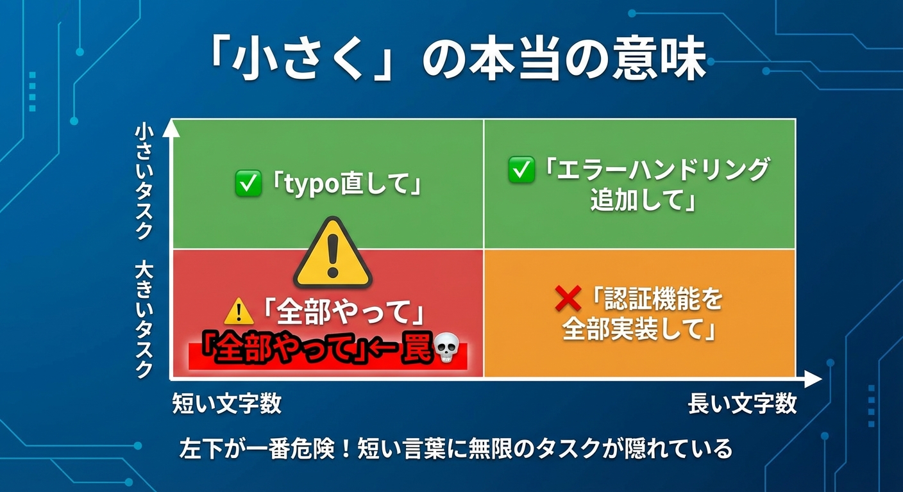

# はじめに

## 「AIに頼んだのに、なんか微妙」の正体

「ChatGPTに文章を書いてもらったけど、なんか微妙」
「画像生成AIでロゴを作ったけど、イメージと違う」
「Claudeにコードを書かせたけど、手直しが多すぎる」

AIを使ったことがある人なら、誰でもこの経験があるはずです。

最初は「すごい！」と思ったのに、実際に使い込むほど「なんか違う」が増えていく。

これはAIの能力が低いからでしょうか？

**違います。**

問題は、私たちが**お願いのしかた**を間違えていることにあります。

---

## 「全部やって」と頼むと、70%で止まる

AIに大きなタスクを丸投げすると、だいたい**70%の完成度**で止まります[^accuracy]。

なぜか？

理由は単純です。**AIには「見える範囲」に限界がある**からです。

2023年と2025年、科学者たちは**AIの2つの弱点**を発見しました。

- **Lost in the Middle**（2023年）：即答型AIは長い入力の**中間部分を忘れやすい**
- **Lost at the Beginning of Reasoning**（2025年）：熟考型AIは**最初の推論に引きずられやすい**

つまり：

- 入力が長くなるほど、AIは重要な情報を見落とす
- 大きなお願いほど、AIは「全体像」を見失う
- 結果として、70%くらいの精度で止まってしまう

逆に言えば：

- **入力を小さくすれば、AIは全部覚えている**
- 小さなお願いを積み重ねれば、精度は98%まで上がる[^accuracy]

---

## 「地図」で考えてみる


AIにお願いするとき、あなたは「地図」を渡しているようなものです。

「美味しいラーメン屋を探して」（13文字）
→ どこの？何軒？基準は？
→ AIは日本中のラーメン屋から推測する必要がある

「この駅前商店街のラーメン屋3軒を比較して」（20文字）
→ 場所・数・目的が明確
→ AIは狭い範囲を確実に調べられる

文字数は後者の方がほぼ2倍。
でも、AIが「見る範囲」は後者の方がずっと小さい。

これが「小さく」の本当の意味です。



> ⚠️ **「小さく」とは、スコープ（範囲）を絞ること**
>
> 左下の「全部やって」が一番危険！短い言葉に無限のタスクが隠れています。

```text
【「小さい」の本当の意味】

キーワード：AIが考える範囲を狭める

❌ 文字数が少ない ≠ 小さいタスク
   「全部やって」（5文字）
   　　↓
   指示は短いが、AIが考える範囲は無限大
   　　↓
   精度70%で止まる

✅ 範囲が明確 ＝ 小さいタスク
   「ユーザー登録APIのバリデーション処理を書いて」（23文字）
   　　↓
   指示は長いが、AIが考える範囲は狭い
   　　↓
   精度98%を達成

つまり「小さく」とは、
「文字数を減らす」ことではなく、
「AIが推測する範囲を狭める」ことです。
```

これが、本書で紹介する「**コンテキスト縮小戦略**」の核心です。

[^accuracy]: 「70%」「98%」は著者による概念的な目安であり、特定の研究から直接引用した数値ではありません。TaskBench (NeurIPS 2024) では、シンプルなタスク（1-2ツール）で96%、複雑なタスク（6ツール以上）で39%という精度差が報告されており、タスクの複雑さと精度の反比例関係を示しています。Stanford大学の「Lost in the Middle」論文（2023年）は即答型AIの中間忘却を、「Lost at the Beginning of Reasoning」論文（2025年）は熟考型AIの最初依存を実証しています。

---

## でも、小さくするだけじゃダメ

「じゃあ、細かく指示すればいいんでしょ？」

半分正解で、半分間違いです。

確かに、**細かく指示すれば精度は上がります**。
AIに「何をすべきか」「何をすべきでないか」を明確に伝えれば、迷わずに正確な出力を返してくれます。

しかし、**細かすぎると別の問題が起きます**。

AIには**推論する力**があります。
こちらが言わなくても、文脈から判断して、適切な提案をしてくれる能力。
アイデアを出し、選択肢を示し、壁打ち相手になってくれる能力。

**細かく指示しすぎると、この推論の力を殺してしまう**のです。

```text
❌ 細かすぎる指示：
「3つの選択肢を出して。1つ目はA、2つ目はB、3つ目はCにして」
→ AIは指示通りに出すだけで、自分で考えない

✅ 余白を残した指示：
「このアプローチで良いと思うんだけど、どう思う？」
→ AIは自分の知識を使って、別の視点を提案できる
```

だから本書のサブタイトルは「**小さく、でも余白を残して**」なのです。

---

## 2つの使い方を使い分ける

AIを効果的に使うには、**2つのモード**を意識して使い分ける必要があります。

### 1. 精度モード：実行させたい時

- 明確で具体的な指示
- スコープを絞る
- 検証可能な出力を求める
- 例：「この関数のテストコードを書いて」

### 2. 推論モード：考えさせたい時

- 余白を残した指示
- 選択肢を提案してもらう
- 壁打ち相手になってもらう
- 例：「このアーキテクチャの問題点を指摘して」

**両方を使いこなせる人**が、AIを本当に活用できる人です。

---

## この本で学べること

本書は7つのパートで構成されています。

**第1部「なぜAIは期待通りに動かないのか？」** では、誰もが経験する「70%問題」の原因を解説します。

**第2部「AIの見える範囲には限界がある」** では、AIの2つの弱点（Lost in the Middle / Lost at the Beginning）を紹介し、なぜ小さく分けることが有効なのかを説明します。

**第3部「細かく指示する──精度を上げる」** では、スコープ収束パターンと二段階AI活用を紹介します。

**第4部「曖昧にする──推論を引き出す」** では、あえて余白を残すテクニックを解説します。

**第5部「よくある失敗とその対処法」** では、Before/After形式で失敗パターンと解決策を見せます。

**第6部「VSCodeでの実践」** では、ファイル分割の考え方と、AIへの渡し方を具体的に示します。

**第7部「AIと人間の新しい役割分担」** では、人間の仕事が「分けること」に変わっていく未来を展望します。

---

## この本の位置づけ

本書は、姉妹編「**AIエージェント開発は仕様が9割**」と対をなす本です。

| 項目 | 本書（思想編） | 姉妹編（実践編） |
| --- | --- | --- |
| 対象読者 | AIを使う全ての人 | エンジニア |
| 内容 | 普遍的な原則 | 具体的な7文書、ツール |
| 分量 | 80-120ページ | 詳細なワークフロー |

本書を読んで「なるほど」と思った方は、ぜひ姉妹編も手に取ってみてください。
開発者向けの具体的な実践方法が詳しく解説されています。

---

## さあ、始めましょう

AIは、正しく使えば強力なパートナーになります。

「なんか微妙」を「期待以上」に変える。

そのための原則は、驚くほどシンプルです。

**小さく、でも余白を残して。**

この原則を、一緒に学んでいきましょう。

<div class="ai-samurai-dojo">

## 🥷 AI侍道場 - 本書の案内人


</div>
