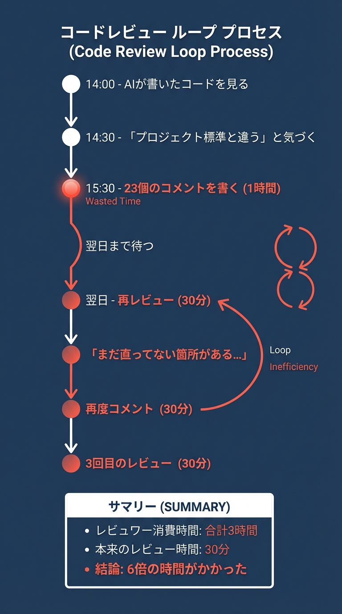
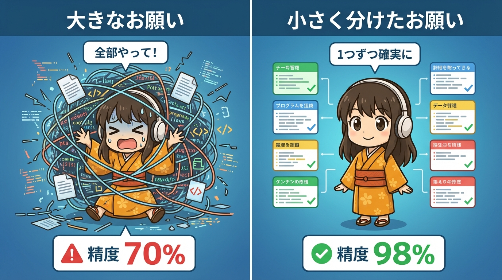
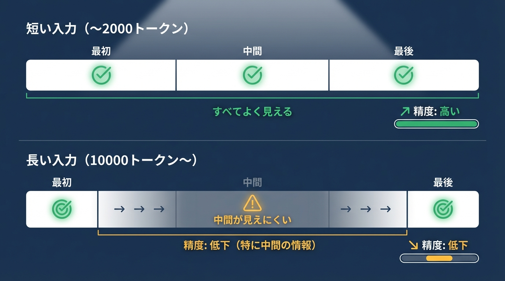

# 第1章　70%問題（後編）──隠れたコストと解決策の糸口

## この章で学ぶこと

- 70%問題が引き起こす**4つの隠れたコスト**（時間・認知・機会・チーム）を理解する
- 「AIで時短」が逆効果になるメカニズムを数字で把握する
- 解決策「**コンテキスト縮小戦略**」の基本を学ぶ
- 「小さく分ける」ことがなぜ効果的かを理解する

---

> **前編のおさらい**
>
> 前編では、AIに「全部やって」と大きなお願いをすると、
> 約70%の完成度で止まってしまう現象を見てきました。
>
> - テキスト生成 → 表面的で汎用的な内容
> - コード生成 → 動くけどレビューで指摘多数
> - 画像生成 → 何度修正しても「何か違う」
> - 調査・分析 → 既知情報の羅列
>
> 3つの詳細なケーススタディで、「微妙」の正体も確認しました。
>
> この後編では、70%問題が引き起こす**4つの隠れたコスト**と、
> **解決策の糸口**を見ていきます。
>
> → [前編を読む](01_the-seventy-percent-problem.md)

---

## 「70%」が引き起こす隠れたコスト

ここまで見てきた例から、
「70%の完成度」が実際に引き起こすコストを整理してみましょう。

### コスト1：時間コスト

#### ケーススタディ：佐藤さんのAPI設計ドキュメント

**背景**:
中堅SaaS企業のバックエンドエンジニア佐藤さん（仮名）は、
新機能のAPI設計ドキュメントを作成することになった。
「AIに任せれば2時間で終わる」と見積もった。

**依頼**:
「決済システムのAPI仕様書を作成して。
エンドポイント、リクエスト/レスポンス形式、
エラーハンドリング、セキュリティ要件を含めて。」


上の図が示すように、期待と現実には大きなギャップがありました。
では、もしAIを使わなかったら？

**手動で最初から作った場合の見積もり**:
2時間

**結論**:
AIに頼んだ方が**2倍時間がかかった**

**佐藤さんの振り返り**:
> 「最初の出力を見たとき、『おっ、いい感じ！』と思ったんです。
> でも、実際に使おうとすると細部が全部違っていた。
> エラーコードの体系、認証フローの設計、レスポンス形式...
> 結局、土台から直すことになって、AIの出力を参考にする意味すらなくなりました」

---

### コスト2：認知的コスト

#### ケーススタディ：田中さんのマーケティング資料

**背景**:
マーケティング担当の田中さん（仮名）は、
新プロダクトのランディングページ（LP）のコピーをAIに依頼した。

**依頼**:
「BtoB向けプロジェクト管理ツールのLPコピーを書いて。
ターゲットは中小企業のマネージャー層。」

**AIが返してきたコピー**:
> 「チームの生産性を最大化。シンプルで直感的なインターフェースで、
> プロジェクトを効率的に管理しましょう。」

**田中さんの思考の流れ**:

「何が間違っているか」を特定する精神的負荷:

1. **AIの出力を評価する負荷**
   - 「これ、本当に正しいのか？」
   - 「どこが間違っているのか？」
   - 「どう直せばいいのか？」

2. **修正指示を考える負荷**
   - 「どう言えば、AIは理解してくれるのか？」
   - 「前回の指示が悪かったのか？」
   - 「もっと具体的に指示すべきか？」

3. **フラストレーションの蓄積**
   - 「なんでこうなるんだ...」
   - 「さっきと言ってること同じなのに」
   - 「もう疲れた」

**結果**:
本来の仕事（戦略立案、コード設計、クリエイティブ思考）に
使うべき認知リソースが消耗される。

**田中さんの振り返り**:
> 「AIの出力を読んで、『これ、うちの会社のトーンじゃないな』と思った瞬間から、
> 頭の中でずっと『どう直せばいいか』を考えていました。
> 結局、午後の戦略会議の準備に集中できなくて、会議の質も下がった気がします。
> AIに頼まなければ、もっとシンプルに進んだのかもしれません」

---

### コスト3：機会コスト

#### ケーススタディ：山本さんの「失われた午後」

**背景**:
スタートアップCTOの山本さん（仮名）は、
投資家向けのピッチ資料をAIに作らせようとした。
「AIなら1時間で下書きができる」と期待していた。

**実際に起きたこと**:

- 14:00 - AIに依頼
- 14:30 - 最初の出力を確認「う〜ん、方向性が違う」
- 15:00 - 修正依頼、2回目の出力
- 15:30 - 「まだ違う...」3回目の修正
- 16:00 - 「もう自分で直す」手動修正開始
- 18:00 - やっと形になる

**消費時間**: 4時間

AIの修正に使った4時間で、
本来できたはずのこと:

- ✅ 新機能のプロトタイプを1つ作れた
- ✅ 顧客インタビューを3件実施できた
- ✅ 技術記事を2本書けた
- ✅ チームメンバーとの1on1を4回できた

**失われた価値**:
目に見える「時間」だけでなく、
その時間で生み出せたはずの「価値」も失われる。

**山本さんの振り返り**:
> 「14時から18時までの4時間って、CTOとして一番価値を生み出せる時間帯なんです。
> プロダクトの方向性を決めたり、チームの技術課題を解決したり。
> それをAIの出力を直すことに使ってしまった。
> 機会コストで考えると、この4時間の損失は計り知れません」

---

### コスト4：チームコスト

一人で完結しない場合、影響は拡大します。

#### ケーススタディ：鈴木さんのPRレビュー地獄

**背景**:
ジュニアエンジニアの鈴木さん（仮名）は、
ユーザー管理機能の実装をAIに任せた。
「先輩の負担を減らしたい」と思っての行動だった。

**鈴木さんの期待**:
「AIがコードを書いてくれれば、レビューも軽く済むはず」

#### 実際に起きたこと：コードレビューの場合



**レビュワーの消費時間**: 合計3時間

**本来のレビュー時間** (プロジェクト標準に沿ったコード):
30分

**結論**:
一人の「時間節約」のために、
チーム全体で**6倍の時間**を使った。

**レビュワー（先輩エンジニア）の声**:
> 「鈴木くんは悪くないんです。AIを使って効率化しようとした姿勢は良い。
> でも、AIが出したコードは『動くけど、うちのやり方じゃない』というものばかり。
> 結果的に、私のレビュー時間が3倍になり、チーム全体の速度が落ちました。
> AIの使い方を変えれば、違う結果になったのかもしれません」

---

### 感情的な旅路

「70%問題」は、単なる時間やコストの問題ではありません。

ユーザーの**感情的な旅路**にも影響します。


**最終的な結論**:
「AIは期待外れだった」

でも、本当にそうでしょうか？

---

## 解決策のヒント：コンテキスト縮小戦略

ここまで、「70%問題」の深刻さを見てきました。

でも、諦めるのは早いです。

実は、**解決策は存在します**。

その鍵が、「**コンテキスト縮小戦略**」です。

> **コンテキスト縮小戦略**
>
> 大きなお願いを小さく分ける。
> AIが一度に処理する情報量を減らす。
>
> 小さく分ける → AIが全体を見渡せる → 精度が上がる

具体的にどういうことか、3つの例で見てみましょう。

---

### ティーザー例1：文章生成の場合

**Before（70%の精度）**:

```text
依頼: 「リモートワーク生産性について、5000字の記事を書いて」
結果: 表面的で汎用的な内容
```

**なぜ70%で止まるのか**:
AIは「5000字」「リモートワーク生産性」という**広大な範囲**を一度に処理しようとする。
すべてのトピックを網羅しようとするため、各トピックの深掘りができず、
「どこかで見たような一般論」になってしまう。

**After（98%の精度）**:

```text
ステップ1: 「リモートワーク生産性で、重要なポイントを5つ挙げて」
        → 見出しが返ってくる

ステップ2: 「1つ目の見出し『集中環境の作り方』について、
           具体的な tips を800字で書いて」
        → 具体的で深い内容

ステップ3: 「2つ目の見出しについて...」
        → (繰り返し)
```

**なぜ改善するのか**:
各ステップでAIが処理する範囲を「**見出し**」「**1セクション800字**」に限定している。
AIは「集中環境の作り方」という**狭いトピック**に集中できるため、
表面的な羅列ではなく、深い洞察や具体的な例を出力できる。

**結果**:
各セクションが深く、具体的で、実用的な内容になる。

---

### ティーザー例2：コード生成の場合

**Before（70%の精度）**:

```text
依頼: 「認証システム全体を実装して」
結果: 動くけど、レビューで23個のコメント
```

**なぜ70%で止まるのか**:
「認証システム全体」という依頼に対して、AIは**一般的なベストプラクティス**で実装する。
しかし、プロジェクト固有のルール（エラーハンドリングの形式、監査ログの要件、
セキュリティポリシーなど）は**AIには見えていない**。
結果、「動くけど、うちのやり方じゃない」コードが生成される。

**After（98%の精度）**:

```text
ステップ1: 「認証システムの型定義を、プロジェクト標準に沿って作成して」
        → 型定義ファイルが生成される

ステップ2: 「ログインエンドポイントを実装して。
           型は先ほどの定義を使用。
           エラーハンドリングはResult型で」
        → 標準に沿ったコードが生成される

ステップ3: 「ログイン試行を監査ログに記録する処理を追加して」
        → (繰り返し)
```

**なぜ改善するのか**:
各ステップで「**何を**」「**どのルールで**」を明示している。

- ステップ1：「型定義」という**狭い範囲**に限定
- ステップ2：「Result型」というプロジェクト標準を**明示的に指定**
- ステップ3：「監査ログ」という**具体的な要件**を追加

AIが「推測」する余地を減らすことで、精度が向上する。

**結果**:
プロジェクト標準に沿った、レビュー可能なコード。

---

### ティーザー例3：画像生成の場合

**Before（70%の精度）**:

```text
依頼: 「会社のロゴを一発で完璧に作って」
結果: 10回修正しても「何か違う」
```

**なぜ70%で止まるのか**:
「完璧なロゴ」をAIに求めると、AIは「**一般的にウケるデザイン**」を生成しようとする。
しかし、会社の理念、ターゲット顧客のイメージ、競合との差別化ポイントなどは
**AIには見えていない**。結果、「おしゃれだけど、どこかで見たようなデザイン」になる。

**After（98%の精度）**:

```text
ステップ1: 「ロゴのコンセプトを3つ提案して」
        → コンセプト案を確認・選択

ステップ2: 「選んだコンセプトで、カラーパレットを3つ提案して」
        → カラーを確認・選択

ステップ3: 「選んだコンセプトとカラーで、ロゴのラフを生成して」
        → (繰り返し、徐々に洗練)
```

**なぜ改善するのか**:
各ステップで**人間が意思決定を挟む**ことで、AIの「推測」を**人間の判断**に置き換えている。

- ステップ1：コンセプトを人間が選ぶ → **会社の理念**を反映
- ステップ2：カラーを人間が選ぶ → **ブランドイメージ**を反映
- ステップ3：徐々に洗練 → **フィードバックループ**で精度向上

AIに「一発で完璧」を求めるのではなく、
「**提案→選択→洗練**」のサイクルを回すことで、精度が向上する。

**結果**:
ブランドにぴったりのロゴが段階的に完成。



---

### なぜ「小さく分ける」ことが効くのか？

それは、AIの「**見える範囲**」に限界があるからです。

大きなお願いをすると、AIは全体を把握しようとして「ぼんやり」見てしまいます。
一方、小さなお願いなら、AIは隅々まで「くっきり」見ることができます。

この違いは、科学的な研究でも裏付けられています。

### 科学的な裏付け：AIの2つの弱点

「小さく分ける」戦略の有効性は、**2つの科学研究**から説明できます。

**弱点1: Lost in the Middle（2023年）**

2023年のスタンフォード大学の研究によると、**即答型AI**は
**入力の中間部分を忘れやすい**という特性があります。



**弱点2: Lost at the Beginning of Reasoning（2025年）**

2025年の研究では、**熟考型AI**（推論モデル）が
**最初の推論ステップに引きずられやすい**ことが発見されました。

どちらの弱点も、「**小さく分ける**」ことで解決できます：

- **即答型** → 短い入力 → 「中間」がない → 忘れない
- **熟考型** → 短い思考連鎖 → 「最初」の影響が限定的 → 修正しやすい

これが「コンテキスト縮小戦略」の科学的な根拠です。

次章（第2章・第2b章）で、これらの弱点をさらに深掘りし、
具体的な対処法を見ていきましょう。

---

## 章末チェックリスト

この章の内容を実践に移すためのチェックリスト：

- [ ] 最近AIに「大きなお願い」をして微妙な結果になった経験を振り返る
- [ ] そのとき、何が「70%」で何が「足りない30%」だったか分析する
- [ ] 同じ仕事を「小さく分けたら」どうなるか想像してみる
- [ ] 次章の予習として「Lost in the Middle」「Lost at the Beginning of Reasoning」を検索してみる

---

<div class="ai-samurai-dojo">

## 🥷 AI侍道場 - 隠れたコストと解決策


---

### 🗡️ AI侍の秘伝書

この章の心得を授ける。

#### 心得その1：4つの隠れたコストを見極めよ

AIの「70%」が引き起こすコストは、目に見える時間だけではない。

| コスト | 影響 | 実例 |
| -------- | ------ | ------ |
| **時間** | AI生成＋手直し > 手動 | 期待40分 → 実際4時間 |
| **認知** | 「何が違うか」を考える負荷 | 本来の仕事に集中できない |
| **機会** | 他のことができたはず | 4時間で新機能1つ作れた |
| **チーム** | レビュー負荷が増大 | レビュー時間6倍 |

#### 心得その2：「小さく分ける」が鉄則

大きなお願いは失敗の元。小さく分けることで精度が上がる。

- ❌ 「5000字の記事を書いて」→ 表面的な羅列
- ✅ 「見出しを5つ挙げて」→「1つ目を800字で」→ 深い内容

#### 心得その3：「推測」を「指定」に置き換えよ

AIが「多分こうだろう」と推測する余地を減らすのがコツ。

- ❌ 「認証システムを実装して」→ AIが標準を推測
- ✅ 「型定義を作って」→「Result型でエラー処理」→ 標準を明示

---

### 🎧 DJ町娘のまとめ

【DJ町娘】「この章のポイント、まとめますね！」

1. **4つの隠れたコスト** - 時間・認知・機会・チーム
2. **コンテキスト縮小戦略** - 大きなお願いを小さく分ける
3. **AIの2つの弱点** - 即答型は中間を忘れやすく、熟考型は最初の推論に引きずられやすい

【DJ町娘】「結局、AIは『全部やって』が苦手なんですね...」

【AI侍】「その通り。だが、落胆する必要はない。**正しい使い方**をすれば、AIは強力な味方になる。
次章では、まず『Lost in the Middle』現象を深掘りし（第2章）、
続いて『Lost at the Beginning』現象を解説する（第2b章）」

【DJ町娘】「原因がわかれば、対処法も見えてきますね！次章も楽しみです🎧」

</div>

---

## 次章への橋渡し

この章では、AIに「全部やって」と頼むと70%の完成度で止まってしまう
現象を見てきました。

ChatGPTでも、Claudeでも、画像生成でも同じ。
これは、AIの能力が低いのではなく、
「**見える範囲**」に限界があるからです。

次章では、この限界の正体を科学的に解き明かします。

スタンフォード大学の研究「**Lost in the Middle**」が示したのは、
LLM（大規模言語モデル）が長い入力の「**中間部分を忘れやすい**」
という驚くべき事実でした。

なぜAIは中間を忘れるのか？
コンテキストが長くなると、なぜ精度が下がるのか？
どうすればこの限界を回避できるのか？

次章で、その答えを見つけましょう。
