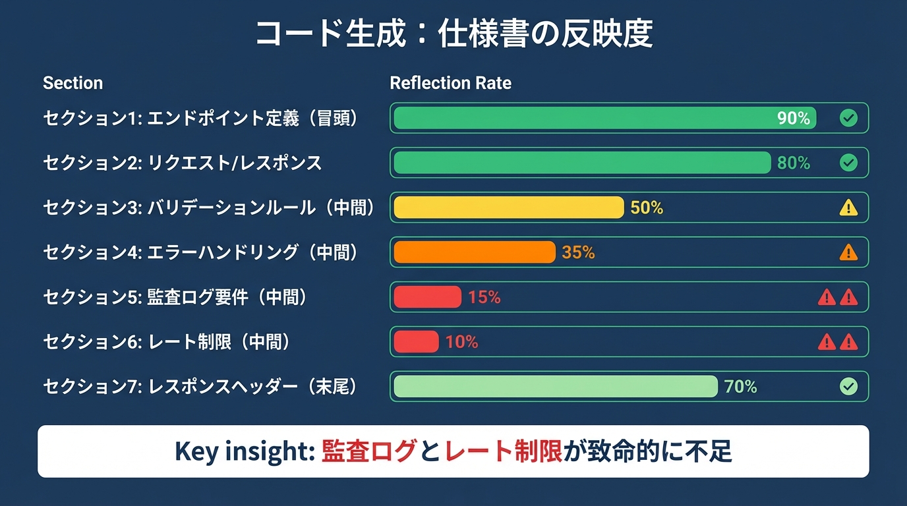
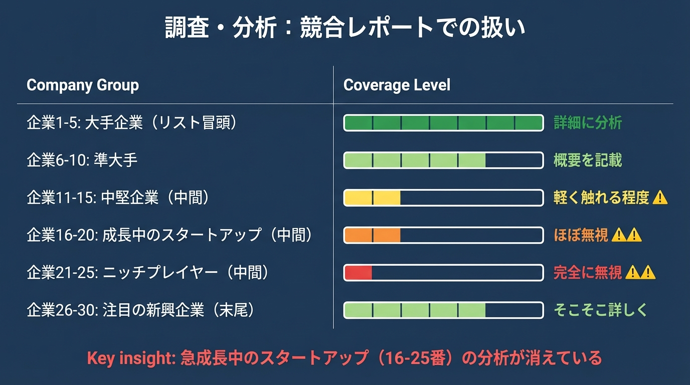
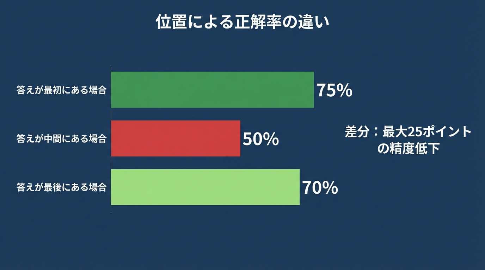

# 第2章　Lost in the Middle──中間を忘れるAI

## この章で学ぶこと

- AIが長い入力の「中間部分」を忘れやすいという科学的事実
- なぜ大きなお願いほど精度が下がるのか、その根本原因
- 「小さく分ける」ことが効果的な理由の科学的裏付け

---

## 「真ん中だけ、忘れられてる...」

ある日、こんな経験をしました。

10ページの企画書をAIに渡して、要約を頼みました。

```text
あなた:
「この企画書の要点を箇条書きでまとめてください」
（10ページのPDFを添付）
```

AIが返してきた要約は、一見とてもよくできていました。

```text
AI:
「企画書の要点は以下の通りです：

1. プロジェクトの目的
   - 新規顧客獲得チャネルの確立
   - 既存顧客のLTV向上

2. 背景と市場環境
   - 競合他社の動向分析
   - 市場成長率の予測

3. 実施スケジュール
   - フェーズ1: 2024年4月〜6月
   - フェーズ2: 2024年7月〜9月

4. 期待される成果
   - 売上20%増加
   - 顧客満足度15ポイント改善」
```

「さすがAI、よくまとまってる」と思いました。

でも、チームミーティングで企画書を使ったとき、
上司からこう聞かれました。

「で、予算はいくらなの？」

あれ？

企画書の5ページ目に、明確に書いてあったはずです。
「**総予算: 3,000万円、内訳: 広告費1,500万円、システム開発費1,000万円...**」

AIの要約には、この情報が**まったく含まれていませんでした**。

慌てて企画書を見返すと、
5〜6ページ目には他にも重要な情報がありました。

- **競合との差別化ポイント**（5ページ目）
- **想定されるリスクと対策**（6ページ目）
- **KPI設定と測定方法**（6ページ目）

これらも、AIの要約からは**すべて抜け落ちていた**のです。

不思議に思って、企画書の構成を確認しました。


気づきましたか？

**最初と最後はよく反映されている。**
**でも、真ん中がごっそり抜けている。**

これは偶然でしょうか？

いいえ、**科学的に証明された現象**なのです。

---

## スタンフォード大学が発見した「中間忘却」問題

2023年、スタンフォード大学などの研究者たちが、
衝撃的な論文を発表しました。

> **Lost in the Middle: How Language Models Use Long Contexts**
>
> Nelson F. Liu ら
> Stanford University, UC Berkeley, Samaya AI
> 2023年

論文のタイトルを日本語にすると、
「**中間で迷子になる：言語モデルは長いコンテキストをどう使うか**」。

研究者たちは、シンプルだけど決定的な実験を行いました。

---

### 実験の内容

実験はとても単純です。

```text
【実験の設計】

1. AIに「20個の文書の中から、質問の答えを探して」と頼む

2. 答えが書いてある文書の「位置」を変えてみる
   - 最初（1番目）に置く
   - 中間（10番目）に置く
   - 最後（20番目）に置く

3. それぞれの正解率を測定する
```

もしAIが入力を均等に理解しているなら、
答えの位置に関係なく、同じ正解率になるはずです。

ところが、結果は**驚くべきパターン**を示しました。

---

### U字曲線の発見


グラフの形が、**アルファベットの「U」**に見えませんか？

これが、研究者たちが発見した**「U字曲線」**です。

---

### 3つの重要な発見

この実験から、3つの重要な事実が明らかになりました。

#### 発見1: 最初の情報はよく覚えている

入力の冒頭にある情報は、高い精度で処理される。
これを「初頭効果」（Primacy Bias）と呼びます。

#### 発見2: 最後の情報もよく覚えている

入力の末尾にある情報も、比較的高い精度で処理される。
これを「新近効果」（Recency Bias）と呼びます。

#### 発見3: 中間の情報は忘れやすい

入力の中間にある情報は、精度が大幅に低下する。
最大で**25ポイント**もの差が生じることがある。

同じAI、同じ質問、同じ答え。
**違うのは「位置」だけ。**

それなのに、正解率に25ポイントもの差が出る。

これが**「Lost in the Middle」**──中間で迷子になる──問題の正体です。

---

## 4つの分野で起きる「中間忘却」

この現象は、特定のタスクだけで起きるわけではありません。
**あらゆる分野**で観察されています。

---

### 例1: テキスト生成の場合

**シナリオ**:
20ページの要件定義書から、システムマニュアルを作成してもらう


**結果**:

生成されたマニュアルを確認すると...

- システム概要 → 詳しく書かれている ✓
- 基本的な機能 → だいたい網羅 ✓
- **セキュリティ要件 → ほぼ抜けている** ✗
- **性能要件 → 触れられていない** ✗
- **データのバックアップ方針 → 完全に忘れられている** ✗
- 運用手順 → 概要は書かれている ✓

**最も重要な「セキュリティ」と「性能」が抜けている。**

なぜなら、それらは要件定義書の**中間**に書かれていたからです。

---

### 例2: 画像生成の場合

**シナリオ**:
詳細なキャラクター設定から、イラストを生成してもらう


**結果**:

生成された画像を確認すると...

- 黒髪の20代女性 → OK ✓
- 白いブラウス → OK ✓
- **眼鏡 → ない** ✗
- **イヤリング → ない** ✗
- **赤いマグカップ → ない** ✗
- モダンなオフィス → だいたいOK ✓

プロンプトの**中間に書いたディテール**が、
ことごとく無視されています。

何度「眼鏡をかけて」と追加しても、
なぜか反映されないことがある。

それは、その指示が長いプロンプトの**中間**に
埋もれてしまっているからかもしれません。

---

### 例3: コード生成の場合

**シナリオ**:
600行の仕様書から、REST APIを実装してもらう



**結果**:

PRレビューで指摘されたこと:

1. 「入力値のバリデーションが不十分です」
2. 「エラーレスポンスの形式が仕様と違います」
3. **「監査ログの実装がありません」** ← 致命的
4. **「レート制限が実装されていません」** ← セキュリティリスク
5. 「Content-Typeヘッダーの設定が漏れています」

特に深刻なのは、**監査ログ**と**レート制限**。

どちらも仕様書にはっきり書いてあったのに、
**中間に位置していたため、AIが「見落とした」**のです。

---

### 例4: 調査・分析の場合

**シナリオ**:
30社の競合データを渡して、分析レポートを作成してもらう



**結果**:

戦略会議で問題になったこと:

「リストの16〜25番目に入っていた、急成長中のスタートアップ3社の分析がまったくない。これらは今後の最大の脅威になりうるのに...」

データとしては渡していたのに、
**中間に位置していたため、レポートから消えていた**のです。

---

## なぜAIは中間を忘れるのか？

ここまで読んで、疑問に思っているかもしれません。

「なぜAIは中間を忘れやすいのか？」

技術的な詳細は複雑ですが、
直感的に理解できるメタファーがあります。

---

### 懐中電灯のメタファー

想像してください。

あなたは**暗くて長いトンネル**の中にいます。
手元には**懐中電灯が1つ**だけ。


懐中電灯で照らせるのは:

- **入口**（最初）← よく見える
- **出口**（最後）← よく見える
- **中間** ← 暗くて見えにくい

AIも同じです。

AIは**「注意」（Attention）**という懐中電灯を使って
情報を処理しています。

でも、この懐中電灯には**癖**があります。
**入口と出口を重点的に照らしてしまう**のです。

---

### 技術的な背景（シンプル版）

もう少し技術的に説明すると、こうなります。

AIは**「Transformer」**という仕組みで動いています。

```text
【AIの処理の仕組み（超シンプル版）】

1. 入力を「トークン」という単位に分割する
   「今日は天気がいいですね」
   → [今日][は][天気][が][いい][です][ね]

2. 各トークンに「どのくらい注意を払うか」を決める
   Attention（注意）スコアを計算

3. スコアが高いトークンを重視して処理する
```

問題は、この**「注意スコアの計算」**にあります。

AIは訓練データから学習する際、
ある**偏り**を身につけてしまいます。

```text
【訓練時に学習してしまった偏り】

訓練データのパターン:
- 指示は最初に書かれていることが多い → 最初を重視
- 結論は最後に書かれていることが多い → 最後を重視
- 中間は「つなぎ」であることが多い → 中間を軽視

結果:
→ 最初と最後に注意が集中する
→ 中間の情報は「見落とされやすい」
```

これが、**Lost in the Middle**の技術的な原因です。

---

### 数値で見る影響

論文の実験結果を、もう一度確認しましょう。



**同じAI、同じ質問、同じ答え。**
**違うのは「位置」だけ。**

それなのに、正解率に**25ポイント**もの差が生じる。

これは、AIを使う上で
絶対に知っておくべき事実です。

---

## 第1章で見た「70%問題」の正体

ここで、第1章の内容を振り返りましょう。

第1章では、AIに「全部やって」と頼むと
**70%の完成度で止まる**という現象を見ました。

覚えていますか？

- 「5000字の記事を書いて」→ 表面的な内容に
- 「認証システムを全部実装して」→ 23個のレビューコメント
- 「会社のロゴを一発で作って」→ 10回修正しても微妙

これらの**原因**が、今わかりました。

**「Lost in the Middle」です。**

---

### 因果関係の図解


大きなお願いをすると、必然的に入力が長くなります。

入力が長くなると、**中間の情報が増えます**。

中間の情報が増えると、**AIはそれを見落とします**。

結果として、**重要な要件が抜け落ち**、
70%の完成度で止まってしまうのです。

---

### 具体例で確認

第1章の「認証システム」の例を、
Lost in the Middleの観点で見直してみましょう。

```text
【依頼内容の構成】

「ユーザー認証システムを実装してください。
 ログイン、ログアウト、パスワードリセット、    ← 冒頭
 セッション管理、JWT（JSON Web Token）認証、
 ロールベースのアクセス制御、                   ← 中間
 二要素認証、監査ログ、
 アカウントロックアウト、                       ← 中間
 パスワードポリシーの適用、
 そしてテストも書いてください。」               ← 末尾
```

AIが実装したもの:

- ログイン/ログアウト ✓ （冒頭）
- JWT認証 ✓ （冒頭に近い）
- **ロールベースのアクセス制御 △** （中間）
- **二要素認証 ✗** （中間）
- **監査ログ ✗** （中間）
- **アカウントロックアウト ✗** （中間）
- テスト ✓ （末尾）

**中間に書いた機能が、見事に抜け落ちています。**

これが、PRに23個のコメントがついた原因でした。

---

## 解決策は見えている

ここまで読んで、解決策が見えてきましたか？

もし中間の情報が忘れられるなら、
**「中間」をなくせばいい**のです。


小さく分けると、**それぞれのお願いに「中間」がない**。

中間がなければ、**忘れるものもない**。

各部分を98%の精度で処理できれば、
全体の完成度も格段に上がります。

---

### Before/After: 認証システムの例

```text
【Before: 大きく頼む】

「ユーザー認証システムを全部実装して」
→ 70%の完成度、23個のレビューコメント


【After: 小さく分けて頼む】

依頼1: 「JWTを使った基本的なログイン機能を実装して」
→ 98%の完成度 ✓

依頼2: 「ロールベースのアクセス制御を追加して」
→ 98%の完成度 ✓

依頼3: 「二要素認証を追加して」
→ 98%の完成度 ✓

依頼4: 「監査ログ機能を追加して」
→ 98%の完成度 ✓

依頼5: 「全体のテストを書いて」
→ 98%の完成度 ✓

結果: 全体として98%の完成度、レビューコメントは2個
```

**同じ機能を実装しているのに、結果がまったく違います。**

---

## 章末チェックリスト

この章の内容を実践に移すためのチェックリスト:

- [ ] 最近AIに長い入力を渡して「一部が無視された」経験を振り返る
- [ ] そのとき、無視された情報は「中間」にあったかを確認する
- [ ] 同じ作業を「短い入力を複数回」で試してみる
- [ ] 第1章の「70%問題」がLost in the Middleで説明できるか考える
- [ ] 次章で学ぶ「分けて渡す」テクニックへの期待を持つ

---

<div class="ai-samurai-dojo">

## 🥷 AI侍道場 - 中間忘却の克服

**AI侍**: 「ふむ、Lost in the Middleの正体が分かったであろう」

**DJ町娘**: 「はい！AIは長い入力の真ん中を忘れちゃうんですね。だから大きなお願いをすると70%で止まっちゃう...」

**AI侍**: 「その通りである。では、実践的な対策を伝授しよう」

### 🎯 今日の極意

**1. 「中間」を作らない**

```text
❌ 大きな依頼 → 最初...中間...最後 → 中間が忘れられる
✅ 小さく分割 → 最初→最後 × 3回 → 全部覚えている
```

**2. 重要な情報は「端」に置く**

- 最初に書く：絶対に必要な要件
- 最後に書く：確認してほしいポイント
- 中間は避ける：補足情報のみ

**DJ町娘**: 「なるほど！入力が短ければ『中間』がないから、全部ちゃんと見てもらえるんですね✨」

**AI侍**: 「うむ。次章では『どう分けるか』の具体的なテクニックを学ぶ。心して臨むがよい」

</div>

---

## 次章への橋渡し

この章では、AIが長い入力の「中間部分を忘れやすい」という
科学的事実を学びました。

**Lost in the Middle**──中間で迷子になる。

これが、第1章で見た「70%問題」の根本原因でした。

解決策は見えています。

**「小さく分ける」こと**です。

中間がなければ、忘れるものもない。
各部分を98%の精度で処理できる。
組み合わせれば、全体の完成度も上がる。

でも、疑問が残りますよね。

- **どうやって分ければいいのか？**
- **どのくらい小さくすればいいのか？**
- **分けた後、どう組み合わせるのか？**

次章「細かく指示する──スコープ収束パターン」では、
この「分けて渡す」テクニックを具体的に学んでいきます。

実践的なパターンと、すぐに使えるテクニックをお伝えします。

---

## 出典

本章で紹介した研究:

> **Lost in the Middle: How Language Models Use Long Contexts**
>
> Nelson F. Liu, Kevin Lin, John Hewitt, Ashwin Paranjape,
> Michele Bevilacqua, Fabio Petroni, Percy Liang
>
> Stanford University, UC Berkeley, Samaya AI
>
> arXiv:2307.03172 (2023)
> Transactions of the Association for Computational Linguistics (2024)
>
> [https://arxiv.org/abs/2307.03172](https://arxiv.org/abs/2307.03172)

---

## 画像生成プロンプト

### 画像1: 章扉絵「Lost in the Middle」

**日本語での説明**:
長い文書やテキストの流れを表現。最初と最後は明るく鮮明に、中間部分は霧がかかったようにぼやけている。「注意」や「フォーカス」を表すスポットライトやアイコンが両端に集中し、中間には存在しない。

```text
Conceptual illustration of "Lost in the Middle" phenomenon.
A long horizontal document stream with clear, bright sections
at the beginning and end, but a foggy, faded middle section.
Spotlight icons representing "attention" concentrated at both ends,
missing in the middle. Clean minimalist style, blue gradient background.
--ar 16:9 --style minimalist --v 6
```

### 画像2: U字曲線のインフォグラフィック

**日本語での説明**:
U字型の曲線を示すプロフェッショナルなインフォグラフィック。X軸に「情報の位置」（最初・中間・最後）、Y軸に「AIの記憶度」。中間で大きく落ち込むU字曲線。

```text
Professional infographic showing U-shaped performance curve.
X-axis: "Position of Information" (Beginning, Middle, End).
Y-axis: "AI Retention Rate" (Low to High).
Smooth U-curve showing high retention at edges, significant dip in middle.
Clean data visualization, tech-blue color scheme, Japanese labels.
--ar 3:2 --style infographic --v 6
```

### 画像3: 大きいリクエスト vs 小さく分ける比較

**日本語での説明**:
左右対比の図。左側：長い連続した文書、中間部分がぼやけている（「大きなお願い 70%」）。右側：3つの小さな文書、それぞれが完全に鮮明（「小さく分ける 98% x 3」）。明るさで記憶度を視覚的に表現。

```text
Side-by-side comparison illustration.
LEFT: Long continuous document with faded foggy middle section,
labeled "Large Request: 70%".
RIGHT: Three separate small documents, each fully bright and clear,
labeled "Split into Small: 98% x 3".
Visual metaphor using brightness levels. Modern minimalist style.
--ar 16:9 --style clean --v 6
```
