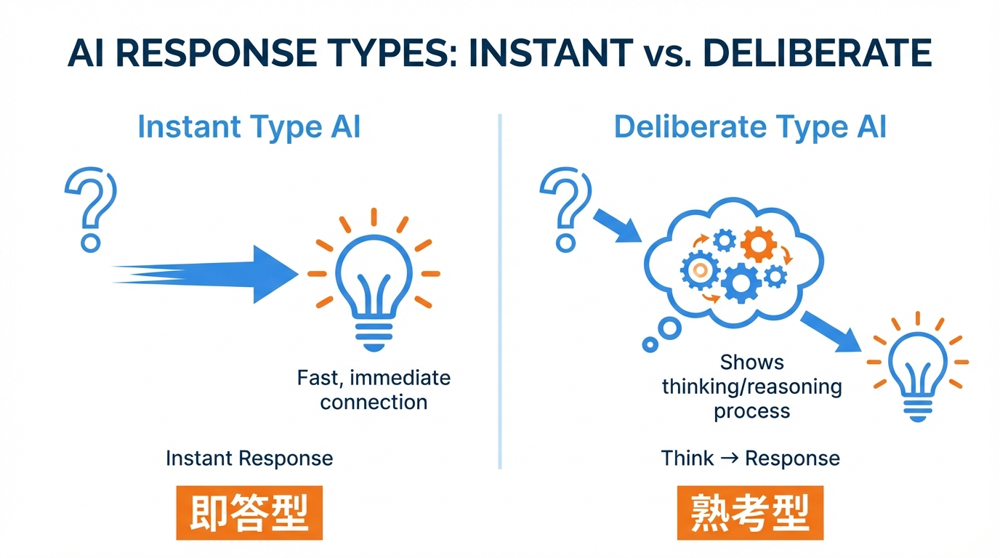
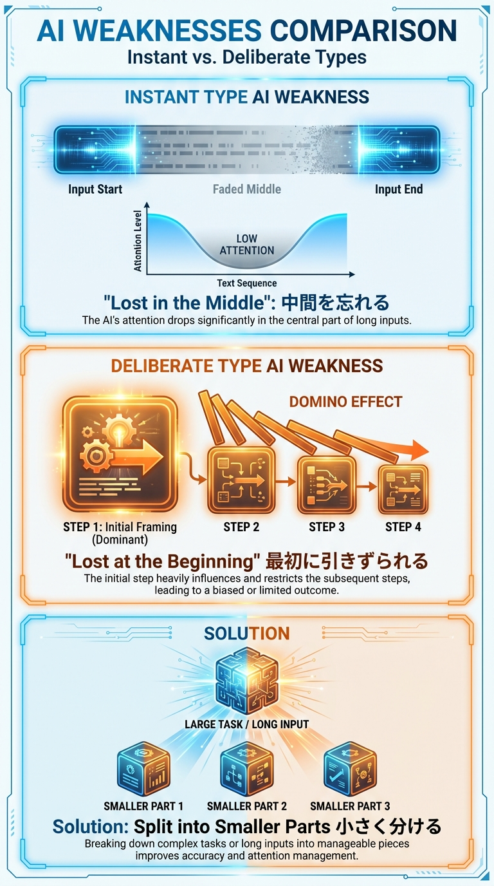

# 第2b章　Lost at the Beginning──最初で迷子になるAI

## この章で学ぶこと

- AIには「即答型」と「熟考型」の2種類があること
- 熟考型AIが「最初の推論」に引きずられやすい科学的事実
- どちらの弱点にも効く共通の解決策

---

## 2種類のAI：即答型と熟考型

前章では、AIが**長い入力の中間を忘れやすい**ことを学びました。

でも、あなたが今使っているAIは、
**どんなタイプ**でしょうか？

実は、現在のAIは大きく**2種類**に分かれます。

---

### 即答型と熟考型の違い

| タイプ | 特徴 | 処理の流れ | 代表例 |
|--------|------|------------|--------|
| **即答型**（非推論モデル） | 質問を受けたらすぐに回答 | 入力 → 出力 | GPT-4、Claude（通常モード） |
| **熟考型**（推論モデル） | 回答前に「考える時間」を取る | 入力 → **思考** → 出力 | o1、o3、Claude（Extended Thinking）、DeepSeek-R1 |



---

### 2024年以降、熟考型が主流に

2024年を境に、**熟考型AI**（推論モデル）が急速に普及しました。
OpenAIのo1（2024年9月）、DeepSeek-R1（2025年1月）などが登場し、
「考える」AIが当たり前になりつつあります。

もしあなたがChatGPTやClaudeを使っていて、
回答前に「考え中...」と表示されたり、
待ち時間があれば、**熟考型を使っている可能性が高い**です。

熟考型AIは「考える時間」を取る分、
複雑な問題を解くのが得意です。

でも、熟考型には**即答型とは違う弱点**があります。

---

## 即答型の弱点：Lost in the Middle（振り返り）

前章で学んだことを、簡潔に振り返りましょう。

**即答型AI**の弱点は、**入力の中間を忘れやすい**こと。

```text
【即答型AIの処理】

入力: [最初]───[中間]───[最後]
       ↓         ↓        ↓
注意:  高い      低い      高い

→ 中間の情報が抜け落ちる
```

これが**Lost in the Middle**──中間で迷子になる問題でした。

U字曲線で表されるこの現象は、
2023年の研究で科学的に証明されています。

---

## 熟考型の弱点：Lost at the Beginning of Reasoning

では、熟考型（推論モデル）はどうでしょうか？

2025年、新しい研究が発表されました。

> **Lost at the Beginning of Reasoning**
> （推論の最初で迷子になる）
>
> arXiv:2506.22058 (2025)

---

### 熟考型AIの処理プロセス

熟考型AIは、回答前に **思考の連鎖**（Chain of Thought）を生成します。

「考える」というのは、具体的には
**ステップごとに推論を積み重ねる**ことです。

```text
【熟考型AIの処理プロセス】

入力: 「複雑な数学の問題」
       ↓
思考: [ステップ1: まず○○を計算]
       ↓
      [ステップ2: 次に△△を求める]
       ↓
      [ステップ3: それらを組み合わせて...]
       ↓
      [ステップ4: 最終的に...]
       ↓
出力: 「答えは42です」
```

この「考えるプロセス」があるから、
熟考型AIは複雑な問題を解けるのです。

---

### 問題：最初のステップが全体を支配する

ところが、研究で驚くべき発見がありました。

**最初の推論ステップが、その後のすべてを支配してしまう**のです。

```text
【熟考型AIの弱点】

思考: [ステップ1] → [ステップ2] → [ステップ3] → ...
       ↓              ↓              ↓
影響:  絶大           依存           依存

→ 最初の推論が間違うと、全体が崩れる
```

最初のステップで方向を間違えると、
その後どれだけ考えても、**間違った方向に進み続けてしまう**。

これが**Lost at the Beginning of Reasoning**──推論の最初で迷子になる問題です。

---

### 研究の具体的な発見

2025年の研究では、以下のことが明らかになりました。

1. **最初の推論ステップの精度が全体を決める**
   - 最初が正しければ、その後も正しい方向に進む
   - 最初が間違うと、その後の修正は困難

2. **入力の「最初の部分」が過度に影響する**
   - 長い入力を与えると、**冒頭の情報**に引きずられやすい
   - 後半の重要な情報が無視される傾向

3. 「**考える時間**」があっても救えない
   - 考える時間が長くても、最初の方向が間違っていれば無意味
   - むしろ、間違った方向に「深く」進んでしまう

---

## 2つの弱点を比較する

即答型と熟考型、**両方に弱点がある**ことがわかりました。

でも、弱点の**場所**が違います。



### 比較表

| | 即答型（非推論モデル） | 熟考型（推論モデル） |
|---|---|---|
| **弱点の場所** | 入力の「中間」 | 思考の「最初」 |
| **問題の名前** | Lost in the Middle | Lost at the Beginning |
| **発見年** | 2023年 | 2025年 |
| **何が抜け落ちる？** | 中間の情報 | 後半の情報（最初に引きずられる） |
| **精度低下の原因** | 注意が両端に集中 | 最初の推論に依存 |

### 共通点

両方の弱点には、**重要な共通点**があります。

「**長い入力**」「**大きなお願い**」で問題が顕著になる

- 即答型：入力が長いほど「中間」が増え、忘れやすくなる
- 熟考型：入力が長いほど「最初」に引きずられやすくなる

---

## どちらにも効く解決策：「小さく分ける」

ここで興味深い事実があります。

**両方の弱点に対して、同じ解決策が有効**なのです。

それは、「**小さく分ける**」こと。

---

### なぜ「小さく分ける」が両方に効くのか

#### 即答型への効果

```text
【即答型：小さく分けると】

Before: [最初]───[中間]───[最後]  → 中間が忘れられる
After:  [最初→最後] × 3回         → 中間がない！
```

入力を小さく分けると、「**中間**」がなくなる。
中間がなければ、忘れるものもない。

#### 熟考型への効果

```text
【熟考型：小さく分けると】

Before: 大きな問題 → 長い思考連鎖 → 最初で間違うと全部崩れる
After:  小さな問題 × 3回 → 短い思考 → 各回で修正可能
```

問題を小さく分けると、**思考の連鎖が短くなる**。
最初のステップの影響が限定的になり、間違いも修正しやすい。

---

### 比喩で理解する

**即答型**は「長いトンネル」。
中間が暗くて見えない。
→ トンネルを短くすれば、全部見える。

**熟考型**は「長い旅」。
最初の一歩で方向を間違えると、遠くまで行ってしまう。
→ 旅を短くすれば、間違っても戻りやすい。

どちらも、「**短くする**」ことが解決策です。

---

## 使い分けのポイント

では、実際にAIを使うとき、どう考えればいいでしょうか？

### 簡易判定表

| あなたが使っているAI | 注意すべきこと |
|----------------------|----------------|
| **即答型**（待ち時間がほぼない） | 長い入力の「中間」に重要情報を置かない |
| **熟考型**（「考え中...」が表示される） | 最初に正しい方向性を示す。問題を分割する |
| **どちらかわからない** | 両方のルールを守る（小さく分ける） |

### 実践的なアドバイス

**即答型を使うとき**:
- 重要な情報は「最初」か「最後」に置く
- 入力が長くなりそうなら、分割する

**熟考型を使うとき**:
- 最初に「ゴール」と「制約」を明確に伝える
- 複雑な問題は、ステップに分けて依頼する
- 途中で方向を確認する

**どちらでも有効**:
- **1回の依頼を小さくする**
- 「全部やって」ではなく「まずこれだけ」

---

### 補足：熟考型には「Why」も効く

熟考型AIの弱点「最初の推論に引きずられる」には、もう1つの対策があります。

それは「**なぜそうしてほしいか**」（Why）を伝えること。

```text
❌ What のみ: 「リファクタリングして」
✅ What + Why: 「パフォーマンスが遅いから、リファクタリングして」
```

「Why」を伝えると、AIは最初の推論を**正しい方向**に開始しやすくなります。

詳しくは[第5章「余白を残す──推論を引き出す」](../part4_inference/05_leave-room-for-thinking.md)で解説します。

---

## 章末チェックリスト

この章の内容を実践に移すためのチェックリスト:

- [ ] 自分が使っているAIが「即答型」か「熟考型」か確認する
- [ ] 即答型なら、重要情報を中間に置いていないか見直す
- [ ] 熟考型なら、最初に方向性を明確に示しているか確認する
- [ ] 熟考型なら、「Why（なぜ）」を伝えているか確認する
- [ ] どちらでも、「大きなお願い」を「小さく分ける」習慣をつける
- [ ] 次章で学ぶ「スコープ収束パターン」への期待を持つ

---

<div class="ai-samurai-dojo">

## 🥷 AI侍道場 - 2つの弱点を制する

**AI侍**: 「ふむ、AIには2つの弱点があることがわかったであろう」

**DJ町娘**: 「はい！即答型は『中間忘れ』、熟考型は『最初依存』ですね。でも、どっちを使ってるか分からないときはどうすれば...？」

**AI侍**: 「心配は無用。**両方に効く解決策**があるからだ」

### 🗡️ AI侍の秘伝書

**其の一、AIの種類を見分ける**

```text
待ち時間がほぼない → 即答型の可能性が高い
「考え中...」表示  → 熟考型の可能性が高い
```

**其の二、どちらでも「小さく分ける」**

```text
即答型: 中間がなくなる → 忘れない
熟考型: 思考が短くなる → 間違えにくい
```

**其の三、熟考型には「Why」を伝える**

```text
❌「リファクタリングして」
✅「パフォーマンスが遅いから、リファクタリングして」
```

→ 最初の推論を正しい方向に導ける

### 🎧 DJ町娘のまとめ

**DJ町娘**: 「2つの弱点、まとめますね！」

- 🔴 即答型は「中間忘れ」、熟考型は「最初依存」
- 🟡 どちらも「大きなお願い」で問題が顕著になる
- 🟢 小さく分ければ両方の弱点を回避できる！
- 🟢 熟考型には「Why」を伝えると効果的！

**AI侍**: 「その通り。次章では『どう分けるか』の具体的な技を学ぶ。両方の弱点を克服する実践テクニックを伝授しよう」

</div>

---

## 次章への橋渡し

この章では、AIの**2つの弱点**を学びました。

- **即答型**：Lost in the Middle（中間忘れ）
- **熟考型**：Lost at the Beginning of Reasoning（最初依存）

そして、両方に効く解決策が「**小さく分ける**」ことだとわかりました。

でも、疑問が残りますよね。

- **どうやって分ければいいのか？**
- **どのくらい小さくすればいいのか？**
- **分けた後、どう組み合わせるのか？**

次章「細かく指示する──スコープ収束パターン」では、
この「分けて渡す」テクニックを具体的に学んでいきます。

即答型にも熟考型にも効く、
**実践的なパターン**をお伝えします。

---

## 出典

本章で紹介した研究:

> **Lost at the Beginning of Reasoning**
>
> Baohao Liao, Xinyi Chen, Sara Rajaee, Yuhui Xu,
> Christian Herold, Anders Søgaard, Maarten de Rijke, Christof Monz
>
> arXiv:2506.22058 (2025)
>
> [https://arxiv.org/abs/2506.22058](https://arxiv.org/abs/2506.22058)

前章で紹介した研究（参考）:

> **Lost in the Middle: How Language Models Use Long Contexts**
>
> Nelson F. Liu ら
> Stanford University, UC Berkeley, Samaya AI
>
> arXiv:2307.03172 (2023)
>
> [https://arxiv.org/abs/2307.03172](https://arxiv.org/abs/2307.03172)

---

## 画像生成プロンプト

### 画像1: 2種類のAI（即答型と熟考型）

**日本語での説明**:
左右対比の図。左側は「即答型」（質問→即回答の直線矢印）、右側は「熟考型」（質問→思考の雲→回答の曲線矢印）。シンプルでわかりやすいアイコン風のイラスト。

```text
Side-by-side comparison of two AI types.
LEFT: "Instant Type" - Simple arrow from question to answer, labeled "Instant Response".
RIGHT: "Deliberate Type" - Arrow from question through thought bubble/cloud to answer, labeled "Think → Response".
Clean icon style, tech-blue and warm orange colors, Japanese labels.
--ar 16:9 --style minimalist --v 6
```

### 画像2: 2つの弱点比較図

**日本語での説明**:
上下対比の図。上段：即答型の弱点「入力の中間が暗くなる」（U字曲線のイメージ）。下段：熟考型の弱点「最初の思考が全体を支配」（ドミノ倒しのイメージ）。両方の下に「解決策：小さく分ける」を示す。

```text
Two-part comparison diagram showing AI weaknesses.
TOP: "Instant Type Weakness" - Long input stream with faded middle section,
U-curve visualization showing low attention in middle.
BOTTOM: "Deliberate Type Weakness" - Chain of thought blocks where first block
is highlighted and subsequent blocks follow its direction (domino effect).
FOOTER: "Solution for Both: Split into Smaller Parts" with icon.
Clean infographic style, consistent color scheme.
--ar 9:16 --style infographic --v 6
```
