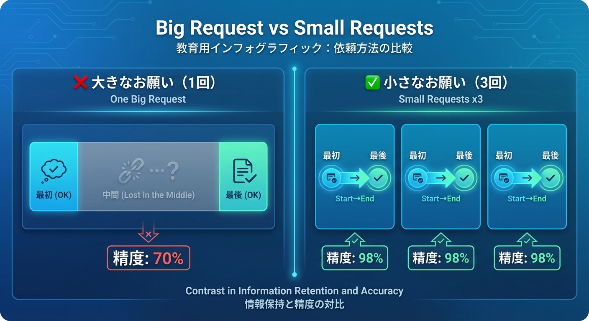
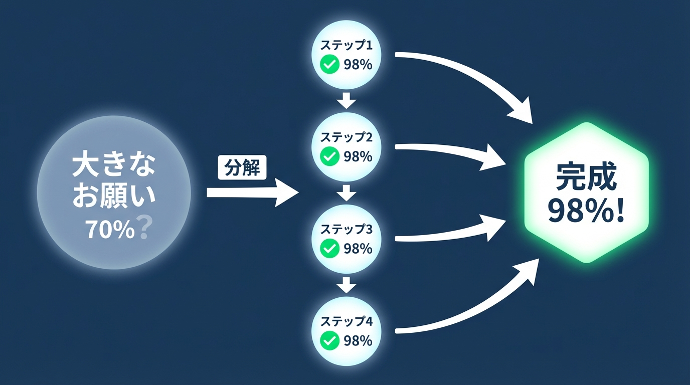
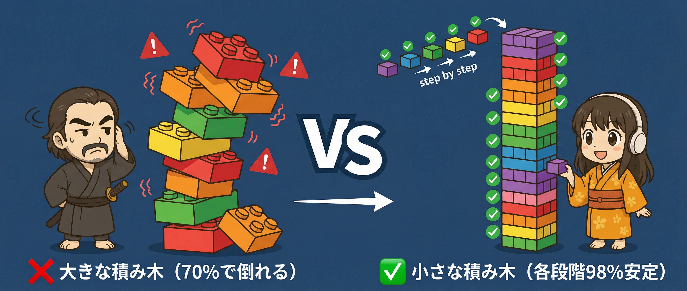

# 第3-1章　スコープ収束パターン──小さく分けて精度を上げる

## 「全部やって」から「まず〇〇から」へ

第1-1章、第2-1章、第2-2章で、大きな事実が明らかになりました。

**第1-1章の発見**:
AIに「全部やって」と頼むと、70%の完成度で止まる。

**第2-1章の発見**:
即答型AIは「Lost in the Middle」──長い入力の中間部分を忘れやすい。

**第2-2章の発見**:
熟考型AIは「Lost at the Beginning」──最初の推論に引きずられやすい。

では、どうすればいいのでしょうか？

答えは、驚くほどシンプルです。

「**小さく分けて渡す**」

これだけです。

---

### 思い出してください

第2-1章・第2-2章で、こんな事実を学びました。



小さく分けると、**どちらの弱点も回避できます**。

- 即答型：「中間」がなくなる → 忘れない
- 熟考型：思考連鎖が短くなる → 最初の影響が限定的

各部分を98%の精度で処理できる。

この章では、この「小さく分ける」を
**具体的にどうやるか**を学んでいきます。

---

## スコープ収束パターンとは

「小さく分けて渡す」という戦略には、名前があります。

**スコープ収束パターン**（Scope Convergence Pattern）



「**スコープ**」とは、作業の範囲のこと。
「**収束**」とは、小さな成功が積み重なって、大きな成果に収束していくこと。

大きなスコープを小さく分解し、
それぞれを高精度で完了させ、
最終的に大きな成果に収束させる。

これが「スコープ収束パターン」です。

---

### 70% → 90% → 98% の収束

スコープ収束パターンを使うと、
精度がどう変わるか見てみましょう。


一発で完璧を求めると、70%で止まる。
でも、小さなステップを積み重ねると、
**70% → 90% → 98%** と収束していきます。

これが「収束」の意味です。

---

## なぜ「分ける」のか？──精度モードのWhy

「小さく分けて渡す」という戦略は、
「**何をしてほしいか**」を明確にするためだけではありません。

実は、「**なぜそうしてほしいか**」を伝えることで、
精度をさらに上げることができます。

```text
【What のみ vs What + Why】

❌ What のみ:
「ログイン機能を実装して」

✅ What + Why:
「ログイン機能を実装して。
 セキュリティを重視してほしい。
 理由：金融系サービスだから」
```

この2つ目の例では、AIは「セキュリティ重視」という
**判断基準**を持てます。

パスワードのハッシュ化、セッション管理の厳格さ、
二要素認証の検討──こうした判断を、
AIが自発的に行えるようになります。

「**小さく分ける**」+「**Whyを伝える**」

この組み合わせが、精度モードの本質です。

---

## 3つの基本ルール

スコープ収束パターンには、3つの基本ルールがあります。

---

### ルール1: 一度に1つだけ求める

最初のルールは、「**一度に1つだけ求める**」です。

```text
【ルール1の例】

❌ 悪い例:
「ログイン機能と、ログアウト機能と、
 パスワードリセット機能と、セッション管理を実装して」

✅ 良い例:
依頼1:「まず、ログイン機能を実装して」
依頼2:「次に、ログアウト機能を追加して」
依頼3:「次に、パスワードリセット機能を追加して」
依頼4:「最後に、セッション管理を追加して」
```

一度に複数のことを求めると、
AIは「中間」の情報を忘れやすくなります。

一度に1つだけ求めれば、
AIは**その1つに集中**できます。

---

### ルール2: 成功を確認してから次へ

2つ目のルールは、「**成功を確認してから次へ進む**」です。

```text
【ルール2の例】

❌ 悪い例:
依頼1 → 確認せず → 依頼2 → 確認せず → 依頼3
                                        ↓
                              問題が積み重なっている

✅ 良い例:
依頼1 → 確認 ✓ → 依頼2 → 確認 ✓ → 依頼3
   ↓           ↓           ↓
 問題なし     問題なし     問題なし
```

確認せずに次へ進むと、
最初の問題が後続のステップに影響します。

各ステップで確認することで、
**問題を早期に発見**し、修正できます。

---

### ルール3: 各ステップを検証可能にする

3つ目のルールは、「**各ステップを検証可能にする**」です。

```text
【ルール3の例】

❌ 検証しにくい出力:
「認証システムを実装しました」
→ 本当に正しいか、どう確認する？

✅ 検証しやすい出力:
「ログイン機能を実装しました。
 テスト用アカウント: test@example.com / password123
 以下のコマンドでテストできます: npm test」
→ 実際に試して確認できる
```

検証できない出力は、信頼できません。
各ステップの出力を**検証可能な形**にすることで、
本当に正しいかを確認できます。

この「検証可能にする」という考え方は、
次章の「二段階AI活用」でさらに深掘りします。

---

## 分野別の分け方ガイド

では、具体的にどう分ければいいのでしょうか？

分野ごとに「分け方」のパターンを見ていきましょう。

---

### テキスト生成の場合

**シナリオ**: 5000字のブログ記事を書いてもらう

```text
【従来のアプローチ】

「リモートワークの生産性について、
 5000字の包括的な記事を書いてください」

→ 70%の完成度
→ 中間部分が薄い
→ 結論が曖昧
```

```text
【スコープ収束パターン】

ステップ1:「この記事の見出し構成を5つ提案して」
    ↓ 確認 ✓
ステップ2:「見出し1の内容を800字で書いて」
    ↓ 確認 ✓
ステップ3:「見出し2の内容を800字で書いて」
    ↓ 確認 ✓
ステップ4:「見出し3の内容を800字で書いて」
    ↓ 確認 ✓
ステップ5:「見出し4の内容を800字で書いて」
    ↓ 確認 ✓
ステップ6:「見出し5の内容を800字で書いて」
    ↓ 確認 ✓
ステップ7:「全体を読み返して、導入と結論を調整して」

→ 98%の完成度
→ 各セクションが充実
→ 結論も明確
```

**ポイント**:

- 最初に「構成」を決める
- 各セクションを**個別に**書かせる
- 最後に**全体を調整**する

---

### コード生成の場合

**シナリオ**: REST APIの認証システムを実装してもらう

```text
【従来のアプローチ】

「JWT認証を使ったREST APIを実装して。
 ログイン、ログアウト、トークン更新、
 ロールベースアクセス制御も含めて」

→ 70%の完成度
→ 中間の機能が抜けている
→ テストがない
```

```text
【スコープ収束パターン】

ステップ1:「まず、認証関連の型定義を書いて」
    ↓ 確認 ✓（TypeScriptの型が正しいか確認）

ステップ2:「JWT（JSON Web Token）トークンの発行関数を書いて」
    ↓ 確認 ✓（トークン生成が動くか確認）

ステップ3:「ログインエンドポイントを実装して」
    ↓ 確認 ✓（実際にログインできるか確認）

ステップ4:「トークン検証ミドルウェアを実装して」
    ↓ 確認 ✓（保護されたルートにアクセスできるか確認）

ステップ5:「ロールベースのアクセス制御を追加して」
    ↓ 確認 ✓（権限チェックが動くか確認）

ステップ6:「テストコードを書いて」
    ↓ 確認 ✓（テストが通るか確認）

→ 98%の完成度
→ すべての機能が実装されている
→ テストもある
```

**ポイント**:

- **型定義から始める**（基盤を固める）
- 各機能を**独立して実装**
- **テストで検証**する

---

### 画像生成の場合

**シナリオ**: 会社のロゴを作成してもらう

```text
【従来のアプローチ】

「テック企業のロゴを作って。
 シンプルで、青系で、信頼感があって、
 モダンな感じで、アイコンも付けて」

→ 70%の完成度
→ イメージと違う
→ 10回修正しても微妙
```

```text
【スコープ収束パターン】

ステップ1:「ロゴのコンセプト案を3つ、
           テキストで説明して」
    ↓ 選択 ✓（案Bを選ぶ）

ステップ2:「案Bのカラーパレットを
           3パターン提案して」
    ↓ 選択 ✓（パレット2を選ぶ）

ステップ3:「案B + パレット2で、
           シンプルなロゴのラフ案を作って」
    ↓ 確認 ✓（方向性OK）

ステップ4:「ラフ案をベースに、
           細部を洗練させて」
    ↓ 確認 ✓（ほぼ完成）

ステップ5:「最終調整：文字の間隔を
           もう少し広げて」

→ 98%の完成度
→ 2-3回の修正で完成
→ イメージ通り
```

**ポイント**:

- **コンセプト**を最初に固める
- **カラー**を次に決める
- **詳細化**は最後に

---

### ドキュメント作成の場合

**シナリオ**: 新機能の提案書を作成してもらう

```text
【従来のアプローチ】

「新機能の提案書を作って。
 背景、課題、解決策、スケジュール、
 リスク、予算、期待効果を含めて」

→ 70%の完成度
→ 各セクションが浅い
→ 数字が曖昧
```

```text
【スコープ収束パターン】

ステップ1:「提案書の目次構成を作って」
    ↓ 確認 ✓（構成OK）

ステップ2:「『背景と課題』セクションを書いて」
    ↓ 確認 ✓（課題が明確）

ステップ3:「『解決策』セクションを書いて」
    ↓ 確認 ✓（解決策が具体的）

ステップ4:「『スケジュール』セクションを
           ガントチャート形式で作って」
    ↓ 確認 ✓（日程が現実的）

ステップ5:「『リスクと対策』セクションを
           表形式で作って」
    ↓ 確認 ✓（リスクが網羅的）

ステップ6:「『予算』と『期待効果』を
           数字を入れて作って」
    ↓ 確認 ✓（数字が具体的）

ステップ7:「全体を読み返して、
           エグゼクティブサマリーを作って」

→ 98%の完成度
→ 各セクションが充実
→ 数字が具体的
```

**ポイント**:

- **構成**を最初に決める
- **セクション単位**で作成
- **サマリー**は最後に

---

## 「分けすぎ」の罠

ここまで「小さく分ける」ことの重要性を説明してきました。

でも、**分けすぎにも問題**があります。

```text
【分けすぎの例】

❌ 分けすぎ:
「まず、関数名を決めて」
→「次に、引数を1つ追加して」
→「次に、引数をもう1つ追加して」
→「次に、戻り値の型を決めて」
→「次に、関数の1行目を書いて」
→「次に、関数の2行目を書いて」
→ ...

問題:
- 各ステップが小さすぎて、文脈が断絶
- AIが全体像を把握できない
- かえって非効率
```

---

### ちょうどいい粒度の見つけ方

では、どのくらいの粒度が適切なのでしょうか？

**目安**: 1つのお願いで、**1つの成果物**が得られる

```text
【粒度の判断基準】

✅ ちょうどいい粒度:
「ログイン機能を実装して」
→ 成果物: 動作するログイン機能（1つ）

❌ 細かすぎ:
「ログインボタンのHTMLを書いて」
→ 成果物: HTMLだけ（不完全）

❌ 大きすぎ:
「認証システム全体を実装して」
→ 成果物: 複数の機能（混在）
```

**もう1つの目安**: **検証できる単位**で分ける

```text
【検証できる単位で分ける】

✅ 検証できる:
「ログイン機能を実装して」
→ 実際にログインして確認できる

✅ 検証できる:
「パスワードのバリデーションを追加して」
→ 不正なパスワードを入力して確認できる

❌ 検証しにくい:
「セキュリティを向上させて」
→ 何をどう確認すればいい？
```

---

### 分け方のチェックリスト

迷ったときは、このチェックリストを使ってください。

```text
【分け方のチェックリスト】

□ 1つのお願いで、1つの成果物が得られるか？
□ その成果物を、すぐに検証できるか？
□ 分けた各ステップが、独立して意味を持つか？
□ ステップ間の依存関係が明確か？
□ 全体として、元のゴールを達成できるか？
```

---

## Before/After: 具体例

ここまでの内容を、Before/After形式でまとめます。

---

### 例1: テキスト生成

```text
Before:
「リモートワークの生産性について、
 5000字の包括的な記事を書いてください」
→ 70%の完成度

After:
1.「記事の見出し構成を5つ提案して」
2.「各見出しの内容を800字で書いて」（×5）
3.「導入と結論を調整して」
→ 98%の完成度
```

---

### 例2: コード生成

```text
Before:
「認証システム全体を実装して」
→ 70%の完成度、大量のレビューコメント

After:
1.「型定義を書いて」
2.「ログイン機能を実装して」
3.「権限チェックを追加して」
4.「テストを書いて」
→ 98%の完成度、わずか数個のレビューコメント
```

---

### 例3: 画像生成

```text
Before:
「テック企業のロゴを作って」
→ 70%の完成度、10回修正しても微妙

After:
1.「コンセプト案を3つ提案して」
2.「カラーパレットを提案して」
3.「ラフ案を作って」
4.「細部を洗練させて」
→ 98%の完成度、2-3回で完成
```

---

### 例4: ドキュメント

```text
Before:
「新機能の提案書を作って」
→ 70%の完成度、各セクションが薄い

After:
1.「目次構成を作って」
2.「各セクションを個別に書いて」
3.「エグゼクティブサマリーを作って」
→ 98%の完成度、各セクションが充実
```

---

## 章末チェックリスト

この章の内容を実践に移すためのチェックリスト:

- [ ] 次にAIに何か頼むとき、「まず〇〇から」と分けて頼んでみる
- [ ] 3つの基本ルールを意識する
  - [ ] 一度に1つだけ求める
  - [ ] 成功を確認してから次へ
  - [ ] 各ステップを検証可能にする
- [ ] 自分の分野での「分け方パターン」を考えてみる
- [ ] 「分けすぎ」にならないよう、粒度を確認する

---

<div class="column-box">

## 📌 コラム：積み木タワーの法則



**DJ町娘**：「先生、小さく分けるって、そんなに大事なんですか？」

**AI侍**：「うむ。積み木タワーを思い浮かべよ」

**DJ町娘**：「積み木...ですか？」

**AI侍**：「大きな積み木を一気に積もうとすると、バランスが崩れて70%の高さで倒れる。だが、小さな積み木を一つずつ丁寧に積めば、各段階で安定を確認しながら高く積める。これが**スコープ収束パターン**の本質じゃ」

**DJ町娘**：「確かに！一つずつ確認すれば、どこで失敗したかもすぐわかりますね！」

**AI侍**：「その通り。次章では、その『確認』をさらに強化する『二段階AI活用』を伝授するぞ」

</div>
