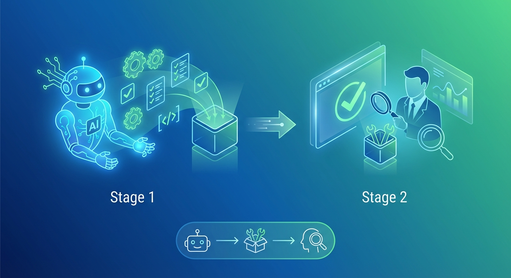
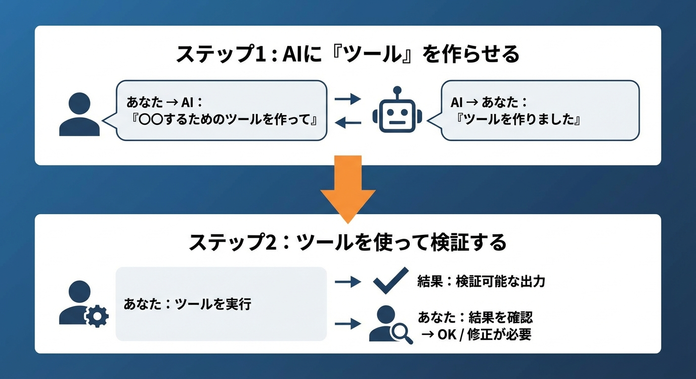
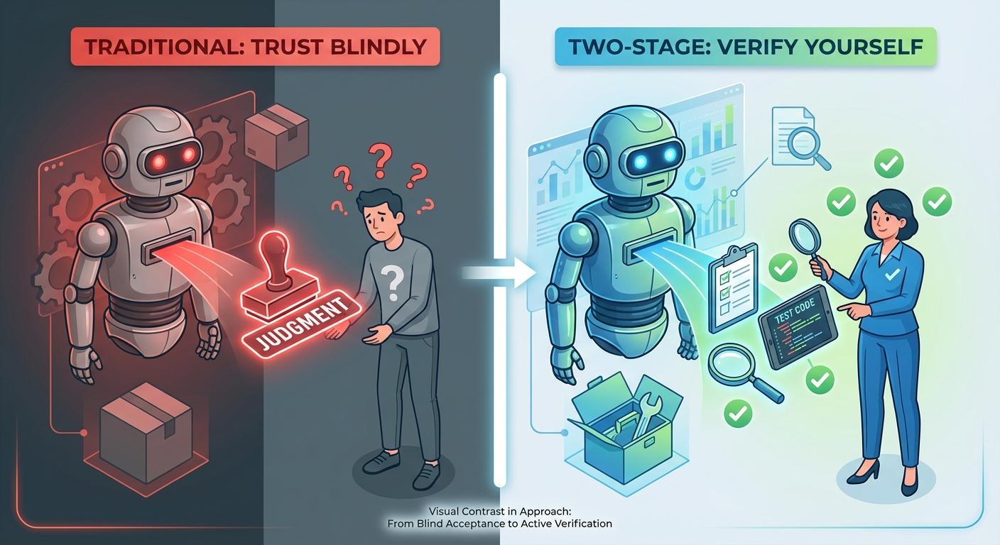
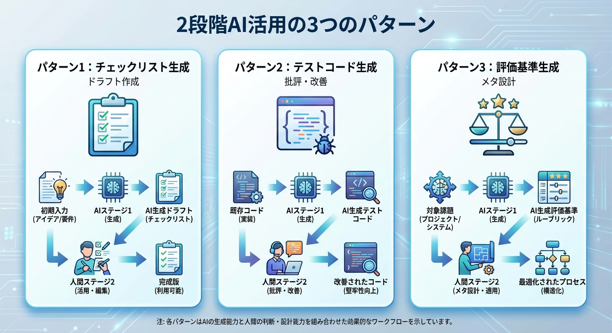

# 第3-2章　二段階AI活用──検証可能な形で出力させる

## この章で学ぶこと

- AIに「直接やらせる」と「ツールを作らせる」の決定的な違い
- 二段階AI活用の考え方と3つのパターン
- 5分野（テキスト/コード/画像/ドキュメント/リサーチ）での実践例

---

## 「テストして」vs「テストコードを書いて」

前章で、スコープ収束パターンの3つ目のルールを学びました。

「**各ステップを検証可能にする**」

この「検証可能にする」を、
もう少し深く考えてみましょう。

---

### 2つのアプローチ

AIにテストを頼むとき、
2つのアプローチがあります。

```text
【アプローチ1: AIに直接やらせる】

あなた: 「このコードをテストして、問題がないか確認して」
AI: 「テストしました。問題ありません」

→ 本当に？どうやって確認する？
```

```text
【アプローチ2: AIにツールを作らせる】

あなた: 「このコードのテストコードを書いて」
AI: 「テストコードを書きました」
あなた: （テストを実行）→ 3件失敗
あなた: 「ここにバグがあるね。修正して」

→ 自分で確認できる！
```

この違い、わかりますか？

**アプローチ1**: AIの「判断」を信じるしかない
**アプローチ2**: AIの「出力」を自分で検証できる

---

### なぜこの違いが重要なのか

AIは、自信満々に間違えることがあります。

```text
【AIが自信満々に間違える例】

あなた: 「このコードにセキュリティの問題はある？」
AI: 「確認しました。セキュリティ上の問題は
     見当たりません。安全に使用できます」

→ 実際には SQLインジェクションの脆弱性があった
```

AIの「判断」は、**必ずしも正しくありません**。

でも、AIの「出力」（コードやリスト）は、
**人間が検証できます**。

これが、二段階AI活用の核心です。

---

## 二段階AI活用とは

**二段階AI活用**とは、
AIに直接結果を出させるのではなく、
**AIに「ツール」を作らせて、そのツールで検証する**手法です。





**ツール**とは:

- テストコード
- チェックリスト
- 評価基準
- スクリプト
- テンプレート

など、**繰り返し使えるもの**を指します。

---

### 従来のアプローチとの比較



```text
【従来のアプローチ】

あなた → AI → 結果（判断）
              ↑
          信じるしかない

【二段階AI活用】

あなた → AI → ツール → あなたが実行 → 結果
                              ↑
                          自分で確認できる
```

二段階AI活用では、
**AIの出力を「信じる」のではなく「検証する」**のです。

---

## 3つのパターン

二段階AI活用には、主に3つのパターンがあります。



---

### パターン1: チェックリスト生成

AIに「チェックリスト」を作らせ、
それを使って自分でチェックする。

```text
【従来】
あなた: 「この文章を校正して」
AI: 「校正しました」（自信満々）
→ 本当に正しい？

【二段階AI活用】
あなた: 「この文章の校正チェックリストを作って」
AI:
  □ 誤字脱字はないか
  □ 主語と述語が対応しているか
  □ 専門用語の説明はあるか
  □ 数字の単位は明記されているか
  □ 結論は明確か

あなた: （チェックリストで自分で確認）
→ 自分の目で確認できる
```

**適用場面**:

- 文章の校正
- コードレビュー
- 提案書のレビュー
- デザインのフィードバック

---

### パターン2: テストコード生成

AIに「テストコード」を書かせ、
それを実行して確認する。

```text
【従来】
あなた: 「このコードは正しく動く？」
AI: 「はい、正しく動きます」（自信満々）
→ 本当に？

【二段階AI活用】
あなた: 「この関数のテストコードを書いて」
AI: テストコード（5つのテストケース）

あなた: npm test
結果: 4件成功、1件失敗
あなた: 「この1件が失敗してる。原因を特定して」
→ 実際に確認できる
```

**適用場面**:

- コードの動作確認
- API のレスポンス検証
- データ処理の正確性確認
- バリデーションロジックの検証

---

### パターン3: 評価基準生成

AIに「評価基準」を作らせ、
それを使って成果物を評価する。

```text
【従来】
あなた: 「このデザインはいい感じ？」
AI: 「はい、いいと思います」（曖昧）
→ 何がいいの？

【二段階AI活用】
あなた: 「ロゴデザインの評価基準を作って」
AI:
  1. 視認性（5点満点）
     - 小さくしても読めるか
     - 白黒でも識別できるか
  2. 一貫性（5点満点）
     - ブランドカラーと合っているか
     - 既存デザインと統一感があるか
  3. 独自性（5点満点）
     - 競合と差別化されているか
     - 記憶に残りやすいか

あなた: （各項目を自分で評価）
  視認性: 4/5
  一貫性: 3/5（要改善）
  独自性: 5/5
→ 具体的な改善点がわかる
```

**適用場面**:

- デザインの評価
- 文章の品質評価
- プレゼンの改善点特定
- 成果物の品質確認

---

## 5分野での実践例

では、具体的に5つの分野で
二段階AI活用を見ていきましょう。

---

### 分野1: テキスト生成

**シナリオ**: ブログ記事の校正を依頼する

```text
【Before: AIに直接やらせる】

あなた: 「この記事を校正して、問題点を修正して」
AI: 「校正しました。以下の修正を行いました...」

問題:
- AIが見落とした箇所はわからない
- 修正が適切かどうかも判断しにくい
```

```text
【After: 二段階AI活用】

ステップ1:
あなた: 「この記事の校正チェックリストを作って。
       チェック観点ごとに、具体的に何を確認するか書いて」

AI:
□ 誤字脱字
  - 「〜たり」の重複使用がないか
  - 「〜の〜の」の連続がないか
□ 論理展開
  - 各段落の最初の文が結論になっているか
  - 根拠→主張の順になっているか
□ 読みやすさ
  - 一文が60字を超えていないか
  - 専門用語に説明があるか

ステップ2:
あなた: （チェックリストに沿って自分で確認）
  「3段落目の一文が80字ある。分割しよう」
  「この専門用語には説明がない。追加しよう」
```

---

### 分野2: コード生成

**シナリオ**: 実装したAPIの動作確認をしたい

```text
【Before: AIに直接やらせる】

あなた: 「このAPIは正しく動作する？」
AI: 「コードを確認しました。
     正しく動作すると思われます」

問題:
- 「思われます」って何？
- 実際に動かしてないでしょ？
```

```text
【After: 二段階AI活用】

ステップ1:
あなた: 「このAPIのテストコードを書いて。
       正常系と異常系の両方をカバーして」

AI:
// 正常系
test('ログイン成功', async () => {
  const res = await api.login({
    email: 'test@example.com',
    password: 'valid_password'
  });
  expect(res.status).toBe(200);
  expect(res.body.token).toBeDefined();
});

// 異常系
test('無効なパスワードでログイン失敗', async () => {
  const res = await api.login({
    email: 'test@example.com',
    password: 'wrong_password'
  });
  expect(res.status).toBe(401);
});

ステップ2:
あなた: npm test
結果:
  ✓ ログイン成功
  ✗ 無効なパスワードでログイン失敗
    Expected: 401
    Received: 500

あなた: 「異常系で500が返ってる。
       エラーハンドリングを修正して」
```

---

### 分野3: 画像生成

**シナリオ**: ロゴデザインの品質を評価したい

```text
【Before: AIに直接やらせる】

あなた: 「このロゴデザイン、いい感じ？」
AI: 「はい、クリーンでモダンなデザインだと思います」

問題:
- 何が「クリーン」で何が「モダン」なの？
- 改善点は？
```

```text
【After: 二段階AI活用】

ステップ1:
あなた: 「ロゴデザインの評価基準を作って。
       各項目5点満点で、具体的な評価ポイントも書いて」

AI:
【評価基準】

1. 視認性（5点満点）
   5点: どんなサイズでも即座に認識可能
   3点: 中サイズなら問題なし
   1点: 大きくしないと認識困難

2. シンプルさ（5点満点）
   5点: 要素が3つ以下
   3点: 要素が5つ程度
   1点: 要素が多すぎて複雑

3. 記憶しやすさ（5点満点）
   5点: 一度見たら忘れない
   3点: 何度か見れば覚える
   1点: 印象に残らない

ステップ2:
あなた: （基準に沿って評価）
  視認性: 4/5（小さいと少し見づらい）
  シンプルさ: 5/5（要素が2つでシンプル）
  記憶しやすさ: 3/5（もう少し特徴が欲しい）

あなた: 「記憶しやすさを上げるため、
       もう1つ特徴的な要素を追加してみて」
```

---

### 分野4: ドキュメント作成

**シナリオ**: 提案書のレビューを依頼する

```text
【Before: AIに直接やらせる】

あなた: 「この提案書をレビューして、
       問題点を指摘して」
AI: 「レビューしました。全体的によく書けています。
     強いて言えば、予算の根拠がもう少しあると良いです」

問題:
- 「全体的によく書けています」って具体的に何が？
- 他に見落としはない？
```

```text
【After: 二段階AI活用】

ステップ1:
あなた: 「提案書のレビュー観点リストを作って。
       経営陣が気にするポイントを網羅して」

AI:
【レビュー観点リスト】

□ エグゼクティブサマリー
  - 3行以内で要点が伝わるか
  - 金額感が明記されているか

□ 課題認識
  - 数字で課題を示しているか
  - 競合との比較があるか

□ 解決策
  - 実現可能性が説明されているか
  - 段階的なアプローチがあるか

□ 投資対効果
  - ROI が明記されているか
  - 回収期間が示されているか

□ リスクと対策
  - リスクが3つ以上挙げられているか
  - 各リスクに対策があるか

ステップ2:
あなた: （観点リストで確認）
  エグゼクティブサマリー: ✓
  課題認識: △（競合比較がない）
  解決策: ✓
  投資対効果: ✗（ROI未記載）
  リスクと対策: △（対策が曖昧）

あなた: 「ROI と競合比較を追加して。
       リスク対策ももう少し具体的に」
```

---

### 分野5: リサーチ・分析

**シナリオ**: 市場調査の結果を確認したい

```text
【Before: AIに直接やらせる】

あなた: 「AI市場の最新トレンドを調査して、
       結論を出して」
AI: 「調査しました。AI市場は急成長しており、
     特に生成AIの分野が注目されています。
     参入をお勧めします」

問題:
- 何を根拠にしてるの？
- 情報源は信頼できる？
```

```text
【After: 二段階AI活用】

ステップ1:
あなた: 「AI市場のリサーチをするための
       情報源リストを作って。
       各情報源の特徴と信頼性も書いて」

AI:
【情報源リスト】

1. Gartner（信頼性: 高）
   - 企業向けIT市場の権威
   - 調査方法: 独自リサーチ
   - 確認すべきレポート: Magic Quadrant

2. Statista（信頼性: 中〜高）
   - 統計データの集約
   - 市場規模の数字を確認

3. 各社のIR資料（信頼性: 高）
   - 実際の売上・成長率
   - 競合他社の動向把握

4. arXiv / 論文（信頼性: 技術面は高）
   - 技術トレンドの確認
   - 実用化の可能性評価

ステップ2:
あなた: （リストに沿って自分で確認）
  Gartner: AI市場は2025年に〇〇億ドル
  Statista: 年成長率 XX%
  各社IR: OpenAI, Anthropic, Googleの動向
  論文: 最新の技術トレンド

あなた: 「根拠が揃った。これで判断できる」
```

---

## なぜ「二段階」が効くのか

ここまで、二段階AI活用の具体例を見てきました。

では、なぜこの手法が効果的なのでしょうか？

---

### AIの出力は「正しいかもしれないし、間違っているかもしれない」

AIは、**自信満々に間違えることがあります**。

```text
【AIの特性】

✓ 正しいことを言うこともある
✓ 間違ったことを言うこともある
✗ 「間違っているかも」とは言わない
✗ 自分で自分を疑わない
```

だから、**AIの「判断」をそのまま信じるのは危険**です。

---

### 人間が検証できる形にする

二段階AI活用では、
AIの出力を「**判断**」ではなく「**ツール**」に変えます。

```text
【判断 vs ツール】

判断: 「問題ありません」
→ 信じるしかない

ツール: テストコード、チェックリスト、評価基準
→ 自分で実行して確認できる
```

ツールなら、**人間が自分の目で確認**できます。
確認できれば、**信頼性が格段に上がります**。

---

### 最終判断は常に人間

二段階AI活用の本質は、
「**最終判断を人間に戻す**」ことです。

```text
【従来】
AI が判断 → 人間は受け入れるだけ

【二段階AI活用】
AI がツールを作る → 人間が判断する
```

AIは強力なアシスタントですが、
**最終判断は人間がするべき**です。

二段階AI活用は、
その判断を**可能にする仕組み**なのです。

---

## 第3部まとめ

第3-1章と第3-2章で、「精度を上げる」ための
2つの重要なパターンを学びました。

---

### スコープ収束パターン（第3-1章）

「**小さく分けて渡す**」

- 一度に1つだけ求める
- 成功を確認してから次へ
- 各ステップを検証可能にする

---

### 二段階AI活用（第3-2章）

「**検証可能な形で出力させる**」

- AIに直接やらせるのではなく、ツールを作らせる
- チェックリスト、テストコード、評価基準
- 最終判断は人間がする

---

### 70%問題の解決

この2つのパターンを組み合わせると、
**70%問題を解決**できます。

```text
【解決の流れ】

大きなお願い → 70%で止まる

↓ スコープ収束パターンを適用

小さく分ける → 各ステップ98%

↓ 二段階AI活用を適用

検証可能にする → 問題を早期発見・修正

↓

全体として98%の完成度を達成
```

---

## 章末チェックリスト

この章の内容を実践に移すためのチェックリスト:

- [ ] AIに「〇〇して」と頼む前に、「〇〇するためのツールを作って」と言い換えてみる
- [ ] 3つのパターンのどれが使えるか考える
  - [ ] チェックリスト生成
  - [ ] テストコード生成
  - [ ] 評価基準生成
- [ ] AIの出力を「信じる」のではなく「検証する」習慣をつける
- [ ] 最終判断は自分でする意識を持つ

---

<div class="column-box">

## 📌 コラム：料理の下ごしらえ理論


**DJ町娘**：「先生、AIに全部やってもらえば楽なのに...」

**AI侍**：「待て。料理を思い浮かべてみよ」

**DJ町娘**：「料理...ですか？」

**AI侍**：「AIに『料理を作って』と頼むと、材料も調理法も見えないブラックボックス。味見するまで良し悪しがわからん。だが、『材料を切って並べて』と頼めば、自分で確認しながら調理できる。これが**二段階AI活用**じゃ」

**DJ町娘**：「なるほど！AIは料理人じゃなくて、アシスタントなんですね！」

**AI侍**：「その通り。次章では、そのアシスタントに『推論の余白』を与える技を伝授するぞ」

</div>
