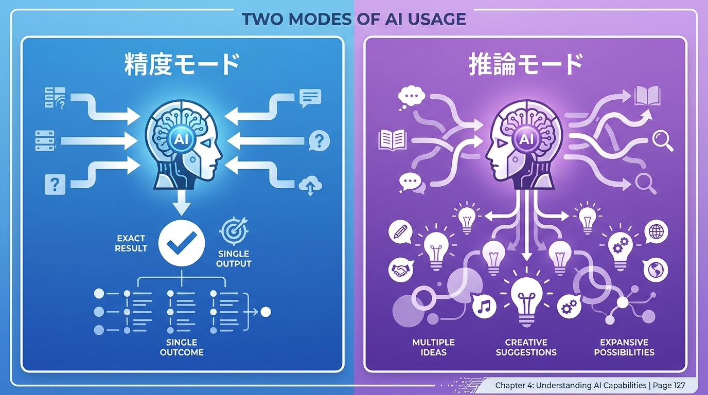
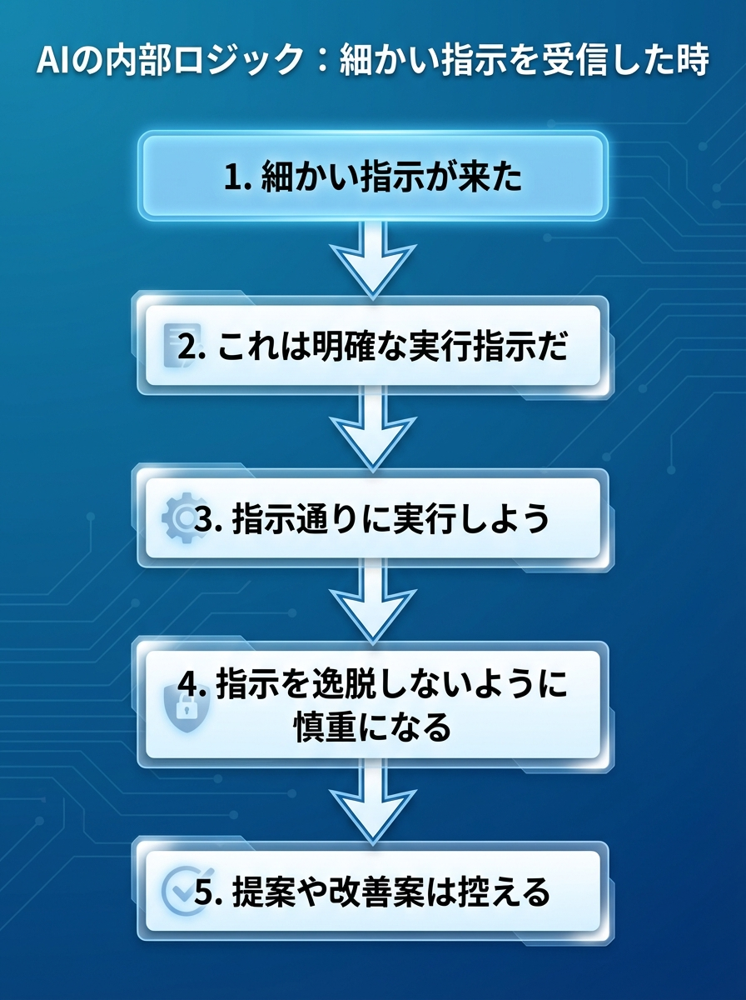
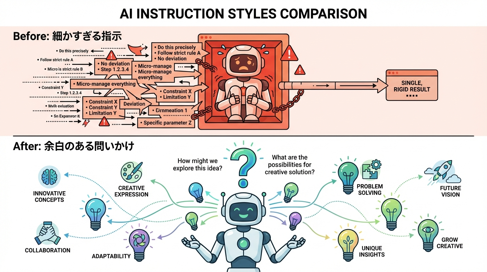

# 第4-1章　余白を残す──推論の力を借りる

## この章で学ぶこと

- 細かすぎる指示がAIの推論を邪魔する理由
- 「〜と思うけど、どう思う？」の威力
- 目的に応じた使い分け（精度モード vs 推論モード）
- AIを壁打ち相手として活用する方法

---

## 精度と推論のジレンマ

第3部で、私たちは「精度を上げる」方法を学びました。

**スコープ収束パターン**:
小さく分けて渡す → 70% → 90% → 98%

**二段階AI活用**:
AIに直接やらせるのではなく、ツールを作らせる

これらを使えば、AIの出力精度は格段に上がります。

でも、ここで1つ、大切な問いがあります。

---

### 「細かく指示する」だけでいいのか？

AIには、もう1つの力があります。

**推論する力**。

こちらが言わなくても、文脈から判断して、
適切な提案をしてくれる能力。
アイデアを出し、選択肢を示し、
壁打ち相手になってくれる能力。

この力を活かすには、
「**細かく指示する**」だけでは不十分なのです。

---

### 2つのモード

AIには、2つの使い方があります。

```text
【精度モード】
明確に指示する → 正確に実行させる
「ログイン機能を実装して」→ ログイン機能ができる

【推論モード】
余白を残す → 考えさせる、提案させる
「この設計、どう思う？」→ 改善案を提案してくれる
```

第3部で学んだのは「精度モード」。
この章で学ぶのは「推論モード」です。

両方を使い分けることで、
AIを**本当に使いこなせる**ようになります。



---

## 細かすぎると推論の邪魔をする

まず、「細かすぎる指示」が
何を引き起こすか見てみましょう。

---

### 極端な例

```text
【細かすぎる指示】

「ランディングページを作ってください。
 ヘッダーは高さ80px、背景色は#1a1a2e。
 ロゴは左寄せで、ナビゲーションは右寄せ。
 メインビジュアルは幅100%、高さ500px。
 テキストは白色、フォントサイズ48px、
 フォントファミリーはNoto Sans JP。
 CTAボタンは背景色#e94560、
 角丸8px、パディング16px 32px...」

AI: （言われた通りに作る）

結果: 言われた通りのものができる。
      でも、「もっといい方法」の提案はない。
```

この指示を受けたAIは、
「**言われた通りにする**」モードになります。

指示が細かければ細かいほど、
AIは「従う」ことに集中し、
「考える」ことをしなくなります。

---

### なぜそうなるのか？



細かい指示は、AIに
「**正確に実行せよ**」というシグナルを送ります。

すると、AIは推論モードを
無意識に「オフ」にするのです。

---

### 図解：指示の詳細度と推論の余地


精度を求めるなら、詳細度を上げる。
推論を求めるなら、詳細度を下げる。

これが基本原則です。

---

## 「〜と思うけど、どう思う？」の威力

では、推論モードを引き出すには
どうすればいいのでしょうか？

答えはシンプルです。

**余白を残した聞き方をする**。

---

### 余白を残す表現パターン

```text
【余白を残す表現】

❌ 細かすぎ:
「青色のボタンを、角丸8pxで、フォントサイズ16pxで作って」

✅ 余白あり:
「CTAボタンを作りたいんだけど、どんなデザインがいいかな？」
```

```text
【より具体的なパターン】

パターン1: 「〜と思うけど、どう思う？」
→ 「この構成でいこうと思うんだけど、どう思う？」

パターン2: 「〜がいいかな」
→ 「ユーザー認証はJWTがいいかな」

パターン3: 「〜という方向で考えてるけど」
→ 「マイクロサービスという方向で考えてるけど、
    他にいいアプローチある？」

パターン4: 「どう思う？」
→ 「このエラーハンドリング、どう思う？」

パターン5: 「〜したいんだけど」
→ 「パフォーマンス改善したいんだけど、
    どこから手をつけるべき？」
```

これらの表現には共通点があります。

「**こうしてほしい**」ではなく、
「**どう思う？**」と聞いている

この違いが、AIの推論モードを引き出します。



---

### 実際の会話例

```text
【精度モード（余白なし）】

あなた: 「このAPIにレート制限を追加して。
        1分あたり100リクエストで、
        超過したら429を返して」

AI: 「レート制限を追加しました。
     1分あたり100リクエスト、
     超過時は429を返します」

→ 言われた通りのものができる
```

```text
【推論モード（余白あり）】

あなた: 「このAPIにレート制限を入れたいんだけど、
        どういう設計がいいと思う？」

AI: 「レート制限の設計について、いくつか提案します。

     1. トークンバケット方式
        - バースト的なトラフィックに対応可能
        - 実装例: 1分あたり100リクエスト、
          バースト許容10リクエスト

     2. スライディングウィンドウ方式
        - より精密な制御が可能
        - 境界時間の問題を回避

     3. 段階的な制限
        - 50%超過で警告、100%超過でブロック
        - ユーザー体験を考慮

     用途によりますが、一般的なAPIなら
     1のトークンバケット方式がおすすめです。
     どの方式で進めますか？」

→ 選択肢と推奨が得られる
```

同じ「レート制限を追加する」という目的でも、
聞き方で得られる情報がまったく違います。

---

## なぜ「余白を残す」が効くのか？──Anthropicの発見

ここで、1つの疑問が浮かぶかもしれません。

「**余白を残すと、なぜAIの推論が引き出されるのか？**」

その答えを、AIの設計思想から見てみましょう。

---

### What → Why へのシフト

2026年1月、Anthropic（Claude開発元）は
「Claude憲法」を更新しました。

その核心は、**What（何をすべきか）からWhy（なぜそうすべきか）へのシフト**。

> AIに「なぜそう行動すべきか」を理解させると、
> 新しい状況でも適切に判断できるようになる

これは、AIの訓練方法に関する発見ですが、
私たちの「プロンプトの書き方」にも示唆を与えます。

---

### 「〜と思うんだけど」の正体

実は、「〜と思うんだけど、どう思う？」という表現は、
無意識のうちに「**Why**」を伝えているのです。

```text
【「〜と思うんだけど」の構造】

あなた: 「マイクロサービスで行こうと思うんだけど、
        どう思う？」

含まれているWhy:
- 「スケーラビリティを重視している」
- 「チーム分割を考えている」
- 「でも確信が持てない」

→ AIは「なぜこの人はこう思うのか」を推論できる
→ だから、的確な提案ができる
```

「**余白を残す**」のではなく「**Whyを伝える**」。

この視点の転換が、推論を引き出す本質です。

---

### 実践：Whyを明示的に伝える

「〜と思うんだけど」を使わなくても、
Whyを直接伝えることができます。

```text
【Before: What のみ】
「キャッシュ機能を追加して」

【After: What + Why】
「キャッシュ機能を追加して。
 理由：APIのレスポンスが遅くて、
 ユーザーから苦情が来てるから」

→ AIは「ユーザー体験の改善」が目的と理解
→ キャッシュだけでなく、他の高速化案も提案できる
```

```text
【コードレビューでのWhy】

❌ What のみ:
「このコードをレビューして」

✅ What + Why:
「このコードをレビューして。
 特に気になってるのは、
 エラーハンドリングが適切かどうか。
 本番で予期せぬエラーが出て困った経験があるから」

→ AIは「エラーハンドリング」に重点を置いてレビュー
→ 過去の問題を防ぐ視点でフィードバック
```

**ポイント**:
- 「〜と思う」は、自然にWhyを伝える表現
- Whyを直接伝えることで、より精度の高い推論を引き出せる
- 目的や背景を共有すると、AIは「パートナー」として機能する

※ Anthropicの「Claude憲法」はAI側の価値判断基準ですが、
  「Whyを伝えると推論が向上する」という原則は、
  プロンプト設計にも応用できます。

---

## 2つのモードの使い分け

精度モードと推論モード、
どちらを使うべきかは**目的**によります。

---

### 比較表

| 観点 | 精度モード | 推論モード |
|------|------------|------------|
| 目的 | 正確に実行させる | 考えさせる、提案させる |
| 指示 | 具体的、詳細 | 余白あり、曖昧さを残す |
| 出力 | 言われた通りのもの | 選択肢、提案、改善案 |
| 適した場面 | 仕様が決まっている | 仕様を検討中 |
| リスク | 自分の発想に縛られる | 的外れになる可能性 |

---

### 2つのモードのベクトル

実は、精度モードと推論モードは
**ベクトルの方向が逆**です。


**精度モード**: 「何を」を細かく指定し、Whyで制約を追加 → AIは深く掘る
**推論モード**: 「なぜ」という目的を共有し、Whatの選択肢を探る → AIは広く考える

この図を頭に入れておくと、
使い分けが直感的にわかるようになります。

---

### 精度モードを使うべき場面

```text
【精度モードが適切な場面】

✅ 仕様がすでに決まっている
   「このインターフェースに沿って実装して」

✅ 正確な出力が必要
   「このフォーマットでCSVを出力して」

✅ 繰り返しの作業
   「同じパターンで残りの3つも実装して」

✅ デバッグ・修正
   「この行のバグを修正して」
```

---

### 推論モードを使うべき場面

```text
【推論モードが適切な場面】

✅ 仕様を検討中
   「この機能、どう設計するのがいいかな？」

✅ アイデアが欲しい
   「他にどんなアプローチがある？」

✅ レビュー・フィードバック
   「このコード、改善点ある？」

✅ 壁打ち
   「この方向性で考えてるんだけど、どう思う？」

✅ 選択肢が欲しい
   「ライブラリの選択肢を教えて」
```

---

### 判断のフローチャート

```text
【どちらのモードを使うか？】

仕様は決まっている？
  │
  ├─ はい → 精度モード
  │        「〇〇を実装して」
  │
  └─ いいえ → 推論モード
              「〇〇について、どう思う？」

アイデアが欲しい？
  │
  ├─ はい → 推論モード
  │        「他にどんな方法がある？」
  │
  └─ いいえ → 精度モード
              「この方法で実装して」
```

---

## 壁打ち相手としてのAI活用

推論モードの最も強力な使い方が、
「**壁打ち相手**」としてのAI活用です。

---

### 壁打ちとは？

壁打ちとは、アイデアや考えを
誰かに話すことで整理する行為です。

従来は、同僚や上司に
「ちょっと聞いてもらっていい？」と
相談していました。

今は、AIがその役割を担えます。


---

### AIに壁打ちを頼むメリット

```text
【AIの壁打ちメリット】

1. いつでも利用可能
   - 深夜でも、休日でも
   - 相手の時間を気にしなくていい

2. 遠慮なく話せる
   - 「こんなこと聞いていいのかな」がない
   - 初歩的な質問も気にならない

3. 知識の幅が広い
   - 技術、ビジネス、デザイン、多分野をカバー
   - 自分の専門外の視点を得られる

4. 客観的な視点
   - 感情的なバイアスがない
   - 冷静なフィードバック
```

---

### 壁打ちの実際の会話例

```text
【壁打ち例1: 設計の相談】

あなた: 「今、ECサイトの検索機能を作ってるんだけど、
        全文検索エンジンを入れるか迷ってる。
        Elasticsearchとか大げさな気もするし、
        PostgreSQLの全文検索で十分な気もする。
        どう思う？」

AI: 「なるほど、検索機能の設計ですね。

     判断のポイントをいくつか挙げます：

     【PostgreSQLで十分なケース】
     - 商品数が1万点以下
     - 単純なキーワード検索
     - 日本語の形態素解析が不要

     【Elasticsearchが必要なケース】
     - 商品数が数万点以上
     - ファセット検索（絞り込み）
     - 類似商品検索
     - 検索のレスポンス要件が厳しい

     現時点の商品数と将来の規模感、
     あと検索のUXでやりたいことを
     もう少し教えてもらえますか？」

あなた: 「今は500点くらいだけど、
        1年後には5000点くらいになる予定。
        絞り込み検索はやりたいかな」

AI: 「5000点で絞り込み検索なら、
     PostgreSQLでも対応可能です。

     ただ、将来的に商品数が増えるなら、
     最初からElasticsearchにしておく
     という判断もアリです。

     私のおすすめは：
     1. まずPostgreSQLで始める
     2. パフォーマンスが問題になったら移行
     3. その時のために、検索ロジックは
        抽象化しておく

     この方向でどうでしょう？」

→ 判断材料と推奨が得られ、方向性が固まる
```

---

### 壁打ちのコツ

```text
【壁打ちを成功させるコツ】

1. 背景を伝える
   「今〇〇を作ってて、〇〇で悩んでる」

2. 自分の考えを先に出す
   「〇〇かなと思ってるんだけど」

3. 判断を求める
   「どう思う？」「他の選択肢ある？」

4. 深掘りする
   「そのデメリットは？」「具体的には？」
```

---

### 壁打ちで使えるフレーズ集

```text
【壁打ちフレーズ】

■ 相談開始
- 「ちょっと相談したいんだけど」
- 「今〇〇で悩んでて」
- 「考えを整理したいんだけど」

■ 意見を求める
- 「どう思う？」
- 「この方向性でいいかな？」
- 「見落としてることある？」

■ 選択肢を求める
- 「他にどんな方法がある？」
- 「もっといいアプローチある？」
- 「それぞれのメリット・デメリットは？」

■ 深掘り
- 「もう少し詳しく教えて」
- 「具体的にはどうなる？」
- 「そのリスクはどう対処する？」

■ 決定
- 「じゃあこの方向で行くね」
- 「ありがとう、整理できた」
```

---

## 分野別：推論モードの活用例

最後に、いくつかの分野で
推論モードを活用する例を見てみましょう。

---

### テキスト生成での活用

```text
【精度モード】
「リモートワークの生産性について、
 5000字の記事を書いて。
 見出しは5つ、各1000字で」

【推論モード】
「リモートワークの生産性について
 記事を書きたいんだけど、
 どんな構成がいいと思う？
 読者はマネージャー層を想定してる」

→ 推論モードでは、読者に合わせた
  構成案や切り口の提案が得られる
```

---

### コード生成での活用

```text
【精度モード】
「このAPIにキャッシュを追加して。
 Redisを使って、TTLは1時間」

【推論モード】
「このAPIのパフォーマンス改善したいんだけど、
 どこから手をつけるべき？
 ボトルネックになってそうな箇所ある？」

→ 推論モードでは、キャッシュ以外の
  改善案も提案してもらえる
```

---

### 画像生成での活用

```text
【精度モード】
「テック企業のロゴを作って。
 青色系、シンプル、幾何学的なデザイン」

【推論モード】
「テック企業のロゴを作りたいんだけど、
 どんなコンセプトがいいと思う？
 信頼感とイノベーションを
 両立させたいんだよね」

→ 推論モードでは、コンセプト案と
  それぞれの特徴を提案してもらえる
```

---

## 章末チェックリスト

この章の内容を実践に移すためのチェックリスト:

- [ ] 次にAIに相談するとき、「〜と思うけど、どう思う？」と聞いてみる
- [ ] 仕様が決まっていない段階では、推論モードを使ってみる
- [ ] AIを壁打ち相手として使ってみる
- [ ] 精度モードと推論モードを意識的に使い分けてみる

---

<div class="column-box">

### 🧩 コラム：ジグソーパズルの極意

ジグソーパズルを作るとき、「全部のピースを決まった場所にはめてね」と指示されたら、作業は簡単だけど面白くないですよね。

でも、「四隅だけ決めて、あとは自由に組み立ててみて」と言われたら、自分で考えながら完成させる楽しみがあります。

AIも同じです。すべての細部を指定すると「実行するだけ」になりますが、余白を残すと「考えて提案してくれる」のです。

**AI侍**: 「ジグソーパズルと一緒じゃ。すべて埋めてしまうと、AIは考える余地がなくなる」  
**DJ町娘**: 「ヒントだけ渡して、AIに完成させてもらうのが賢い使い方なんですね！」

</div>

---

## 次部への橋渡し

ここまでで、AIを使いこなす2つのモードを学びました。

**精度モード**（第3部）:
- 小さく分けて渡す（スコープ収束パターン）
- 検証可能な形で出力させる（二段階AI活用）
- → 70%から98%へ精度を上げる

**推論モード**（第4部）:
- 余白を残した聞き方をする
- 「どう思う？」で提案を引き出す
- → アイデアや選択肢を得る

この2つのモードを状況に応じて使い分けることが、
AIを本当に使いこなすためのカギです。

---

次部では、これまで学んだことを踏まえて、
「**よくある失敗パターンとその対処法**」を見ていきます。

「全部一度に頼んでしまう」
「AIの出力を鵜呑みにしてしまう」
「修正を一度に全部頼んでしまう」

こうした失敗パターンと、
Before/After形式での解決策を学びましょう。
