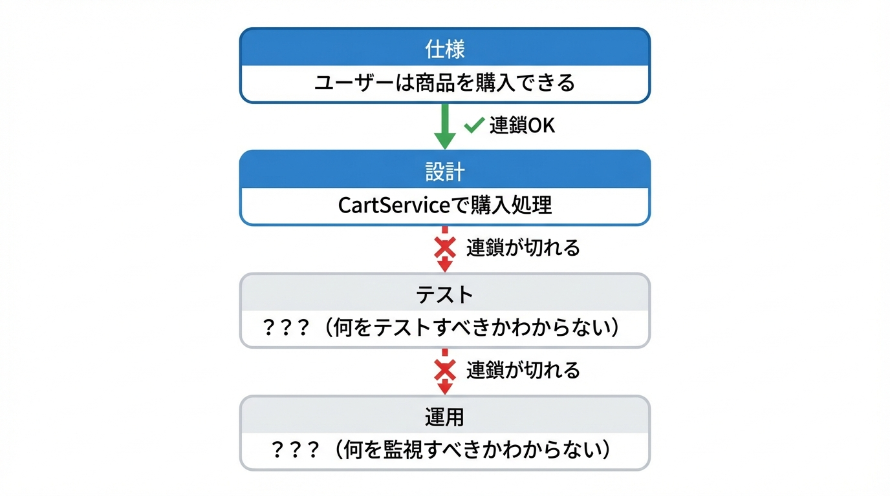
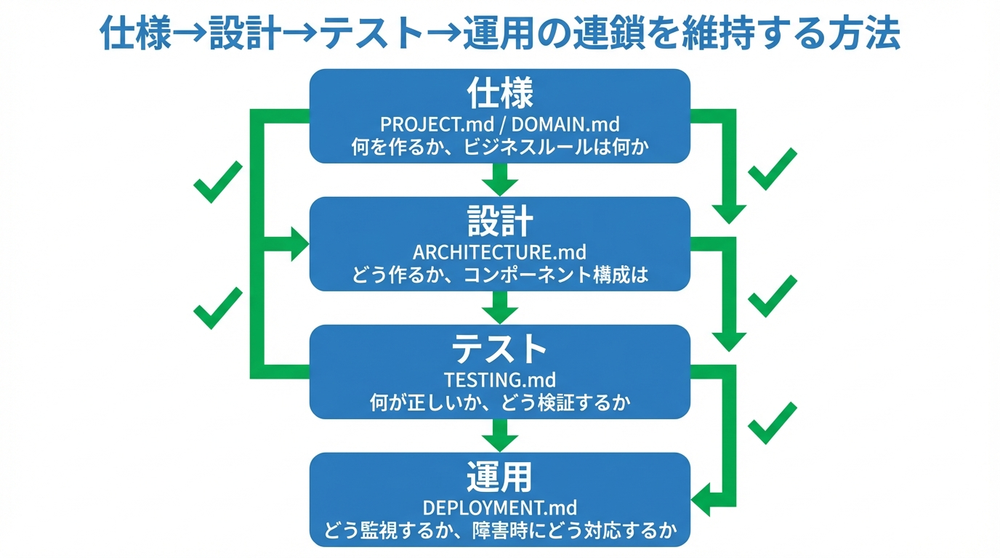

# 書籍メタデータ

## 表紙


## 基本情報

| 項目 | 内容 |
|------|------|
| **タイトル** | AI仕様駆動開発 |
| **サブタイトル** | AIエージェント開発の新常識 |
| **著者** | [著者名] |
| **ステータス** | draft |
| **バージョン** | 0.1.0 |
| **作成日** | 2026-01-01 |
| **更新日** | 2026-01-01 |

## 想定読者

- AIコーディングツール（Claude Code, GitHub Copilot, Cursor等）を活用したいエンジニア
- AI活用で手戻りやブレに悩んでいる開発チーム
- ドキュメント駆動開発に興味があるテックリード・マネージャー

## 書籍のゴール

読者が「AI仕様駆動開発」の考え方を理解し、自分のプロジェクトで7文書構成を導入して、AIに安心して開発を任せられるようになること。

## 構成概要

| 部 | タイトル | 章数 | 狙い |
|----|----------|------|------|
| 第1部 | なぜ「AI任せ」は失敗するのか | 2章 | 問題提起と原因分析 |
| 第2部 | 結論：仕様が9割 | 3章 | コアコンセプトの提示 |
| 第3部 | 実践ワークフロー | 4章 | 具体的な導入・運用手順 |
| 第4部 | 現場FAQ | 3章 | 懐疑派への回答 |
| 第5部 | 組織展開 | 2章 | チーム・組織への適用 |

## 帯コピー案

1. **「AIが書いたコード、誰がレビューする？」——その問いに答える本。**
2. **仕様を先に書けば、AIは迷わない。手戻りゼロの開発フローがここに。**
3. **7つの文書で、コーディングを"人間の仕事"から解放する。**

## 参考資料

- [AI仕様駆動開発 公式ドキュメント](https://github.com/feel-flow/ai-spec-driven-development)
- [GitHub Spec-Kit](https://github.blog/ai-and-ml/generative-ai/spec-driven-development-with-ai-get-started-with-a-new-open-source-toolkit/)
- [Microsoft Spec-Driven Development](https://developer.microsoft.com/blog/spec-driven-development-spec-kit)


# はじめに {.unnumbered}

## 「AIに任せる開発なんて無理」の正体

「AIにコードを書かせる？ 結局、手直しに時間がかかって意味ないよ」

エンジニアの間でよく聞く声です。Claude Code、GitHub Copilot、Cursor——AIコーディングツールは確かに進化しています。しかし、多くの開発現場では、こんな悩みが絶えません。

- AIが生成したコードが、既存のアーキテクチャと全く合わない
- PRが巨大になりすぎて、レビューが不可能になる
- 「なぜこう実装したのか」が分からず、修正に余計な時間がかかる
- 何度も同じような間違いを繰り返す

これらの問題を経験すると、「やっぱりAIは信用できない」という結論に至りがちです。

しかし、**本当の問題はAIの能力ではありません**。

問題は、AIに渡している「入力」——つまり**スコープの曖昧さ**——にあります。

---

## 実際に効果はあるのか？——現場のデータ

「理屈はわかった。でも本当に効果があるのか？」

そう思う方のために、私が関わったプロジェクトでの計測結果を紹介します。

RAGチャットボットの機能実装において、Issue駆動でAIに開発を任せた結果です。

| 指標 | 結果 |
| --- | --- |
| コード生産性 | 業界平均（50〜200行/日）の**115〜460倍** |
| PRマージ率 | **98%**（321件中315件） |
| コードレビュー工数 | **97%削減**（人間は全体の3.3%のみ担当） |

**このデータの読み方について、いくつか補足します。**

「115〜460倍」という数値は、**行数ベースの生産性比較**であり、従来の人手による開発とは前提条件が異なります。

- **測定対象**：RAGチャットボット開発における機能実装フェーズに限定。要件定義・設計・テスト設計などの上流工程は含みません
- **測定方法**：AIが生成し、レビューを経てマージされたコード行数を、実装にかかった経過日数で割った値。業界平均値（50〜200行/日）は、ソフトウェア工学の文献（*Code Complete* 等）で報告されている生産性データを参照しています
- **なぜ幅があるか**：業界平均値自体に幅がある（プロジェクト規模や言語によって異なる）ため、115倍〜460倍のレンジで表記しています
- **再現条件**：本書で解説する7文書構成とIssue駆動の開発フローが整備済みの環境で計測。仕様が曖昧な状態では、この生産性は再現できません

つまり、「AIが速い」のではなく、**「仕様が整っていれば、AIは速く・正確に動ける」** という結果です。

ポイントは、**品質を落とさずに**この生産性を実現したことです。98%のPRがそのままマージされている事実が、それを証明しています。

詳細なレポートはこちら：[AI駆動開発レポート](https://feelflow.co.jp/report/ai-agent-development-report20251201/)

では、どうやってこの結果を出したのか？——それが本書で解説する「3つの戦略」です。

---

## 結論を先に言います：3つの戦略がすべて

私が実際にAI駆動開発を実践してきた経験から、**効く戦略は3つだけ** です。

### 戦略1：Issueでスコープを絞る（コンテキストエンジニアリング）

**これが最も重要です。**

「ログイン機能を作って」と指示すると、AIは迷います。認証方式は？エラーハンドリングは？既存コードとの整合性は？——書かれていないことを推測し、ほぼ確実にズレた実装をします。

解決策はシンプルです。**Issueを作り、スコープを絞る**。

```text
❌ 悪い例：「認証機能を実装して」

✅ 良い例：
Issue #42: JWTトークン検証ミドルウェアの実装
- 受け入れ基準：
  - Authorization ヘッダーからBearerトークンを抽出
  - トークンの署名検証と有効期限チェック
  - 検証失敗時は401を返す
- 制約：
  - 既存の authMiddleware.ts を拡張
  - エラーレスポンスは errors/auth.ts の形式に従う
```

Issueを書く行為は、**コンテキストエンジニアリング**そのものです。AIに「何をすべきか」「何をすべきでないか」を明示することで、推測の余地を排除します。

スコープが絞られていれば、AIは迷わない。迷わなければ、バグは生まれない。

### 戦略2：PRは70%の完成度でいい

完璧を求めてはいけません。

AIが書いたコードをPRに出す時点では、**70%の完成度** だと思ってください。これは妥協ではなく、**設計された戦略** です。

なぜか？

レビューを受けることで、スコープがさらに狭まります。

- 「この関数、責務が2つ混ざってるね」→ 分割
- 「エッジケースのテストが足りない」→ 追加
- 「命名がプロジェクトの慣習と違う」→ 修正

レビュー指摘に基づいてAIに再実装させると、**指摘内容がそのままコンテキストになる**ため、より正確なコードが生成されます。

```text
レビュー指摘：「validateUser関数、バリデーションと永続化が混ざってる」
↓
AIへの指示：「validateUser関数を、バリデーション専用のvalidateUserInput関数と、
             永続化専用のpersistUser関数に分割して」
↓
結果：明確な責務分離が実現
```

**レビュー→再レビュー→完成** という反復が、スコープを収束させ、精度を上げていきます。

### 戦略3：指摘をナレッジ化する

同じ指摘を何度も受けていませんか？

- 「またエラーハンドリングが漏れてる」
- 「テストのモック設定が毎回違う」
- 「import文の順序がバラバラ」

これらは**AIに事前に教えておくべき知識** です。

指摘が多かった場合、そのナレッジをまとめて「次回どうやったら指摘されないか」を仕組み化します。

**具体的な手段：**

1. **静的解析の強化**
   - ESLint/Prettierルールの追加
   - カスタムルールで頻出パターンを検出

2. **pre-commitフックでAIレビュー**
   ```bash
   # .husky/pre-commit
   claude-code review --staged --rules .review-rules.md
   ```

3. **サブエージェントによる多視点レビュー**
   - セキュリティ視点のレビュワーエージェント
   - パフォーマンス視点のレビュワーエージェント
   - 既存コード整合性チェックのエージェント

指摘を受ける→ナレッジ化→自動チェックに組み込む→次回から指摘されない。

このサイクルを回すことで、AIの出力品質は**プロジェクト固有の文脈を学習**し、継続的に向上します。

---

## この3つを支える基盤：7文書構成

上記の3戦略を効果的に運用するには、**AIが参照できる仕様の基盤** が必要です。

それが、本書で紹介する**7文書構成** です。

| 文書 | 役割 | 戦略との関係 |
| --- | --- | --- |
| MASTER.md | プロジェクト索引 | AIが迷子にならない地図 |
| PROJECT.md | ビジョンと要件 | Issueの背景を示す |
| ARCHITECTURE.md | システム設計 | 制約を明示する |
| DOMAIN.md | ビジネスロジック | ルールの唯一の置き場 |
| PATTERNS.md | 実装パターン | ナレッジの蓄積先 |
| TESTING.md | テスト戦略 | レビュー基準を定義 |
| DEPLOYMENT.md | 運用手順 | リリース可能性を定義 |

Issueを書くとき、ARCHITECTURE.mdの制約を参照する。
レビューで指摘されたパターンは、PATTERNS.mdに蓄積する。
テストの書き方で揉めたら、TESTING.mdを更新する。

**仕様が整っていれば、3つの戦略はスムーズに回ります。**

---

## 本書の読み方

本書は5部構成になっています。

**第1部「なぜAI任せは失敗するのか」** では、AI活用が失敗する本当の原因を分析します。「AIが悪い」のではなく「スコープが曖昧」であることを理解していただきます。

**第2部「結論：仕様が9割」** では、7文書構成の全体像を提示します。各文書の役割と、3つの戦略との接続を解説します。

**第3部「実践ワークフロー」** では、Issueベースの開発フロー、70%完成度でのPR運用、ナレッジ蓄積の具体的な手順を示します。

**第4部「現場FAQ」** では、懐疑的なエンジニアからの質問に答えます。「結局人間が全部書くのでは？」「品質は担保できるのか？」

**第5部「組織に展開する」** では、個人の取り組みをチーム標準に広げる方法を解説します。

---

## さあ、始めましょう

AIコーディングツールは、正しく使えば圧倒的な生産性をもたらします。

しかし、「正しく使う」とは何か？

**スコープを絞り、70%で出し、指摘をナレッジ化する。**

この3つの戦略と、それを支える7文書構成。

「AIに任せる開発なんて無理」を「AIに任せたら、本当に楽になった」に変える。

そのための旅を、一緒に始めましょう。


# 目次

## AI仕様駆動開発

**AIエージェント開発の新常識**

---

## はじめに

- 「AIに任せる開発なんて無理」の正体
- 生成AIは"自律"ではなく"条件反射"
- この本で約束すること

→ [00_preface.md](./00_preface.md)

---

## 第1部　なぜ「AI任せ」は失敗するのか（そして、なぜ誤解なのか）

### 第1章　AIに全部任せようとして事故る典型パターン

- "vibe coding"が破綻する瞬間
- PRが巨大化する／レビュー不能になる／仕様が消える
- 「AIが賢くない」のではなく「入力が仕様になっていない」

→ [part1_why-ai-fails/01_typical-failure-patterns.md](./part1_why-ai-fails/01_typical-failure-patterns.md)

### 第2章　AIが苦手なのは"コーディング"ではなく"心を読むこと"

- LLMが強い領域：既知パターンの組み立て
- LLMが弱い領域：未記述要件の補完
- 解法：仮定を排除して、仕様を"書いてから"渡す

→ [part1_why-ai-fails/02_ai-weakness.md](./part1_why-ai-fails/02_ai-weakness.md)

---

## 第2部　結論：AIに任せる開発は「仕様」が9割

### 第3章　仕様を"生きた成果物"にする

- 仕様＝合意の置き場所
- 変更は「差分」ではなく「影響度」で扱う
- "仕様→設計→テスト→運用"の連鎖を切らない

→ [part2_spec-is-90percent/03_living-spec.md](./part2_spec-is-90percent/03_living-spec.md)

### 第4章　7文書が「AI任せ」を成立させる最小構成

- 7文書の全体像
- MASTER.md / PROJECT.md / ARCHITECTURE.md
- DOMAIN.md / PATTERNS.md / TESTING.md / DEPLOYMENT.md

→ [part2_spec-is-90percent/04_seven-documents.md](./part2_spec-is-90percent/04_seven-documents.md)

### 第5章　「7文書」を回すための最低限のルール

- Frontmatterでメタデータを揃える
- 変更時は影響度評価→バージョン更新→Changelogまで一気通貫
- コミット前に検証チェック

→ [part2_spec-is-90percent/05_minimum-rules.md](./part2_spec-is-90percent/05_minimum-rules.md)

### 第6章　文書追加の意思決定（Decision Matrix）

- 「PROJECT？DOMAIN？ARCHITECTURE？」の判断
- 例：DB設計、認証、権限、監査ログ、SLO
- MASTER.mdの索引更新を必須タスクに

→ [part2_spec-is-90percent/06_decision-matrix.md](./part2_spec-is-90percent/06_decision-matrix.md)

### 第7章　変更に強い運用：影響度評価で手戻りを消す

- 変更の種類：文言修正／概念追加／概念再定義
- HIGH変更のチェックリスト
- 仕様変更→AI再実装を"安全に繰り返す"設計

→ [part2_spec-is-90percent/07_change-impact.md](./part2_spec-is-90percent/07_change-impact.md)

---

## 第3部　実践：AI仕様駆動開発のワークフロー

### 第8章　導入手順：既存プロジェクト／新規プロジェクト

- 新規：docs構造を作り、最初の7文書を生成
- 既存：既存設計を"吸い上げ"て、欠けた文書を補完
- 「最初から完璧」を捨てる

→ [part3_practice/08_introduction.md](./part3_practice/08_introduction.md)

### 第9章　プロトタイピング：仕様を書く前に"動くもの"で確かめる

- PoCと本実装の違い——何を検証し、何を捨てるか
- AIで素早くプロトタイプを作るアプローチ
- PoCから仕様に落とすタイミングと方法
- 失敗したPoCの正しい扱い方

→ [part3_practice/09_prototyping.md](./part3_practice/09_prototyping.md)

### 第10章　日々の開発フロー：AIに"タスク"を渡す前にやること

- 仕様の粒度：受け入れ基準が書けているか
- 設計の粒度：アーキテクチャ制約が明示されているか
- テストの粒度：テストが仕様を代替していないか

→ [part3_practice/10_daily-workflow.md](./part3_practice/10_daily-workflow.md)

### 第11章　ツール実装（前編）：Claude Code Skillsで"仕様駆動"を自動化する

- Claude Code Skillsの考え方と設計方法
- 仕様駆動を支援するスキル例（5種）
- pr-review-toolkit（公式プラグイン）

→ [part3_practice/11_claude-code-skills.md](./part3_practice/11_claude-code-skills.md)

### 第12章　ツール実装（後編）：GitHub Copilot Agentsで"仕様駆動"を自動化する

- GitHub Copilot Agentsの仕組みと4つのタイプ
- 仕様駆動開発向けエージェント（6種のテンプレート）
- Claude Code vs GitHub Copilot 比較

→ [part3_practice/12_copilot-agents.md](./part3_practice/12_copilot-agents.md)

---

## 第4部　現場で揉めるポイントへの回答

### 第13章　「それ、結局エンジニアが全部書くのでは？」への答え

- 役割分担の再設計
- "書く"ではなく"編集する"に寄せる

→ [part4_faq/13_engineer-role.md](./part4_faq/13_engineer-role.md)

### 第14章　品質・セキュリティ・責任の所在

- 「AIが書いたコード」の責任
- テスト戦略を先に固める意味
- 監査可能性

→ [part4_faq/14_quality-security.md](./part4_faq/14_quality-security.md)

---

## 第5部　組織に展開する

### 第15章　チーム標準化：レビューの中心を「コード」から「仕様」へ

- 仕様レビュー→タスク→実装レビューの順番
- 「MASTERが更新されていないPRは受け付けない」ルール

→ [part5_organization/15_team-standardization.md](./part5_organization/15_team-standardization.md)

### 第16章　ロードマップとナレッジ蓄積

- 成長フェーズで増やす文書
- "知見"をAIに食わせられる形で残す

→ [part5_organization/16_roadmap-knowledge.md](./part5_organization/16_roadmap-knowledge.md)

---

## おわりに

- AIに任せるために必要なのは「仕様というOS」
- 次にやること

→ [99_afterword.md](./99_afterword.md)

---

## 付録

### 付録：AIエージェント設定ファイル一覧

- AGENTS.mdとは（オープンスタンダード）
- ツール別設定ファイル（Claude Code, GitHub Copilot, Cursor等）
- 7文書との連携テンプレート

→ [appendix_agent-config.md](./appendix_agent-config.md)


**［第1部］** 「AIに任せれば楽になる」——その期待が裏切られる原因を解明します。vibe codingの限界、PRの肥大化、そしてAIが本当に苦手なこと。失敗パターンを知ることが、成功への第一歩です。

---

# 第1章　AIに全部任せようとして事故る典型パターン

## 1.1　この章で学ぶこと

- "vibe coding"が破綻する瞬間を理解する
- PRが巨大化・レビュー不能になるメカニズム
- 「AIが賢くない」のではなく「入力が仕様になっていない」という本質

---

## 1.2　"vibe coding"が破綻する瞬間

### 1.2.1　「なんとなく」で始まる開発

AIコーディングツールを使い始めたエンジニアが最初にやりがちなのが、 **"vibe coding"** です。

```
「なんかいい感じにユーザー認証作って」
「このAPIをRESTfulに直して」
「エラーハンドリングをいい感じに」
```

「いい感じ」「なんとなく」——この曖昧な指示でも、AIは何かを生成します。そして、その生成されたコードは、一見すると動いているように見えます。

**ここが罠です。**

### 1.2.2　暗黙知の推測ゲーム

vibe codingが破綻するのは、**AIが暗黙知を推測し始める瞬間** です。

あなたのプロジェクトには、明文化されていないルールがたくさんあります。

- 「認証はJWTを使う」（どこにも書いていない）
- 「エラーレスポンスはこの形式」（過去のコードを見ればわかる）
- 「この関数は非同期で呼ばれる前提」（設計時の暗黙の了解）
- 「テストはこのパターンで書く」（チームの慣習）

AIはこれらを**知りません**。

知らないから、推測します。推測は、プロジェクトの文脈と乖離します。乖離したコードは、レビューで弾かれるか、より悪いケースでは本番で事故を起こします。

### 1.2.3　破綻のシグナル

vibe codingが限界に達したときに現れるシグナル：

1. **「なんでこうなった？」が増える**
   - コードの意図が読めない
   - AIの判断根拠が不明
   - 修正しようにも、どこを直せばいいかわからない

2. **レビューコメントが膨大になる**
   - 「ここ、うちのプロジェクトではこう書く」の連発
   - 同じ指摘が何度も繰り返される

3. **「もう一度書いて」が頻発する**
   - 微調整では済まず、全面書き直しになる
   - 結局、手で書いた方が早かった

#### 1.2.3.1　実際に起きた失敗事例

あるチームで、「決済画面のUIを改善して」という指示でAIにコードを生成させました。AIは見た目の良いUIを生成しましたが、3つの問題が発生しました。

1つ目は、既存のデザインシステムを無視したことです。プロジェクトにはコンポーネントライブラリがありましたが、AIはそれを知らず、独自のスタイルを生成しました。結果、他の画面と統一感のないUIになりました。

2つ目は、アクセシビリティ要件を満たしていなかったことです。このプロジェクトではWCAG 2.1 AAに準拠する必要がありましたが、AIが生成したコードはコントラスト比やキーボードナビゲーションの要件を満たしていませんでした。

3つ目は、エラーハンドリングが不十分だったことです。決済エラー時の表示が「エラーが発生しました」という汎用メッセージだけで、カード番号の誤りなのか、残高不足なのか、ネットワークエラーなのか、ユーザーには区別できませんでした。

これらの問題は、「UIを改善」という曖昧な指示に、デザインシステムの参照、アクセシビリティ要件、エラーハンドリング方針が含まれていなかったことが原因です。

---

## 1.3　PRが巨大化する／レビュー不能になる／仕様が消える

### 1.3.1　なぜPRは巨大化するのか

「ログイン機能を作って」——この一言で、AIは何を作るでしょうか？

- ログインフォームのUI
- バリデーションロジック
- API呼び出し
- 認証トークンの保存
- エラーハンドリング
- 成功時のリダイレクト
- ログアウト機能も「あった方がいいだろう」と追加
- パスワードリセット機能も「普通はあるよね」と追加

1つの指示から、**関連しそうなもの全部** を生成しようとします。

結果、PRは何百行、何千行にもなります。

### 1.3.2　レビュー不能のメカニズム

巨大なPRがレビュー不能になる理由は単純です。

**人間がレビューできる限界は、1回あたり200〜400行程度** と言われています。

それを超えると：
- 細部を見落とす
- 「まあ動いてるからいいか」という妥協が生まれる
- セキュリティホールやパフォーマンス問題が見逃される

また、巨大なPRは**変更の意図を追跡できなくなります**。

「なぜこのファイルが変更されているのか」
「この変更は本当に必要だったのか」
「別の方法はなかったのか」

これらの問いに答えられないPRは、レビューしようがありません。

### 1.3.3　仕様が消える

最も深刻な問題は、**仕様が消える**ことです。

AIに「ログイン機能を作って」と言ったとき、その仕様はどこにありますか？

- チャットログの中？（1週間後には埋もれる）
- あなたの頭の中？（共有されていない）
- なんとなくの合意？（明文化されていない）

仕様が明文化されていなければ、**何が正しいのか判断できません**。

- このバリデーションルールは正しいのか？
- エラーメッセージの文言は意図通りか？
- リダイレクト先はこれでよかったのか？

レビュワーも、実装者も、後から見た人も、誰も判断できない。

これが「仕様が消える」という状態です。

#### 1.3.3.1　仕様消失がもたらす具体的なコスト

仕様が消えることの影響を、ある開発チームの実測値で示します。

このチームでは、仕様が明文化されていない機能についてバグ報告があったとき、平均して以下の時間がかかっていました。

- **仕様の確認**：45分（Slackの過去ログを検索、関係者に確認）
- **「正しい動作」の合意形成**：30分（複数人で議論）
- **修正の実装**：20分（実際のコード変更）
- **レビュー**：15分

つまり、修正自体は20分で終わるのに、「何が正しいか」を確認するだけで75分かかっていました。修正時間の3.75倍です。

さらに深刻だったのは、同じ機能について異なる解釈で実装されたケースです。AさんとBさんが別々のPRで同じ機能に触れ、それぞれ異なる「正しい動作」を想定して実装しました。結果、本番で矛盾した動作が発生し、緊急対応に4時間を要しました。

仕様を明文化するのに必要な時間は、1機能あたり30分程度です。この30分を惜しんで、何倍もの時間を無駄にしていたことになります。

---

## 1.4　「AIが賢くない」のではなく「入力が仕様になっていない」

### 1.4.1　責任の所在を正しく理解する

ここまでの問題を見て、「やっぱりAIはまだ使えない」と結論づけるのは早計です。

問題の構造を整理しましょう。

| 現象 | よくある誤解 | 本当の原因 |
|------|------------|-----------|
| 意図と違うコードが生成される | AIの理解力が低い | 意図が明示されていない |
| PRが巨大になる | AIが勝手に拡張する | スコープが定義されていない |
| 仕様と合わない | AIがプロジェクトを知らない | 仕様がAIに渡されていない |
| 同じミスを繰り返す | AIが学習しない | ナレッジがフィードバックされていない |

すべての原因は、**「入力」の問題** です。

### 1.4.2　LLMの動作原理を思い出す

生成AIは、与えられた入力から「最も確率の高い続き」を生成します。

入力が曖昧なら、出力も曖昧になります。
入力がブレれば、出力もブレます。
入力に含まれていない情報は、推測するしかありません。

これはAIの限界ではなく、**AIの仕様** です。

### 1.4.3　入力を「仕様」にする

解決策は明確です。

**AIへの入力を「仕様」にする**。

仕様とは何か？

- 何を作るのか（要件）
- どう作るのか（設計制約）
- 何を作らないのか（スコープ外）
- 何が正しいのか（受け入れ基準）
- どこに置くのか（既存コードとの関係）

これらが明示されていれば、AIは推測する必要がありません。

推測が不要なら、ブレません。
ブレなければ、レビューも楽になります。
レビューが楽なら、品質も上がります。

---

## 1.5　章末チェックリスト

この章の内容を実践に移すためのチェックリスト：

- [ ] 自分の指示が「vibe coding」になっていないか振り返る
- [ ] 最近のPRサイズを確認し、200行を超えているものを特定する
- [ ] 仕様がチャットログにしか残っていないケースを洗い出す
- [ ] 「AIが悪い」と思った場面を、「入力が不十分だった」視点で再評価する

---

## 1.6　🥷 AI侍道場 - vibe codingが破綻する本質


---

### 1.6.1　🗡️ AI侍の秘伝書

vibe codingから脱却する3つの極意を授ける。

#### 1.6.1.1　秘伝その1：「いい感じ」を分解せよ

「いい感じ」という言葉を使いたくなったら、それを5W1Hで分解せよ。

**❌ 悪い例（vibe coding）**：
```markdown
認証機能を作って。いい感じにお願い。
```

**⭕ 良い例（分解された指示）**：
```markdown
## 1.7　What（何を）
- メールアドレスとパスワードでのログイン機能

## 1.8　Why（なぜ）
- ユーザーごとに異なるデータを表示するため

## 1.9　How（どう）
- JWT認証（HS256）
- トークン有効期限は24時間
- リフレッシュトークンは使用しない（今回）

## 1.10　Where（どこに）
- `/src/auth/login.ts`（ロジック）
- `/src/middleware/auth.ts`（検証）

## 1.11　When（いつ）
- POSTリクエスト時に認証
- 以降の全APIリクエストでトークン検証

## 1.12　Who（誰が）
- 一般ユーザー（管理者権限は別途実装）
```

5W1Hで分解すれば、AIは推測せずに正確に実装できる。

#### 1.12.0.1　秘伝その2：「当たり前」を疑え

チーム内で「当たり前」と思っていることこそ、書き出せ。**暗黙知を明示知に変えるのだ**。

**❌ 悪い例（暗黙のまま）**：
AIに「エラー処理を追加して」とだけ伝える
→ AIは独自の判断で `throw new Error("Something went wrong")` を書く

**⭕ 良い例（PATTERNS.mdに明示）**：
````markdown
## 1.13　エラーハンドリング規約

### 1.13.1　エラーレスポンス形式（統一）
```typescript
{
  "error": {
    "code": "VALIDATION_ERROR",
    "message": "メールアドレスの形式が正しくありません"
  }
}
```

### 1.13.2　プロジェクト固有の「当たり前」リスト
- ✅ 認証方式：JWT（HS256、有効期限24h）
- ✅ ファイル名：kebab-case（例：`user-service.ts`）
- ✅ テストパターン：Arrange-Act-Assert
- ✅ コミットメッセージ：Conventional Commits形式
````

これらをPATTERNS.mdに書けば、AIは「プロジェクトの当たり前」を共有できる。

#### 1.13.2.1　秘伝その3：スコープを明示せよ

「ログイン機能を作って」と言うと、AIはログアウト、パスワードリセット、2段階認証まで作ろうとする。

**今回作るもの**と**今回作らないもの**を明示せよ。

```markdown
## 1.14　今回作るもの
- メールアドレスとパスワードでのログイン
- JWT発行

## 1.15　今回作らないもの
- ログアウト機能（別Issue）
- パスワードリセット（Phase 2）
- ソーシャルログイン（スコープ外）
```

---


# 第2章　AIが苦手なのは"コーディング"ではなく"心を読むこと"

## 2.1　この章で学ぶこと

- LLMが得意な領域と苦手な領域を正確に理解する
- 「未記述要件の補完」がなぜ危険なのか
- 仮定を排除して仕様を渡す方法論

---

## 2.2　LLMが強い領域：既知パターンの組み立て

### 2.2.1　コーディング能力は本物

まず明確にしておきたいのは、**LLMのコーディング能力は非常に高い** ということです。

以下のようなタスクでは、人間を凌駕するスピードと正確さを発揮します：

1. **既知のパターンの実装**
   - CRUD操作
   - 認証・認可の標準的な実装
   - デザインパターンの適用
   - ライブラリの標準的な使い方

2. **コードの変換・リファクタリング**
   - 言語間の変換（Python → TypeScript）
   - フレームワーク間の移行（Express → Fastify）
   - レガシーコードのモダナイズ

3. **ボイラープレートの生成**
   - 設定ファイル
   - テストの雛形
   - CIパイプラインの設定

4. **明確な仕様に基づく実装**
   - 「この入力でこの出力を返す関数」
   - 「このAPIスキーマに従ったエンドポイント」
   - 「このテストケースをパスする実装」

### 2.2.2　なぜ強いのか

LLMは、膨大な量のコードを学習しています。

GitHub上の何百万ものリポジトリ、Stack Overflowの質問と回答、技術ドキュメント、ブログ記事——これらすべてから「こういう要件にはこういう実装」というパターンを学習しています。

そのため、**すでに世の中に存在するパターン** であれば、高い精度で再現できます。

---

## 2.3　LLMが弱い領域：未記述要件の補完

### 2.3.1　「書かれていないこと」への対処

LLMが苦手なのは、**書かれていない要件を正しく補完すること** です。

例を見てみましょう。

```
指示：「ユーザー登録APIを作って」

AIが推測しなければならないこと：
- パスワードの最小文字数は？（8文字？12文字？）
- メールアドレスの重複チェックは？（どのタイミングで？）
- ユーザー名の使用可能文字は？（英数字のみ？日本語OK？）
- 登録後に確認メールを送る？（即時アクティブ？）
- どのエラーコードを返す？（400？409？422？）
- レスポンスに何を含める？（ID？作成日時？トークン？）
```

これらの情報が指示に含まれていなければ、AIは**「一般的にはこうだろう」という推測** で実装します。

その推測が、あなたのプロジェクトの要件と一致する保証はどこにもありません。

### 2.3.2　勝手な仮定の危険性

AIが置く「勝手な仮定」は、しばしば発見が遅れます。

```typescript
// AIが書いたコード
async function registerUser(email: string, password: string) {
  // AIの仮定：パスワードは8文字以上でよいだろう
  if (password.length < 8) {
    throw new Error('Password must be at least 8 characters');
  }

  // AIの仮定：メールの重複チェックは先にやるべきだろう
  const existing = await db.user.findByEmail(email);
  if (existing) {
    throw new Error('Email already exists');
  }

  // AIの仮定：パスワードはbcryptでハッシュ化するだろう
  const hashed = await bcrypt.hash(password, 10);

  // AIの仮定：作成日時は自動で入るだろう
  return db.user.create({ email, password: hashed });
}
```

このコードは動きます。一見、問題ないように見えます。

しかし：

- 会社のセキュリティポリシーは「12文字以上、英数字記号混在」かもしれない
- 既存システムではArgon2を使っているかもしれない
- ユーザー名も必須かもしれない
- 監査ログを書く要件があるかもしれない

**動くコードが、正しいコードとは限らない** のです。

### 2.3.3　推測の連鎖

一つの推測が、次の推測を呼びます。

```
「認証API」→ JWT使うだろう → RS256だろう → 公開鍵はどこに置く？ → 環境変数だろう
         → トークンの有効期限は？ → 1時間だろう → リフレッシュトークンは？ → いるだろう
         → どこに保存する？ → Cookieだろう → httpOnlyだろう → SameSiteは？ → Strictだろう
```

すべてが推測の上に推測を重ねた構造になります。

この推測の連鎖のどこかがプロジェクトの要件と違っていれば、大きな手戻りが発生します。

#### 2.3.3.1　推測連鎖の可視化

推測の連鎖は、実際のコードレビューで発覚するまで見えにくいものです。しかし、AIに「あなたが置いた仮定を列挙して」と聞くことで可視化できます。

あるプロジェクトで試してみた結果を紹介します。「ユーザー認証機能を実装して」という指示に対して、AIが置いた仮定を確認したところ、17個の仮定が見つかりました。

- 認証方式に関する仮定（JWT、有効期限、リフレッシュトークン）：5個
- セキュリティに関する仮定（ハッシュアルゴリズム、ソルト、CSRF対策）：4個
- ストレージに関する仮定（トークンの保存場所、セッション管理）：3個
- エラーハンドリングに関する仮定（レスポンス形式、ログ出力）：3個
- UIに関する仮定（リダイレクト先、エラー表示）：2個

このうち、プロジェクトの要件と一致していたのは9個でした。残りの8個は修正が必要でした。

推測の可視化を習慣にすることで、「どの程度の仕様を明示すれば推測を減らせるか」が感覚としてわかるようになります。最初は面倒に感じますが、手戻りを大幅に減らせるため、結果的には時間の節約になります。

---

## 2.4　技術バージョン：もう一つの「未記述要件」

### 2.4.1　AIの学習データには締め切りがある

LLMにはもう一つ、見落とされがちな弱点があります。

それは**学習データのカットオフ（知識の締め切り日）** です。

LLMは特定の日付までのデータで学習されています。

- Claude Sonnet 4：2025年3月頃
- Claude Sonnet 4.5：2025年7月頃（信頼性が高いのは2025年1月まで）
- GPT-4o：2024年6月頃
- GPT-5：2024年10月頃
- Gemini 2.5 Pro：2025年1月末頃

つまり、**カットオフ以降にリリースされた技術については、古い情報しか持っていない**可能性があります。

### 2.4.2　バージョンを書かないとどうなるか

```
指示：「Next.jsでApp Routerを使ってAPIルートを作って」

AIが推測すること：
- Next.jsのバージョンは？（13.4？14.0？15.0？）
- 各バージョンでAPIルートの書き方が微妙に違う
- App Routerはいつから安定版？
```

バージョンを明記しなければ、AIは「学習時点で一般的だったバージョン」を想定します。

結果として：

- **非推奨APIを使ったコードが生成される**
- **新しいバージョンでは動かない書き方が提案される**
- **セキュリティパッチが適用される前の脆弱な実装パターンが使われる**

### 2.4.3　実際に起きる問題

Next.jsを例に見てみましょう。

**AIが書いたコード（Next.js 13.x想定）** — `pages/api/users.ts`（Pages Routerの書き方）

```typescript
export default function handler(req, res) {
  res.status(200).json({ users: [] });
}
```

**実際のプロジェクト（Next.js 15.x）では** — `app/api/users/route.ts`（App Routerの書き方）

```typescript
export async function GET() {
  return Response.json({ users: [] });
}
```

ディレクトリ構造も、エクスポート形式も、レスポンスの返し方も、まったく異なります。

AIが古い書き方で実装すると、プロジェクトの構成と合わず、すべて書き直しになります。

### 2.4.4　Reactでも同様の問題

**AIが書いたコード（React 18想定）** — クライアントコンポーネントとして全体を実装

```typescript
'use client';
import { useState, useEffect } from 'react';

export default function UserList() {
  const [users, setUsers] = useState([]);

  useEffect(() => {
    fetch('/api/users').then(r => r.json()).then(setUsers);
  }, []);

  return <ul>{users.map(u => <li key={u.id}>{u.name}</li>)}</ul>;
}
```

**実際のプロジェクト（React 19 + Next.js 15）** — Server Componentとしてシンプルに実装

```typescript
export default async function UserList() {
  const users = await fetch('/api/users').then(r => r.json());
  return <ul>{users.map(u => <li key={u.id}>{u.name}</li>)}</ul>;
}
```

Server Componentsを知らないAIは、不要な`'use client'`を付け、`useEffect`で無理やりデータを取得します。

### 2.4.5　解決策：技術スタックにバージョンを明記する

MASTER.mdやARCHITECTURE.mdで、**使用する技術とバージョンを明示**します。

```markdown
## 2.5　技術スタック

| 技術 | バージョン | AIへの注意点 |
|------|-----------|-------------|
| Next.js | 16.1.x | App Router使用（Pages Router禁止） |
| React | 19.2.x | Server Componentsがデフォルト |
| TypeScript | 5.9.x | strict mode有効 |
| PostgreSQL | 17.x | - |
| Prisma | 6.x | - |
```

この情報があれば、AIは次のように動作します。

- 「Next.js 16ではApp Routerでこう書く」と正しく実装
- 「React 19.2のServer Componentsを活用した設計」を提案
- 「TypeScript 5.9の新機能を使用可能」と判断

**バージョンを書くことは、AIへの「追加の仕様」** なのです。

### 2.5.1　なぜADRが必要か

さらに重要なのは、**なぜその技術・バージョンを選んだのか** を記録することです。

これを**ADR（Architecture Decision Record）** と呼びます。

ADRがあると、AIは次のように動作します。

- **AIが技術選定の背景を理解**し、一貫した設計提案ができる
- **後から参加したメンバー** が「なぜこの技術？」を理解できる
- **将来の変更時** に「当時の判断根拠」を参照できる

ADRの詳細な書き方は、第4章のARCHITECTURE.mdセクションで解説します。

#### 2.5.1.1　ADRが解決する具体的な問題

ADRがない状態で起きた実際の問題を紹介します。

あるプロジェクトで、APIの認証方式がJWTで実装されていました。新機能を追加する際、AIに「管理者向けAPIを実装して」と依頼したところ、セッションベースの認証で実装されました。

AIは「管理者向け」という言葉から、「より厳格なセキュリティが必要」と推測し、セッション認証の方が適切と判断したのです。しかし、このプロジェクトでは「マイクロサービス間の呼び出しを考慮してJWTを採用」という設計判断があり、管理者向けAPIもJWTで統一すべきでした。

問題は、この設計判断がどこにも書かれていなかったことです。元々の開発者は「当然JWTで統一だろう」と思っていましたが、AIにとっては「当然」ではありませんでした。

ADRに「認証はJWTを採用、理由はマイクロサービス間の認証を統一するため。セッション認証は使用しない」と書かれていれば、AIはこの判断を尊重し、管理者向けAPIもJWTで実装したはずです。

技術選定の背景を記録するだけで、このような「暗黙の了解」による不整合を防げます。

---

## 2.6　解法：仮定を排除して、仕様を"書いてから"渡す

### 2.6.1　「仮定させない」という発想

AIに「勝手に仮定するな」と言っても無駄です。情報がなければ、仮定するしかありません。

解決策は、**仮定する余地をなくすこと** です。

つまり、**仕様を書いてから渡す**。

### 2.6.2　良い仕様の例

先ほどのユーザー登録APIを、仕様として書き直してみましょう。

`````markdown
## 2.7　ユーザー登録API

### 2.7.1　エンドポイント
POST /api/v1/users

### 2.7.2　リクエスト
```json
{
  "email": "user@example.com",
  "password": "SecureP@ss123",
  "username": "johndoe"
}
```

### 2.7.3　バリデーションルール
- email: 有効なメールアドレス形式、255文字以内
- password: 12文字以上、英大文字・小文字・数字・記号を各1つ以上含む
- username: 3-30文字、英数字とアンダースコアのみ

### 2.7.4　重複チェック
- email: 重複時は409 Conflictを返す
- username: 重複時は409 Conflictを返す

### 2.7.5　パスワードハッシュ
- アルゴリズム: Argon2id
- メモリコスト: 65536
- 時間コスト: 3
- 並列度: 4

### 2.7.6　レスポンス（成功時）
- ステータス: 201 Created
- ボディ:
```json
{
  "id": "uuid",
  "email": "user@example.com",
  "username": "johndoe",
  "createdAt": "2026-01-01T00:00:00Z"
}
```

### 2.7.7　レスポンス（エラー時）
- 400 Bad Request: バリデーションエラー
- 409 Conflict: メールまたはユーザー名の重複
- 500 Internal Server Error: サーバーエラー

### 2.7.8　監査ログ
- 登録成功時: audit.log に USER_CREATED イベントを記録
- 登録失敗時: audit.log に USER_REGISTRATION_FAILED イベントを記録

### 2.7.9　既存コードとの関係
- バリデーション: src/validators/user.ts の validateUserInput を使用
- エラーレスポンス: src/errors/http.ts の形式に従う
- 監査ログ: src/services/audit.ts の AuditService を使用
`````

この仕様をAIに渡せば、**推測の余地がほとんどなくなります**。

### 2.7.10　仕様に含めるべき情報

最低限、以下の情報を含めましょう。

| カテゴリ | 含めるべき情報 |
|---------|--------------|
| What | 何を作るのか、何を作らないのか |
| How | どう実装するのか（アルゴリズム、使用ライブラリ） |
| Where | 既存コードのどこに配置するのか |
| Constraint | 制約条件（パフォーマンス、セキュリティ） |
| Format | 入出力の形式（スキーマ、エラーレスポンス） |
| Test | 正しさの判定基準（テストケース、受け入れ条件） |

### 2.7.11　Issue = 最小の仕様書

「仕様を書く」と聞くと重厚長大なドキュメントを想像するかもしれませんが、その必要はありません。

**Issue（課題チケット）が最小の仕様書** になります。

```markdown
## 2.8　Issue #42: ユーザー登録API の実装

### 2.8.1　背景
新規ユーザー登録機能を実装する。セキュリティポリシーに準拠した
パスワード要件を満たすこと。

### 2.8.2　受け入れ基準
- [ ] POST /api/v1/users でユーザーを作成できる
- [ ] パスワードは12文字以上、英大文字・小文字・数字・記号必須
- [ ] メール・ユーザー名の重複時は409を返す
- [ ] 成功時は201と作成されたユーザー情報を返す
- [ ] 監査ログにイベントが記録される

### 2.8.3　技術的制約
- パスワードハッシュはArgon2id（既存の hashService を使用）
- エラーレスポンスは src/errors/http.ts の形式に従う

### 2.8.4　スコープ外
- メール確認フローは別Issue（#43）で対応
- ソーシャルログインは別Issue（#44）で対応
```

この程度の情報があれば、AIは「仮定」をほとんど置かずに実装できます。

---

## 2.9　章末チェックリスト

- [ ] 最近AIに出した指示を振り返り、「推測が必要だった箇所」を特定する
- [ ] 次にAIに指示を出すとき、What/How/Where/Constraint/Format/Testを意識する
- [ ] Issueテンプレートを作成し、「受け入れ基準」「技術的制約」「スコープ外」の項目を入れる
- [ ] プロジェクトで使用している主要技術のバージョンを確認する
- [ ] AIが未学習の可能性がある新しい技術を特定する
- [ ] 技術バージョンをMASTER.mdまたはARCHITECTURE.mdに明記する

---

## 2.10　🥷 AI侍道場 - AIの強みと弱みの見極め方


---

### 2.10.1　🗡️ AI侍の秘伝書

AIの強みと弱みを見極め、最大の効果を得る3つの極意。

#### 2.10.1.1　秘伝その1：強みを活かす場面を知れ

AIは**既知のパターン**に対して圧倒的に強い。以下は任せてよい。

- ✅ **CRUD操作の実装**（一般的なパターン）
- ✅ **デザインパターンの適用**（Factory, Repository, etc.）
- ✅ **コードの変換・リファクタリング**（Python → TypeScript）
- ✅ **ボイラープレート生成**（テスト雛形、設定ファイル）

これらは「こういう要件にはこういうコード」という世界中の知識が詰まっている。

#### 2.10.1.2　秘伝その2：弱みをカバーする明示を忘れるな

AIは**プロジェクト固有のルール**を知らない。以下は必ず明示せよ。

- ✅ **バリデーションルール**（文字数、形式、必須項目）
- ✅ **エラーハンドリング方針**（エラーコード、レスポンス形式）
- ✅ **技術的制約**（使うライブラリ、バージョン、アーキテクチャ）
- ✅ **スコープの境界**（今回作るもの/作らないもの）

「当たり前」と思うことほど、書き出せ。

#### 2.10.1.3　秘伝その3：6つの観点で仕様を渡せ

AIに指示を出す時は、この6つを必ず含めよ。

1. **What**：何を作るか（機能の具体的な動作）
2. **How**：どう実装するか（技術的な制約）
3. **Where**：どこに置くか（ファイル構成）
4. **Constraint**：制約は何か（バリデーション、パフォーマンス）
5. **Format**：形式は何か（入力/出力の型）
6. **Test**：何が正しいか（受け入れ基準）

これで「推測」の余地は消える。

---


**［第2部］** 本書の核心です。AIが迷わず動くために必要な「7文書構成」を提示します。MASTER.md を中心に、PROJECT / ARCHITECTURE / DOMAIN / PATTERNS / TESTING / DEPLOYMENT の役割と連携を解説。仕様を「生きた成果物」として運用する方法を学びます。

---

# 第3章　仕様を"生きた成果物"にする

## 3.1　この章で学ぶこと

- 静的ドキュメントから「生きた仕様」への転換
- 変更を「差分」ではなく「影響度」で扱う発想
- 仕様→設計→テスト→運用の連鎖を維持する方法

---

## 3.2　仕様＝合意の置き場所

### 3.2.1　チャットログは仕様ではない

「あのとき Slack で決めたよね」
「PRのコメントに書いてあったはず」
「ミーティングで合意したじゃん」

これらは**仕様ではありません**。

なぜか？

1. **検索できない**：埋もれる、見つからない、探す時間がかかる
2. **変更履歴が追えない**：いつ、誰が、何を変えたかわからない
3. **AIが参照できない**：コンテキストとして渡せない

仕様とは、**参照可能な場所に置かれた、合意の記録** です。

### 3.2.2　仕様の条件

「これが仕様である」と言えるためには、以下の条件を満たす必要があります。

| 条件 | 説明 | 反例 |
|------|------|------|
| 参照可能 | いつでも誰でも見られる | Slackの過去ログ、会議の口頭合意 |
| バージョン管理 | 変更履歴が追える | 上書きされるWikiページ |
| 単一の真実 | 重複がない、矛盾がない | 複数のドキュメントに散在 |
| 機械可読 | AIやツールが読み取れる | スキャンされたPDF、画像 |

#### 3.2.2.1　他のフォーマットを選ばなかった理由

仕様管理には様々なツールやフォーマットがあります。なぜMarkdownを選んだのか、他の選択肢との比較で説明します。

**Notion / Confluence**：リッチなUIで編集しやすい一方、バージョン管理が弱点です。「いつ、誰が、何を変えたか」の追跡が難しく、複数人が同時編集すると競合が発生します。また、AIがコンテキストとして参照するためにはAPI連携が必要になり、セットアップの手間が増えます。

**Google Docs**：リアルタイムコラボレーションには優れていますが、構造化された情報の管理には向きません。見出しやリストのスタイルがドキュメントごとにバラバラになりがちで、機械的な処理が困難です。

**JIRA / Linear などのチケット管理ツール**：タスク管理には優れていますが、仕様の「全体像」を俯瞰するには不向きです。情報がチケット単位で分断され、「このプロジェクトの認証方式は何か」といった横断的な質問に答えにくくなります。

**専用の仕様管理ツール（Swagger、OpenAPIなど）**：APIドキュメントには最適ですが、ビジネスルールやアーキテクチャ決定を記述するには不十分です。

Markdownファイルをリポジトリに置く方式は、これらの課題をすべて解決します。Gitによる完璧なバージョン管理、PRによるレビューフロー、コードと同じリポジトリにあることでの参照しやすさ、そしてAIが直接読み取れるテキスト形式。シンプルですが、最も実用的な選択です。

この条件を満たす最もシンプルな形式が、**GitリポジトリにあるMarkdownファイル** です。

### 3.2.3　なぜMarkdownか

- **バージョン管理**：Gitで変更履歴が完璧に追える
- **差分表示**：PRで変更点がレビューできる
- **構造化**：見出し、リスト、テーブルで情報を整理
- **AI親和性**：LLMが最も扱いやすいテキスト形式
- **ツール連携**：静的サイト生成、Lintチェックが可能

---

## 3.3　変更は「差分」ではなく「影響度」で扱う

### 3.3.1　差分思考の限界

従来の仕様変更管理は「差分」に注目します。

```
変更前：パスワードは8文字以上
変更後：パスワードは12文字以上

差分：文字数が8→12に変更
```

しかし、この「差分」だけ見ても、**影響の大きさはわかりません**。

### 3.3.2　影響度思考への転換

「何が変わったか」ではなく、「何に影響するか」を考えます。

```markdown
## 3.4　変更：パスワード最小文字数 8 → 12

### 3.4.1　影響度：HIGH

### 3.4.2　影響範囲
- [ ] フロントエンド：バリデーションメッセージ更新
- [ ] バックエンド：バリデーションロジック更新
- [ ] テスト：パスワードバリデーションのテストケース追加
- [ ] ドキュメント：API仕様書のパラメータ説明更新
- [ ] 既存ユーザー：パスワード変更時の新ルール適用（ログイン時は旧パスワード許容？）

### 3.4.3　確認事項
- [ ] 移行期間は設けるか？
- [ ] 既存ユーザーへの通知は必要か？
- [ ] 監査ログへの記録方法は？
```

これが **影響度評価（changeImpact）** の発想です。

### 3.4.4　影響度の3段階

変更を以下の3段階で分類します。

| 影響度 | 定義 | 例 | 対応 |
|--------|------|-----|------|
| LOW | 文言・スタイルの修正 | エラーメッセージの文言変更、コメント修正 | 単独で対応可能 |
| MEDIUM | 既存概念の拡張 | フィールドの追加、オプション機能の追加 | 関連文書の確認が必要 |
| HIGH | 概念の再定義・削除 | データモデルの変更、APIの破壊的変更 | 全関連文書のレビューが必要 |

HIGH変更のときは、**必ず立ち止まって**影響範囲を洗い出します。

#### 3.4.4.1　HIGH変更の判断に迷うケース

影響度の分類は単純ではありません。「これはMEDIUMか、HIGHか？」と迷うケースがあります。いくつかの典型例と判断基準を示します。

##### ケース1：APIのレスポンス形式変更

レスポンスに新しいフィールドを追加するのはMEDIUMですが、既存フィールドの型を変更する（例：`string`から`number`へ）のはHIGHです。後方互換性が失われ、クライアント側のコード修正が必須になるためです。

##### ケース2：バリデーションルールの変更

緩める方向（例：8文字以上→6文字以上）はMEDIUMで済むことが多いですが、厳しくする方向（例：8文字以上→12文字以上）は既存データへの影響を考慮する必要があり、HIGHになることがあります。

##### ケース3：オプション機能のデフォルト値変更

デフォルト値が`false`から`true`に変わる場合、「オプションだから影響は少ない」と思いがちですが、既存ユーザーの挙動が変わるためHIGHです。

判断に迷ったときは、**「既存のユーザーやシステムに影響があるか」** を基準にします。新規のみに影響するならMEDIUM、既存にも影響するならHIGHです。そして、迷ったらHIGHとして扱う方が安全です。

---

## 3.5　"仕様→設計→テスト→運用"の連鎖を切らない

### 3.5.1　連鎖が切れるとき

多くのプロジェクトで、こんな状況が起きています。



仕様が曖昧なまま設計に入り、設計が曖昧なままテストを書き、テストが曖昧なまま本番に出す。

この**連鎖の切断** が、品質問題の根本原因です。

### 3.5.2　連鎖を維持する方法

連鎖を維持するには、**各フェーズの成果物が次のフェーズの入力になる** ように設計します。



### 3.5.3　具体例：購入機能の連鎖

**仕様（DOMAIN.md）**

```markdown
## 3.6　購入ルール

- ユーザーは在庫がある商品のみ購入できる
- 購入数量は1〜10個まで
- 購入時に在庫を減算する（楽観的ロック使用）
- 在庫不足時は購入を拒否する
```

**設計（ARCHITECTURE.md）**

```markdown
## 3.7　購入処理フロー

1. CartServiceが購入リクエストを受け取る
2. InventoryServiceで在庫確認（楽観的ロック取得）
3. OrderServiceで注文作成
4. InventoryServiceで在庫減算（ロック解放）
5. PaymentServiceで決済処理
6. NotificationServiceで確認メール送信

### 3.7.1　障害パターン
- 在庫確認後〜減算前に他ユーザーが購入：409 Conflict返却
- 決済失敗：在庫をロールバック
```

**テスト（TESTING.md）**

```markdown
## 3.8　購入機能のテストケース

### 3.8.1　正常系
- [ ] 在庫がある商品を1個購入できる
- [ ] 在庫がある商品を10個購入できる

### 3.8.2　異常系
- [ ] 在庫0の商品は購入できない（409）
- [ ] 11個以上の購入はバリデーションエラー（400）
- [ ] 購入途中で他ユーザーに在庫を取られた場合（409）

### 3.8.3　負荷テスト
- [ ] 同時100ユーザーの購入で在庫の整合性が保たれる
```

**運用（DEPLOYMENT.md）**

```markdown
## 3.9　購入機能の監視

### 3.9.1　メトリクス
- purchase_success_rate: 購入成功率（目標: 99.9%）
- inventory_conflict_rate: 在庫競合率（警告: 5%超過）

### 3.9.2　アラート
- 購入成功率が95%を下回ったら即座に通知
- 在庫競合率が10%を超えたら在庫データ確認

### 3.9.3　障害対応Runbook
- [購入失敗急増時の対応手順](./runbooks/purchase-failure.md)
```

この**連鎖が維持されている** から、AIは一貫した実装ができます。

---

## 3.10　章末チェックリスト

- [ ] 仕様がチャットログやWikiに散在していないか確認する
- [ ] 最近の仕様変更を「影響度」で分類してみる
- [ ] 仕様→設計→テスト→運用の連鎖が途切れている箇所を特定する
- [ ] 途切れている箇所を補完するドキュメントを作成する計画を立てる

---

## 3.11　🥷 AI侍道場 - 生きた仕様の作り方


---

### 3.11.1　🗡️ AI侍の秘伝書

仕様を「生きた状態」で維持する3つの極意を授ける。

#### 3.11.1.1　秘伝その1：仕様の「正」を一箇所に定めよ

チャットログ、Wiki、README、Issue、コメント...仕様が散在すると、どれが正か分からなくなる。

- ✅ **ビジネスルールはDOMAIN.mdに**
- ✅ **技術的制約はARCHITECTURE.mdに**
- ✅ **実装パターンはPATTERNS.mdに**

「正」が一箇所にあれば、そこを更新するだけで全体が最新になる。

#### 3.11.1.2　秘伝その2：変更は「影響度」で扱え

仕様変更には3つのレベルがある。

- **Level 1（局所的）**：1ファイルの修正で済む
  - 例：バリデーションルールの微調整
  - 対応：該当ファイルのみ更新
- **Level 2（波及的）**：複数ファイルに影響
  - 例：APIレスポンス形式の変更
  - 対応：影響範囲を特定して文書更新
- **Level 3（構造的）**：アーキテクチャに影響
  - 例：認証方式の変更
  - 対応：ADRを書いて判断を記録

変更を「大きい/小さい」ではなく、「影響度」で分類せよ。

#### 3.11.1.3　秘伝その3：連鎖を維持せよ

仕様は孤立してはならぬ。設計、テスト、運用と連鎖していなければ、実装と乖離する。

```text
仕様（DOMAIN.md）
  ↓
設計（ARCHITECTURE.md）
  ↓
テスト（TESTING.md）
  ↓
運用（DEPLOYMENT.md）
```

この連鎖が途切れている箇所を見つけたら、即座に補完せよ。

---


# 第4章　7文書が「AI任せ」を成立させる最小構成

## 4.1　この章で学ぶこと

- 7文書の全体像と各文書の役割
- 何が欠けるとAIが迷うのか
- 各文書の具体的な内容と書き方

---

## 4.2　7文書の全体像


### 4.2.1　なぜ7つなのか

従来のソフトウェア開発ドキュメントは、60以上のテンプレートがあることも珍しくありません。

- 要件定義書
- 基本設計書
- 詳細設計書
- テスト計画書
- テスト仕様書
- 運用手順書
- ...

しかし、**AIにとって60ファイルは多すぎます**。

コンテキストウィンドウの制限もありますが、それ以上に**情報が散在すると矛盾が生まれやすい** という問題があります。

7文書は、**AIが効率的に参照できる最小構成** として設計されています。

#### 4.2.1.1　7文書に絞った経緯

この7文書構成は、複数のプロジェクトでの試行錯誤から生まれました。

最初は「必要そうな文書をすべて用意する」アプローチで、12文書構成を試しました。要件定義、機能仕様、非機能要件、API仕様、DB設計、コンポーネント設計、テスト計画、テスト仕様、デプロイ手順、監視設計、障害対応、用語集——すべて別ファイルで管理しました。

結果、2つの問題が発生しました。1つ目は、**文書間の重複と矛盾** です。「ユーザー登録の仕様」が要件定義にも機能仕様にもAPI仕様にも書かれ、それぞれ微妙に異なる記述になりました。2つ目は、**AIへの指示の複雑化** です。「この機能を実装して」と言うたびに、「要件定義のこの部分と、機能仕様のこの部分と、API仕様のこの部分を参照して」と指定する必要がありました。

逆に、「最小限の文書だけでやってみよう」と3文書（README、ARCHITECTURE、PATTERNS）だけで始めたプロジェクトもありました。こちらは**ビジネスルールの置き場所がない** という問題が発生しました。「この割引ルールはどこに書く？」「この状態遷移はどこで管理する？」という疑問が頻発し、結局READMEが肥大化しました。

7文書という数は、「情報の重複を避けつつ、必要な情報が欠けない」バランスポイントとして落ち着いた結果です。それぞれの文書に明確な役割があり、「この情報はどこに書くか」が迷わない構成になっています。

### 4.2.2　7文書の関係図


### 4.2.3　何が欠けるとAIが迷うか

| 欠けている文書 | AIが迷うこと | 結果 |
|---------------|-------------|------|
| MASTER.md | どこに何があるかわからない | 無関係なコードを参照する |
| PROJECT.md | なぜこの機能が必要かわからない | 要件と違う実装をする |
| ARCHITECTURE.md | どう実装すべきかわからない | 既存と整合しない設計をする |
| DOMAIN.md | ビジネスルールがわからない | ルール違反の実装をする |
| PATTERNS.md | どう書くべきかわからない | 一貫性のないコードを書く |
| TESTING.md | 何をテストすべきかわからない | テストが漏れる/過剰になる |
| DEPLOYMENT.md | どうリリースすべきかわからない | 運用できない実装をする |

#### 4.2.3.1　実際に欠けていた事例

あるECサイトのプロジェクトで、DOMAIN.mdが存在しない状態でAIに「商品購入機能を実装して」と依頼したケースを紹介します。

AIは購入機能を実装しましたが、以下のビジネスルールが欠けていました。

- 1回の購入は10商品まで（制限なしで実装された）
- 在庫不足時は購入ボタンを非活性にする（エラーメッセージ表示のみだった）
- 購入完了後は在庫を即座に減らす（非同期で遅延減算されていた）
- 送料は5,000円以上で無料（送料計算ロジックが存在しなかった）

これらのルールはチーム内では「当たり前」でしたが、どこにも書かれていませんでした。AIはそれを知る術がなく、一般的なECサイトの実装パターンで推測しました。

レビューで指摘されて修正しましたが、もしDOMAIN.mdに「購入ルール」として明記されていれば、最初から正しい実装が得られたはずです。このプロジェクトでは、この経験をきっかけにDOMAIN.mdを整備し、同様の問題が再発しなくなりました。

---

## 4.3　MASTER.md：プロジェクト索引

### 4.3.1　役割

MASTER.mdは**AIが最初に読む文書** です。

プロジェクトの地図として機能し、「何がどこにあるか」を示します。

### 4.3.2　含めるべき内容

`````markdown
# MASTER.md

## 4.4　プロジェクト概要
- プロジェクト名：[名前]
- 目的：[1〜2文で]
- 主要技術：[言語、フレームワーク、DB]

## 4.5　文書索引
| 文書 | 説明 | 更新日 |
|------|------|--------|
| [PROJECT.md](./PROJECT.md) | ビジョン・要件 | 2026-01-01 |
| [ARCHITECTURE.md](./ARCHITECTURE.md) | システム設計 | 2026-01-01 |
| [DOMAIN.md](./DOMAIN.md) | ビジネスロジック | 2026-01-01 |
| [PATTERNS.md](./PATTERNS.md) | 実装パターン | 2026-01-01 |
| [TESTING.md](./TESTING.md) | テスト戦略 | 2026-01-01 |
| [DEPLOYMENT.md](./DEPLOYMENT.md) | 運用手順 | 2026-01-01 |

## 4.6　ディレクトリ構造
```text
src/
├── api/          # APIエンドポイント
├── services/     # ビジネスロジック
├── repositories/ # データアクセス
├── domain/       # ドメインモデル
└── utils/        # ユーティリティ
```

## 4.7　重要な制約
- [最重要ルール1]
- [最重要ルール2]
`````

### 4.7.1　AIへの効果

MASTER.mdがあると、AIは次のように動作します。

- 「認証の実装はsrc/services/auth/にある」と理解できる
- 「DB設計はARCHITECTURE.mdを見ればいい」と判断できる
- 「コーディング規約はPATTERNS.mdに従う」と認識できる

---

## 4.8　PROJECT.md：ビジョンと要件

### 4.8.1　役割

**What（何を作るか）** と **Why（なぜ作るか）** を定義します。

### 4.8.2　含めるべき内容

```markdown
# PROJECT.md

## 4.9　ビジョン
[このプロジェクトが実現したい世界を1〜2文で]

## 4.10　ターゲットユーザー
- ペルソナ1：[具体的な人物像]
- ペルソナ2：[具体的な人物像]

## 4.11　主要機能
### 4.11.1　MVP（必須）
- [ ] 機能A：[説明]
- [ ] 機能B：[説明]

### 4.11.2　Phase 2
- [ ] 機能C：[説明]

## 4.12　非機能要件
- パフォーマンス：[具体的な数値目標]
- セキュリティ：[必須要件]
- 可用性：[目標SLA]

## 4.13　スコープ外
- [明示的に作らないもの]
```

### 4.13.1　AIへの効果

PROJECT.mdがあると、AIは次のように動作します。

- 「この機能はMVPに含まれるのか」を判断できる
- 「パフォーマンス目標を満たす実装」を選択できる
- 「スコープ外の機能を勝手に追加しない」

---

## 4.14　ARCHITECTURE.md：システム設計

### 4.14.1　役割

**How（どう作るか）** を定義します。技術的な制約と設計判断を記録します。

### 4.14.2　技術スタックのバージョン明記が重要な理由

第2章で解説した通り、AIには**学習データのカットオフ** があります。

バージョンを明記しないと、AIは「学習時点で一般的だったバージョン」を想定し、古い書き方をしてしまいます。

**❌ 悪い例：バージョンなし**

```markdown
## 4.15　技術スタック
| レイヤー | 技術 |
|---------|------|
| Frontend | Next.js |
| Backend | Node.js |
| Database | PostgreSQL |
```

→ AIは「どのバージョンのNext.js？」と推測するしかない
→ Pages Routerの古い書き方で実装される可能性

**✅ 良い例：バージョンあり**

```markdown
## 4.16　技術スタック
| レイヤー | 技術 | バージョン | AIへの注意点 |
|---------|------|-----------|-------------|
| Frontend | Next.js | 16.1.x | App Router使用（Pages Router禁止） |
| Runtime | Node.js | 22.x LTS | ES2024構文使用可 |
| Database | PostgreSQL | 17.x | JSON、全文検索対応 |
| ORM | Prisma | 6.x | 型安全、マイグレーション |
```

→ AIはバージョン固有の書き方を選択できる
→ 非推奨APIを避けた実装が得られる

「AIへの注意点」列を追加することで、**AIが特に気をつけるべきポイント** を明示できます。

### 4.16.1　含めるべき内容

```markdown
# ARCHITECTURE.md

## 4.17　システム構成図
[Mermaidやテキストでの図]

## 4.18　技術スタック
| レイヤー | 技術 | バージョン | 選定理由 | ADR |
|---------|------|-----------|---------|-----|
| Frontend | Next.js | 16.1.x | App Router、RSC対応 | ADR-003 |
| State | Zustand | 5.x | 軽量、TypeScript親和性 | - |
| Backend | Hono | 4.x | 軽量、型安全 | ADR-004 |
| Database | PostgreSQL | 17.x | リレーショナル、ACID | ADR-002 |
| ORM | Prisma | 6.x | 型生成、マイグレーション | - |
| Cache | Redis | 7.x | セッション、キャッシュ | - |

## 4.19　コンポーネント設計
### 4.19.1　APIレイヤー
- ルーティング：[方針]
- 認証：[方式]
- エラーハンドリング：[方式]

### 4.19.2　サービスレイヤー
- 依存性注入：[方式]
- トランザクション：[方針]

### 4.19.3　データアクセスレイヤー
- ORM：[使用ライブラリ]
- マイグレーション：[方式]

## 4.20　設計判断記録（ADR）
[後述のADRテンプレートを使用して記録]
```

### 4.20.1　ADR（Architecture Decision Record）の重要性

技術選定には **「なぜその技術・バージョンを選んだのか」** の記録が必要です。

これをADR（Architecture Decision Record）と呼びます。

ADRがあると、AIは次のように動作します。

- **AIが技術選定の背景を理解**し、一貫した設計提案ができる
- **後から参加したメンバー** が「なぜこの技術？」を理解できる
- **将来の変更時** に「当時の判断根拠」を参照できる
- **代替案として却下された技術** を再提案しない

### 4.20.2　ADRテンプレート（AI向け最適化版）

従来のADRテンプレートに **「バージョン選定理由」** と **「AIへの指示」**セクションを追加したものです。

```markdown
## 4.21　ADR-00X: [技術名]の選定

### 4.21.1　ステータス
承認済み / 検討中 / 廃止

### 4.21.2　コンテキスト
[なぜこの決定が必要になったのか]

### 4.21.3　決定
[何を選んだのか、バージョンを含めて明記]

### 4.21.4　バージョン選定理由
- **なぜこのバージョンか**: [具体的な理由]
- **AIカットオフ対策**: [このバージョンはAIの知識範囲内か、注意点は何か]
- **非推奨API回避**: [避けるべき古いAPIパターン]
- **LTS/サポート期間**: [サポート終了予定]

### 4.21.5　代替技術との比較
| 技術 | 採用/却下 | 理由 |
|------|----------|------|
| [代替1] | 却下 | [理由] |
| [代替2] | 却下 | [理由] |

### 4.21.6　影響
- **ポジティブ**: [良い影響]
- **ネガティブ**: [考慮すべき制約]

### 4.21.7　AIへの指示
[この技術を使う際に、AIが守るべきルール]

### 4.21.8　関連
- 関連ADR: ADR-00Y
- 公式ドキュメント: [URL]
```

### 4.21.9　ADR記述例：Next.js 16の選定

具体的な記述例を見てみましょう。

```markdown
## 4.22　ADR-003: Next.js 16.1.xの採用

### 4.22.1　ステータス
承認済み

### 4.22.2　コンテキスト
SPAからSSR対応のフルスタックフレームワークへ移行が必要。
SEO対応、初期表示速度の改善、サーバーコンポーネントの活用が目的。

### 4.22.3　決定
Next.js 16.1.x（App Router）を採用する。

### 4.22.4　バージョン選定理由
- **なぜ16.1.xか**: Turbopackファイルシステムキャッシュが安定版、開発起動時間が10〜14倍高速化
- **AIカットオフ対策**: 2025年10月リリースのため、一部AIは未学習の可能性。
  `app/`ディレクトリ構造とRoute Handlers形式を仕様に明記すること。
- **非推奨API回避**:
  - ❌ `pages/api/*.ts`（Pages Router形式）は使用禁止
  - ❌ `getServerSideProps`は使用禁止
  - ✅ `app/api/*/route.ts`形式を使用
- **サポート期間**: Next.js 16はメジャーバージョン、長期サポート対象

### 4.22.5　代替技術との比較
| 技術 | 採用/却下 | 理由 |
|------|----------|------|
| Next.js 15 | 却下 | Turbopackキャッシュが不安定 |
| Remix | 却下 | エコシステム、Vercelとの親和性 |
| SvelteKit | 却下 | チームの学習コスト |

### 4.22.6　影響
- **ポジティブ**:
  - Server Componentsによるバンドルサイズ削減
  - Turbopackキャッシュによる開発体験の大幅向上
- **ネガティブ**:
  - 一部のnpmパッケージがRSC非対応
  - AIが古いPages Router形式を提案する可能性（仕様明記で回避）

### 4.22.7　AIへの指示
Next.jsのコード生成時は以下を遵守：
- ルーティング: `app/`ディレクトリを使用
- APIルート: `route.ts`のHTTPメソッドエクスポート形式
- レンダリング: デフォルトはServer Component、`"use client"`は明示的に指定時のみ
- データ取得: `fetch`のキャッシュオプションを明示的に指定

### 4.22.8　関連
- 公式ドキュメント: https://nextjs.org/docs
- 移行ガイド: https://nextjs.org/docs/app/guides/upgrading
```

### 4.22.9　ADRの管理方法

ADRは以下のいずれかで管理します。

1. **ARCHITECTURE.md内にセクションとして記載**（推奨）
   - 小〜中規模プロジェクト向け
   - 1ファイルで完結し、AIが参照しやすい

2. **別ファイル（DECISIONS.md）に分離**
   - 大規模プロジェクト向け
   - ADRが10件以上になった場合

3. **adr/ディレクトリに個別ファイル**
   - 非常に大規模なプロジェクト向け
   - ただしAIが参照しにくくなる点に注意

### 4.22.10　AIへの効果

ARCHITECTURE.mdがあると、AIは次のように動作します。

- 「Next.js 15のApp Routerで実装」をする
- 「PostgreSQL 16の特性を活かしたクエリ」を書く
- 「ADRで決定済みの方式」に従う
- 「却下された代替技術」を再提案しない
- 「非推奨API」を使用しない

---

## 4.23　DOMAIN.md：ビジネスロジック

### 4.23.1　役割

**ビジネスルールの唯一の置き場所** です。仕様の「正しさ」の定義がここにあります。

### 4.23.2　含めるべき内容

`````markdown
# DOMAIN.md

## 4.24　ドメインモデル
### 4.24.1　User
- id: UUID
- email: string（一意、必須）
- status: "active" | "suspended" | "deleted"

### 4.24.2　Order
- id: UUID
- userId: UUID（必須）
- items: OrderItem[]（1件以上必須）
- status: "pending" | "confirmed" | "shipped" | "completed"

## 4.25　ビジネスルール
### 4.25.1　購入ルール
- ユーザーはactive状態でのみ購入可能
- 1回の注文は10商品まで
- 在庫がない商品は購入不可

### 4.25.2　価格計算ルール
- 税率：10%（税込表示）
- 割引適用順序：クーポン → ポイント
- 送料：5,000円以上で無料、未満は500円

## 4.26　状態遷移
### 4.26.1　Order状態遷移
```text
pending → confirmed → shipped → completed
    ↓         ↓
 cancelled  cancelled
```

## 4.27　用語集
| 用語 | 定義 |
|------|------|
| アクティブユーザー | status="active"のユーザー |
| 有効在庫 | 予約済みを除いた在庫数 |
`````

### 4.27.1　AIへの効果

DOMAIN.mdがあると、AIは次のように動作します。

- 「active状態のチェックを入れる」ことを忘れない
- 「税込計算の順序を正しく実装」する
- 「用語を統一して使用」する

---

## 4.28　PATTERNS.md：実装パターン

### 4.28.1　役割

**「どう書くべきか」のナレッジ蓄積先** です。レビューで指摘されたパターンをここに集約します。

### 4.28.2　含めるべき内容

`````markdown
# PATTERNS.md

## 4.29　コーディング規約
### 4.29.1　命名規則
- 変数：camelCase
- 定数：UPPER_SNAKE_CASE
- クラス：PascalCase
- ファイル：kebab-case.ts

### 4.29.2　エラーハンドリング
```typescript
// ✅ Good
const result = await userService.findById(id);
if (!result.ok) {
  return err(new UserNotFoundError(id));
}
return ok(result.value);

// ❌ Bad
try {
  const user = await userService.findById(id);
} catch (e) {
  throw new Error('User not found');
}
```

## 4.30　頻出パターン
### 4.30.1　リポジトリパターン
```typescript
interface UserRepository {
  findById(id: string): Promise<Result<User, NotFoundError>>;
  save(user: User): Promise<Result<User, SaveError>>;
}
```

### 4.30.2　サービスパターン
```typescript
class UserService {
  constructor(private readonly repo: UserRepository) {}

  async getUser(id: string): Promise<Result<UserDTO, GetUserError>> {
    // ビジネスロジック
  }
}
```

## 4.31　アンチパターン
### 4.31.1　避けるべき実装
- any型の使用（代わりにunknownを使用）
- マジックナンバー（代わりに定数化）
- 複数責務の関数（単一責任に分割）
`````

### 4.31.2　AIへの効果

PATTERNS.mdがあると、AIは次のように動作します。

- 「Result型を使ったエラーハンドリング」を実装する
- 「リポジトリパターン」に従った設計をする
- 「アンチパターンを避けた」コードを書く

---

## 4.32　TESTING.md：テスト戦略

### 4.32.1　役割

**「何が正しいか」の検証方法** を定義します。テストの書き方と品質基準をここに集約します。

### 4.32.2　含めるべき内容

`````markdown
# TESTING.md

## 4.33　テストピラミッド
- Unit: 70%（ドメインロジック中心）
- Integration: 20%（API/DB連携）
- E2E: 10%（クリティカルパス）

## 4.34　テストの書き方
### 4.34.1　ユニットテスト
```typescript
describe('UserService', () => {
  describe('getUser', () => {
    it('存在するユーザーを取得できる', async () => {
      // Arrange
      const repo = createMockRepo({ findById: ok(mockUser) });
      const service = new UserService(repo);

      // Act
      const result = await service.getUser('user-1');

      // Assert
      expect(result.ok).toBe(true);
      expect(result.value.id).toBe('user-1');
    });
  });
});
```

### 4.34.2　モックの方針
- 外部API：必ずモック
- DB：Integrationテストでは実DB使用
- 時間：固定値を注入

## 4.35　カバレッジ目標
| 対象 | 目標 |
|------|------|
| ドメインロジック | 90%以上 |
| サービス層 | 80%以上 |
| API層 | 70%以上 |
| ユーティリティ | 80%以上 |
`````

### 4.35.1　AIへの効果

TESTING.mdがあると、AIは次のように動作します。

- 「Arrange-Act-Assertパターン」でテストを書く
- 「適切なモック戦略」を選択する
- 「カバレッジ目標を意識した」テストを追加する

---

## 4.36　DEPLOYMENT.md：運用手順

### 4.36.1　役割

**「どうリリースするか」「どう運用するか」** を定義します。

### 4.36.2　含めるべき内容

```markdown
# DEPLOYMENT.md

## 4.37　環境
| 環境 | URL | 用途 |
|------|-----|------|
| development | localhost:3000 | ローカル開発 |
| staging | staging.example.com | 検証環境 |
| production | example.com | 本番環境 |

## 4.38　デプロイフロー
1. PR作成 → CIでテスト実行
2. レビュー承認 → mainにマージ
3. 自動デプロイ → staging環境
4. 手動承認 → production環境

## 4.39　監視項目
| メトリクス | 警告閾値 | 重大閾値 |
|-----------|---------|---------|
| レスポンスタイム | 500ms | 1000ms |
| エラーレート | 1% | 5% |
| CPU使用率 | 70% | 90% |

## 4.40　障害対応
### 4.40.1　Runbook
- [APIレスポンス遅延](./runbooks/api-slow.md)
- [DB接続エラー](./runbooks/db-connection.md)
- [認証失敗急増](./runbooks/auth-failure.md)
```

### 4.40.2　AIへの効果

DEPLOYMENT.mdがあると、AIは次のように動作します。

- 「環境変数の扱い方」を正しく実装する
- 「監視しやすい設計」を意識する
- 「運用しやすいログ出力」を入れる

---

## 4.41　章末チェックリスト

- [ ] 7文書のうち、自分のプロジェクトに存在する文書を確認する
- [ ] 最も欠けている（または曖昧な）文書を特定する
- [ ] まずMASTER.mdを作成（または整備）する
- [ ] 次に欠けている文書を1つ選び、最小限の内容で作成する
- [ ] 技術スタックにバージョンを明記する
- [ ] 主要な技術選定についてADRを作成する
- [ ] ADRに「バージョン選定理由」「AIカットオフ対策」「非推奨API」を含める

---

## 4.42　🥷 AI侍道場 - 7文書の極意


---

### 4.42.1　🗡️ AI侍の秘伝書

実戦で7文書を使いこなすコツを伝授する。

#### 4.42.1.1　秘伝その1：まず3文書から始めよ

最初から7つ完璧に揃える必要はない。まずはこの3つだけ作れ。

- ✅ **MASTER.md**：プロジェクトの地図
- ✅ **ARCHITECTURE.md**：技術的な制約
- ✅ **PATTERNS.md**：コードの書き方

この3つがあれば、AIは基本的な実装ができる。残りは必要に応じて追加すればよい。

#### 4.42.1.2　秘伝その2：文書は「育てる」もの

最初から完璧を目指すな。レビューで指摘されたら、その内容を該当する文書に追記していく。
この積み重ねが、プロジェクト固有の「仕様OS」を形作る。

#### 4.42.1.3　秘伝その3：「迷った時の原則」を持て

「この情報、どの文書に書くべきか？」と迷ったら、こう考えよ。

- **Why**: PROJECT.md（なぜ必要か）
- **What**: DOMAIN.md（何を実現するか）
- **How**: ARCHITECTURE.md（どう実現するか）
- **How to write**: PATTERNS.md（どう書くか）

---


# 第5章　「7文書」を回すための最低限のルール

## 5.1　この章で学ぶこと

- Frontmatterでメタデータを統一する方法
- 変更時のバージョン更新・Changelog運用
- コミット前の検証チェックの仕組み

---

## 5.2　Frontmatterでメタデータを揃える

### 5.2.1　なぜメタデータが必要か

7文書が増えてくると、こんな問題が起きます。

- 「この文書、いつ更新されたっけ？」
- 「誰がこれを書いたの？」
- 「このドラフト、もう確定してる？」

これらの疑問に答えるために、**各文書の先頭にメタデータを記述**します。

### 5.2.2　Frontmatter形式

YAML形式のFrontmatterを使います。

```yaml
---
title: ARCHITECTURE.md
version: 1.2.0
status: approved
owner: "@tech-lead"
created: 2026-01-01
updated: 2024-03-15
reviewers:
  - "@senior-dev"
  - "@security-team"
---

# ARCHITECTURE.md

（本文）
```

### 5.2.3　必須フィールド

| フィールド | 説明 | 例 |
|-----------|------|-----|
| title | 文書タイトル | ARCHITECTURE.md |
| version | セマンティックバージョン | 1.2.0 |
| status | 文書の状態 | draft / review / approved |
| owner | 責任者 | @username |
| created | 作成日 | 2026-01-01 |
| updated | 最終更新日 | 2026-01-05 |

### 5.2.4　オプションフィールド

| フィールド | 説明 | 用途 |
|-----------|------|------|
| reviewers | レビュワー一覧 | 承認フロー管理 |
| tags | タグ | 検索・分類 |
| related | 関連文書 | 相互参照 |
| changeImpact | 最新変更の影響度 | LOW / MEDIUM / HIGH |

### 5.2.5　statusの運用

#### 5.2.5.1　なぜstatusが必要なのか

statusフィールドは「この文書を信じてよいか」をAIに伝えるための重要なメタデータです。

あるプロジェクトでは、statusフィールドを設けていなかったために、次のような問題が発生しました。チームが議論中だったAPI設計の「たたき台」をAIが正式仕様として解釈し、そのまま実装を進めてしまったのです。結果、レビュー時に「これ、まだ決まってないよね？」という指摘が入り、3日分の実装がやり直しになりました。

statusを明示することで、AIは「draft文書は参考情報として扱い、approved文書は厳格に遵守する」という判断ができます。これは人間がドキュメントを読むときと同じです。「レビュー中」と書かれた資料を見れば、内容が変わる可能性を意識して読みますよね。AIにも同じ文脈を与えるのがstatusの役割です。

文書のライフサイクルを3段階で管理します。

```
draft → review → approved
  ↑__________________|
     （修正が必要な場合）
```

| status | 意味 | AIへの扱い |
|--------|------|-----------|
| draft | 作成中・未確定 | 参考情報として扱う |
| review | レビュー中 | ほぼ確定だが変更の可能性あり |
| approved | 承認済み | 正式な仕様として遵守 |

#### 5.2.5.2　status運用でよくある失敗

status運用には、2つのよくある失敗パターンがあります。

**1つ目は「reviewに留めすぎる」パターン** です。「まだ変わるかもしれないから」と慎重になりすぎて、いつまでもapprovedにならない文書が増えていきます。こうなるとAIは常に「変更の可能性あり」と判断し、実装時に必要以上の確認を求めてきます。対策としては、「1週間レビューコメントがなければapproved」のような時限ルールを設けることが有効です。

**2つ目は「approvedを早く出しすぎる」パターン** です。急いでいるからとレビューをスキップしてapprovedにすると、後から「やっぱり違った」という修正が頻発します。AIは正式仕様として実装を進めてしまうため、手戻りのコストが大きくなります。対策としては、最低1人のレビュワーによる確認をapprovedの条件にしましょう。

運用のコツは、「draftは1週間以内にreviewへ、reviewは1週間以内にapprovedへ」という目安を持つことです。停滞している文書があれば、週次の振り返りで棚卸しします。

---

## 5.3　変更時のワークフロー：影響度評価→バージョン更新→Changelog

### 5.3.1　変更の3ステップ

文書を変更するときは、以下の3ステップを踏みます。

```
1. 影響度評価（changeImpact）
   ↓
2. バージョン更新
   ↓
3. Changelog記録
```

### 5.3.2　ステップ1：影響度評価

変更内容を以下の基準で評価します。

| 影響度 | 基準 | バージョン更新 |
|--------|------|--------------|
| LOW | 誤字修正、文言調整 | パッチ（0.0.x） |
| MEDIUM | 項目追加、既存拡張 | マイナー（0.x.0） |
| HIGH | 構造変更、概念再定義 | メジャー（x.0.0） |

### 5.3.3　ステップ2：バージョン更新

Frontmatterのversionを更新し、updatedを現在日付に変更します。

```yaml
---
# Before
version: 1.2.0
updated: 2024-03-01

# After（MEDIUM変更の場合）
version: 1.3.0
updated: 2024-03-15
changeImpact: MEDIUM
---
```

#### 5.3.3.1　なぜドキュメントにセマンティックバージョニングを適用するのか

ソフトウェアのバージョン管理でおなじみのセマンティックバージョニング（SemVer）を、なぜドキュメントにも適用するのでしょうか。

最大の理由は、**変更の影響度をバージョン番号だけで伝えられる**ことです。「1.2.0 → 1.2.1」を見れば誤字修正程度だとわかり、「1.2.0 → 2.0.0」を見れば大きな構造変更があったとわかります。AIがドキュメントを参照する際、このバージョン情報から「前回参照時から大きく変わっている可能性がある」と判断できます。

また、複数の文書間で影響を追跡しやすくなります。ARCHITECTURE.mdが2.0.0になったとき、関連するDOMAIN.mdやPATTERNS.mdも見直しが必要かもしれません。バージョン番号の「ジャンプ幅」が、その判断材料になります。

注意点として、ドキュメントのバージョンは**ソフトウェアのバージョンとは独立**して管理します。アプリがv3.0.0でも、ARCHITECTURE.mdはv1.5.0ということがあり得ます。文書の内容変更に応じてバージョンを上げるのがポイントです。

### 5.3.4　ステップ3：Changelog記録

各文書の末尾、またはプロジェクトルートのCHANGELOG.mdに記録します。

```markdown
## 5.4　Changelog

### 5.4.1　[1.3.0] - 2024-03-15
#### 5.4.1.1　追加
- ユーザー認証フローにMFA対応を追加

#### 5.4.1.2　変更
- セッションタイムアウトを30分→60分に変更

### 5.4.2　[1.2.0] - 2024-03-01
#### 5.4.2.1　追加
- リフレッシュトークンの仕様を追加
```

### 5.4.3　HIGH変更のときの追加手順

影響度がHIGHの場合、追加で以下を実施します。

1. **関連文書の洗い出し**

   ```markdown
   ## HIGH変更チェックリスト
   - [ ] PROJECT.md：要件への影響確認
   - [ ] DOMAIN.md：ビジネスルールへの影響確認
   - [ ] TESTING.md：テストケースの更新
   - [ ] DEPLOYMENT.md：運用手順への影響確認
   ```

2. **レビュワーへの通知**
   - PRに「HIGH変更」ラベルを付与
   - 関連チームメンバーをレビュワーに追加

3. **ADR（Architecture Decision Record）の作成**
   - なぜこの変更が必要か
   - 代替案とその却下理由
   - 移行計画

---

## 5.5　コミット前に検証チェック

### 5.5.1　なぜ検証が必要か

文書が増えると、以下の問題が発生しやすくなります。

- リンク切れ
- 用語の不統一
- 構造の不整合（見出しレベルがおかしい）
- Frontmatterの記述漏れ

これらを**コミット前に自動チェック**します。

### 5.5.2　検証チェックの種類

| チェック種類 | 内容 | ツール例 |
|-------------|------|---------|
| 構造検証 | Frontmatter必須項目、見出し構造 | カスタムスクリプト |
| リンク検証 | 内部リンクの存在確認 | markdown-link-check |
| 用語検証 | 用語集との整合性 | textlint |
| 整合性検証 | 文書間の参照整合性 | カスタムスクリプト |

### 5.5.3　pre-commitフックの設定

```bash
#!/bin/bash
# .husky/pre-commit

echo "📋 文書検証チェックを実行中..."

# Frontmatter検証
node scripts/validate-frontmatter.js docs/*.md
if [ $? -ne 0 ]; then
  echo "❌ Frontmatter検証に失敗しました"
  exit 1
fi

# リンク検証
npx markdown-link-check docs/*.md
if [ $? -ne 0 ]; then
  echo "❌ リンク検証に失敗しました"
  exit 1
fi

# 用語検証
npx textlint docs/*.md
if [ $? -ne 0 ]; then
  echo "❌ 用語検証に失敗しました"
  exit 1
fi

echo "✅ 全ての検証チェックに合格しました"
```

### 5.5.4　Frontmatter検証スクリプト例

```javascript
// scripts/validate-frontmatter.js
const fs = require('fs');
const matter = require('gray-matter');

const requiredFields = ['title', 'version', 'status', 'owner', 'created', 'updated'];
const validStatuses = ['draft', 'review', 'approved'];

function validateFrontmatter(filePath) {
  const content = fs.readFileSync(filePath, 'utf-8');
  const { data } = matter(content);

  const errors = [];

  // 必須フィールドチェック
  for (const field of requiredFields) {
    if (!data[field]) {
      errors.push(`Missing required field: ${field}`);
    }
  }

  // statusの値チェック
  if (data.status && !validStatuses.includes(data.status)) {
    errors.push(`Invalid status: ${data.status}`);
  }

  // versionの形式チェック
  if (data.version && !/^\d+\.\d+\.\d+$/.test(data.version)) {
    errors.push(`Invalid version format: ${data.version}`);
  }

  return errors;
}
```

### 5.5.5　Claude CodeによるAIレビュー

pre-commitでAIレビューを追加することもできます。

```bash
# .husky/pre-commit（追加部分）

# AIレビュー（変更されたファイルのみ）
CHANGED_DOCS=$(git diff --cached --name-only --diff-filter=ACMR | grep '\.md$')

if [ -n "$CHANGED_DOCS" ]; then
  echo "🤖 AIレビューを実行中..."
  claude-code review $CHANGED_DOCS --rules .review-rules.md
fi
```

`.review-rules.md`にレビュー観点を記述します。

```markdown
# 文書レビュールール

## 5.6　必須チェック項目
- [ ] Frontmatterが正しく記述されているか
- [ ] 用語が用語集と一致しているか
- [ ] 内部リンクが有効か
- [ ] コードブロックに言語指定があるか

## 5.7　推奨チェック項目
- [ ] 文が長すぎないか（100文字目安）
- [ ] 受動態より能動態を使っているか
- [ ] 具体例が含まれているか
```

---

## 5.8　章末チェックリスト

- [ ] 7文書すべてにFrontmatterを追加する
- [ ] status（draft/review/approved）の運用ルールをチームで合意する
- [ ] 変更時の3ステップ（影響度→バージョン→Changelog）を手順化する
- [ ] pre-commitフックで最低限の検証（Frontmatter、リンク）を設定する

---

## 5.9　🥷 AI侍道場 - 7文書を回すコツ


---

### 5.9.1　🗡️ AI侍の秘伝書

7文書を「回し続ける」ための3つの極意を伝授する。

#### 5.9.1.1　秘伝その1：Frontmatterで状態を可視化せよ

文書の「今」が分からなければ、誰も触らない。Frontmatterで状態を明示せよ。

```yaml
---
status: review  # draft/review/approved
version: 1.2.0
updated: 2026-01-15
---
```

- ✅ **draft**：まだ議論中、参考程度
- ✅ **review**：レビュー待ち、暫定的に使える
- ✅ **approved**：確定版、これが正

一目で「この文書は信頼できるか」が分かる。

#### 5.9.1.2　秘伝その2：変更の3ステップを型化せよ

文書を変更する時は、この3ステップを必ず踏め。

**Step 1：影響度を判定**
- Level 1（局所的）→ バージョンパッチ更新（1.2.0 → 1.2.1）
- Level 2（波及的）→ マイナー更新（1.2.0 → 1.3.0）
- Level 3（構造的）→ メジャー更新（1.2.0 → 2.0.0）

**Step 2：バージョンを更新**
- Frontmatterの version と updated を更新

**Step 3：Changelogに記録**
- 何を、なぜ変更したかを記録

この3ステップを「型」として定着させよ。

#### 5.9.1.3　秘伝その3：自動検証を仕込め

人の記憶に頼るな。pre-commitフックで自動チェックせよ。

```bash
#!/bin/bash
# .git/hooks/pre-commit

# Frontmatterの必須項目チェック
for file in docs/*.md; do
  if ! grep -q "^status:" "$file"; then
    echo "エラー: $file にstatusがありません"
    exit 1
  fi
done

# 内部リンクの検証
# 用語集との整合性チェック
```

これで「うっかり忘れ」は防げる。

---


# おわりに {.unnumbered}

## 5.10　本書のまとめ

### 5.10.1　核心メッセージ

本書で最も伝えたかったことは、シンプルです。

> **AIに任せるために必要なのは、「魔法のプロンプト」ではなく「仕様というOS」**

AIコーディングツールは、入力が曖昧なら曖昧な出力を返します。入力が明確なら、明確な出力を返します。

これはAIの限界ではなく、AIの仕様です。

だから、**入力を整える**——それが本書のアプローチです。

### 5.10.2　3つの戦略

「はじめに」で提示した3つの戦略を振り返ります。

**戦略1：Issueでスコープを絞る**

スコープを絞ることは、コンテキストエンジニアリングそのものです。AIが推測する余地をなくし、明確な境界を与えることで、ブレのない実装を得られます。

**戦略2：PRは70%の完成度でいい**

完璧を求めず、レビューを通じてスコープを収束させます。レビュー指摘は、AIへの次の入力として最適です。反復するたびに精度が上がります。

**戦略3：指摘をナレッジ化する**

同じ指摘を繰り返さないために、ナレッジを蓄積し、自動チェックに組み込みます。これにより、プロジェクト固有の文脈をAIに学習させ続けることができます。

### 5.10.3　7文書構成

3つの戦略を支える基盤が、7文書構成です。

| 文書 | 役割 |
|------|------|
| MASTER.md | AIが迷子にならない地図 |
| PROJECT.md | 何を作るか、なぜ作るか |
| ARCHITECTURE.md | どう作るか |
| DOMAIN.md | ビジネスルール |
| PATTERNS.md | どう書くか |
| TESTING.md | 何が正しいか |
| DEPLOYMENT.md | どう運用するか |

これらが揃っていれば、AIは一貫した実装ができます。

---

## 5.11　次にやること

本書を読んだあなたが、**明日から始める最初の一歩** を示します。

### 5.11.1　最初の1時間

1. **MASTER.mdを作る**（30分）

   プロジェクトのルートに`docs/MASTER.md`を作成し、以下だけ書きます。

   ```markdown
   # プロジェクト名

   ## 概要
   [1〜2文]

   ## 技術スタック
   - 言語: [X]
   - フレームワーク: [Y]
   - DB: [Z]

   ## ディレクトリ構造
   [簡単な説明]
   ```

2. **次のタスクをIssue化する**（30分）

   今取り組もうとしているタスクを、Issueとして書き出します。

   ```markdown
   ## 受け入れ基準
   - [ ] [具体的な動作1]
   - [ ] [具体的な動作2]

   ## スコープ外
   - [今回やらないこと]
   ```

### 5.11.2　最初の1週間

3. **1つの機能を「仕様→実装」で回す**

   Issue → AIに実装依頼 → 70%でPR → レビュー → マージ

   この一連の流れを1回経験します。

4. **レビュー指摘をPATTERNS.mdに記録する**

   「次回から気をつけること」をPATTERNS.mdに書きます。

### 5.11.3　最初の1ヶ月

5. **残りの文書を少しずつ整備する**

   - ARCHITECTURE.md（技術選定の理由）
   - DOMAIN.md（主要なビジネスルール）
   - TESTING.md（テスト方針）

6. **チームに共有する**

   「こういうやり方を試している」と共有し、フィードバックをもらいます。

---

## 5.12　最後に

「AIに任せる開発なんて無理」

この本を手に取る前、あなたもそう思っていたかもしれません。

でも、本当の問題は「AIが使えない」ことではありませんでした。

**「入力が仕様になっていない」**——これが根本原因でした。

仕様を整え、スコープを絞り、反復で精度を上げる。

このシンプルなアプローチで、AIは驚くほど頼れるパートナーになります。

---

「AIに任せる開発なんて無理」を、

「AIに任せたら、本当に楽になった」に。

その第一歩を、今日から踏み出してください。

---

## 5.13　本書のメンテナンスについて

本書で紹介した手法は、AI開発ツールの進化に合わせて更新が必要になる場合があります。

### 5.13.1　更新情報の確認方法

最新の情報は以下で提供しています：

- **X（@zamuraiai）**: 最新のTipsと実践レポート
- **GitHub**: 7文書テンプレートの最新版
  - AI仕様駆動開発 公式リポジトリ（公開準備中）
  - ※公開時はX（@zamuraiai）でお知らせします

### 5.13.2　更新が必要なサイン

以下のような場合、手法の見直しや更新情報の確認をお勧めします：

- 使用しているAIツールがメジャーアップデートした
- 7文書を使っているのに精度が上がらない
- 新しいAI開発パターンが業界標準になった

### 5.13.3　フィードバックについて

本書の内容や手法について、ご意見・ご質問がある場合は：

- X（@zamuraiai）でメンションまたはDM
- GitHubリポジトリでIssueを作成

皆さまのフィードバックが、次の改訂版をより良いものにします。

---

## 5.14　著者について

### 5.14.1　岡崎 太（おかざき ふとし）

株式会社FEEL FLOW 代表取締役。AI開発エンジニア。

20年以上のソフトウェア開発経験を持ち、近年はAI技術を活用した開発手法の研究と実践に注力。
「AI仕様駆動開発」の提唱者として、複数のプロジェクトでその効果を実証。

本書で紹介した手法は、実際の開発現場で得た知見を体系化したものである。

### 5.14.2　著者のオンライン活動

著者はX（Twitter）で **[@zamuraiai](https://twitter.com/zamuraiai)** として、AI開発の最前線から情報を発信している。

**「AI時代のエンジニアリングを、刀で斬るように明確に」**

そんな想いで、AI仕様駆動開発の実践知を日々共有している。

**X: [@zamuraiai](https://twitter.com/zamuraiai)**

- 最新のAI開発Tips
- 実践レポートと事例紹介
- 7文書テンプレートの更新情報
- コミュニティ・イベント情報

本書を読んだあなたを、X でもお待ちしている。

---

## 5.15　本書のキャラクターについて

本書に登場する**AI侍**と**DJ町娘**は、読者の理解を助けるために設計された教育キャラクターです。

### 5.15.1　キャラクターの役割

- **AI侍（🥷）**
  - 技術の本質を明確に切り分ける、深掘り役
  - 武士の口調で、曖昧さを斬り、核心を突く
  - 各章の「秘伝書」で実践的な極意を伝授

- **DJ町娘（🎧）**
  - 読者と同じ目線で質問する、橋渡し役
  - 明るく親しみやすい敬語で、複雑な概念を噛み砕く
  - 各章の「まとめ」で要点を分かりやすく整理

### 5.15.2　設計意図

2人の対話を通じて、複雑な技術概念をより親しみやすく、より深く理解できるよう設計されています。

- **AI侍**が技術的な深さを担当
- **DJ町娘**が親しみやすさを担当

この対比により、技術書でありながら読みやすく、かつ本質的な理解を促進します。

---

## 5.16　謝辞

[謝辞]

## 5.17　参考文献

- [AI仕様駆動開発 公式ドキュメント](https://github.com/feel-flow/ai-spec-driven-development)
- [GitHub Spec-Kit](https://github.blog/ai-and-ml/generative-ai/spec-driven-development-with-ai-get-started-with-a-new-open-source-toolkit/)
- [Microsoft Spec-Driven Development](https://developer.microsoft.com/blog/spec-driven-development-spec-kit)


# 付録：AIエージェント設定ファイル一覧 {.unnumbered}

> **注意**: この情報は2026年1月6日時点の調査結果です。AIコーディングツールの仕様は頻繁に更新されるため、最新情報は各ツールの公式ドキュメントを確認してください。

---

## 5.18　AGENTS.mdとは

**AGENTS.md** は、AIコーディングエージェント向けのオープンスタンダードです。

- **Linux Foundation傘下のAgentic AI Foundation** が管理
- **60,000以上のリポジトリ** で採用（2026年1月時点）
- GitHub Copilot, Cursor, OpenAI Codex等の主要ツールが対応

AGENTS.mdは「AIエージェント向けのREADME」として設計されています。README.mdが人間向けの説明であるのに対し、AGENTS.mdはAIが効率的にコードを理解・生成するための指示を記述します。

### 5.18.1　公式リソース

- 公式サイト: <https://agents.md>
- GitHub: <https://github.com/agentsmd/agents.md>
- OpenAI Codexガイド: <https://developers.openai.com/codex/guides/agents-md/>

---

## 5.19　ツール別設定ファイル一覧

| ツール | 設定ファイル | AGENTS.md対応 |
| ------ | ----------- | :-----------: |
| Claude Code | `CLAUDE.md` | ❌ |
| GitHub Copilot | `.github/copilot-instructions.md`, `AGENTS.md` | ✅ |
| OpenAI Codex | `AGENTS.md`, `SKILL.md` | ✅ |
| Cursor | `AGENTS.md`, `.cursor/rules/*.mdc` | ✅ |
| Windsurf | `AGENTS.md`, Cascade Rules | ✅ |
| Gemini CLI | `AGENTS.md` | ✅ |
| Google Antigravity | `~/.gemini/GEMINI.md`, `AGENTS.md` | ✅ |
| Kiro (AWS) | `.kiro/steering/*.md`, `AGENTS.md` | ✅ |
| Cline | `.clinerules` | - |
| Factory/Droid | `AGENTS.md`, `.factory/droids/*.md` | ✅ |

### 5.19.1　Claude Codeの注意点

Claude CodeはAGENTS.md標準に **ネイティブ対応していません**。`CLAUDE.md`のみを読み込みます。

**ワークアラウンド**: `CLAUDE.md`内でAGENTS.mdを参照するよう記述すれば、間接的に読み込ませることは可能です。

```markdown
# CLAUDE.md

このリポジトリのルールは AGENTS.md に記載されています。
実装前に必ず AGENTS.md を読んでください。
```

**Agent Skills**: Anthropicは独自の「Agent Skills」システムを開発しています。`SKILL.md`ファイルを使用し、Claude.ai、Claude Code、Claude Agent SDKで利用可能です。AGENTS.mdがエージェントの要件・設計・セキュリティ等を定義するのに対し、Agent Skills/SKILL.mdはClaudeが実行時に動的に読み込むスキルモジュールです。両者は補完関係にあり、併用することで効果を発揮します。

複数のAIツールを併用する場合は、`CLAUDE.md`と`AGENTS.md`の両方を用意することを推奨します。

### 5.19.2　Google Antigravityの特徴

Google Antigravity（2025年11月リリース）は、Googleが提供するエージェント型開発プラットフォームです。

- **グローバル設定**: `~/.gemini/GEMINI.md` に個人の設定を記述
- **AGENTS.md対応**: リポジトリルートのAGENTS.mdも読み込み可能
- **アーティファクト機能**: Google Docsスタイルのコメントでエージェントにフィードバック可能

### 5.19.3　Kiro（AWS）の特徴

Kiro（2025年7月リリース）は、AWSが提供する仕様駆動開発に特化したエージェント型IDEです。

- **Steeringファイル**: `.kiro/steering/*.md` でプロジェクト固有のルールを定義
- **AGENTS.md対応**: AGENTS.mdも読み込み可能（ただし inclusion modes は非対応）
- **Spec駆動**: `requirements.md`, `design.md`, `tasks.md` による仕様管理
- **Foundation files**: `product.md`, `tech.md`, `structure.md` でプロジェクトコンテキストを提供

---

## 5.20　7文書との連携

### 5.20.1　基本方針

AIエージェント設定ファイルには、**7文書への参照を明記**します。これにより、AIは自動的に仕様を参照してからコードを生成します。

### 5.20.2　Claude Code向け（CLAUDE.md）

```markdown
# CLAUDE.md

## 5.21　プロジェクト概要

このリポジトリでは docs/ 配下の7文書に仕様が記載されています。

## 5.22　必読ドキュメント

実装前に必ず以下を読んでください：

1. [docs/MASTER.md](docs/MASTER.md) - プロジェクト全体の索引
2. [docs/03-implementation/PATTERNS.md](docs/03-implementation/PATTERNS.md) - 実装パターン

## 5.23　コーディングルール

- マジックナンバー禁止（定数化必須）
- エラーハンドリングはResult型を使用
- テストカバレッジ80%以上を維持

## 5.24　Git運用

- コミットメッセージはConventional Commits形式
- PRはdevelopブランチにマージ
```

### 5.24.1　AGENTS.md対応ツール向け

```markdown
# AGENTS.md

## 5.25　Project Context

This repository uses a 7-document structure under docs/.
Always read docs/MASTER.md before implementing any feature.

## 5.26　Build & Test

- Build: `npm run build`
- Test: `npm test`
- Lint: `npm run lint`

## 5.27　Coding Standards

- No magic numbers (use named constants)
- Error handling with Result type
- Maintain 80%+ test coverage

## 5.28　PR Guidelines

- Target branch: develop
- Use Conventional Commits format
- Include issue number in PR title
```

---

## 5.29　モノレポでの運用

AGENTS.mdはモノレポ構成にも対応しています。

各パッケージに個別のAGENTS.mdを配置すると、**最も近いファイルが優先**されます。

```text
monorepo/
├── AGENTS.md              # リポジトリ全体のルール
├── packages/
│   ├── frontend/
│   │   └── AGENTS.md      # フロントエンド固有のルール
│   └── backend/
│       └── AGENTS.md      # バックエンド固有のルール
└── docs/
    └── MASTER.md
```

---

## 5.30　参考リンク

### 5.30.1　AGENTS.md関連

- [AGENTS.md 公式サイト](https://agents.md)
- [GitHub agentsmd/agents.md](https://github.com/agentsmd/agents.md)
- [OpenAI Codex AGENTS.mdガイド](https://developers.openai.com/codex/guides/agents-md/)
- [InfoQ: AGENTS.md Emerges as Open Standard](https://www.infoq.com/news/2025/08/agents-md/)

### 5.30.2　各ツールの公式リリース・ドキュメント

| ツール | 公式リリース | ドキュメント |
| ------ | ----------- | ----------- |
| Claude Code | [Claude 3.7 Sonnet and Claude Code](https://www.anthropic.com/news/claude-3-7-sonnet) | [Claude Code Docs](https://code.claude.com/docs/) |
| GitHub Copilot | [Coding Agent for GitHub Copilot](https://github.com/newsroom/press-releases/coding-agent-for-github-copilot) | [GitHub Copilot Docs](https://docs.github.com/en/copilot) |
| OpenAI Codex | [Codex is now generally available](https://openai.com/index/codex-now-generally-available/) | [Codex Changelog](https://developers.openai.com/codex/changelog/) |
| Cursor | [Cursor 2.0](https://cursor.com/blog/2-0) | [Cursor Docs](https://docs.cursor.com/) |
| Windsurf | [Windsurf Launch](https://windsurf.com/blog/windsurf-launch) | [Windsurf Changelog](https://windsurf.com/changelog) |
| Gemini CLI | [Introducing Gemini CLI](https://blog.google/technology/developers/introducing-gemini-cli-open-source-ai-agent/) | [Gemini CLI Docs](https://geminicli.com/docs/) |
| Google Antigravity | [Build with Google Antigravity](https://developers.googleblog.com/build-with-google-antigravity-our-new-agentic-development-platform/) | [Antigravity Docs](https://antigravity.google/docs/home) |
| Kiro (AWS) | [Kiro Launch](https://kiro.dev/blog/introducing-kiro-cli/) | [Kiro Docs](https://kiro.dev/docs/) |
| Cline | [GitHub cline/cline](https://github.com/cline/cline) | [Cline Docs](https://docs.cline.bot/) |
| Factory/Droid | [Factory is GA](https://factory.ai/news/factory-is-ga) | [Factory Docs](https://factory.ai/) |


