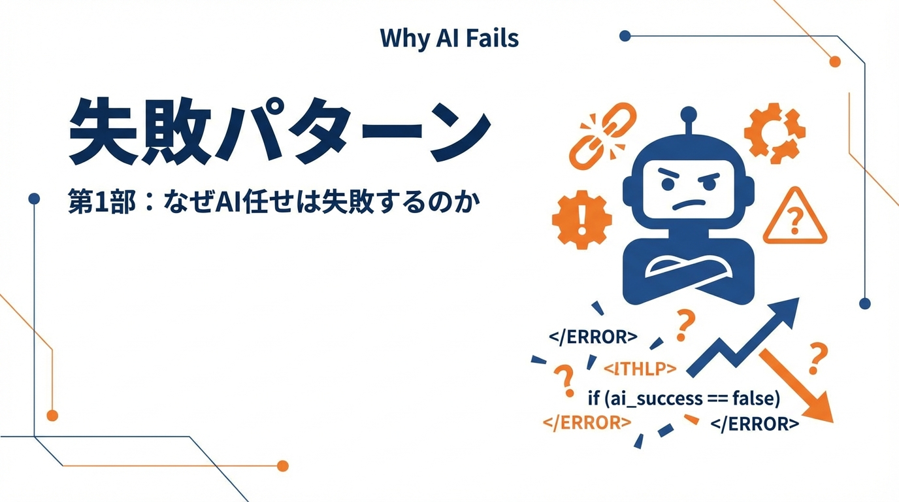

**［第1部］** 「AIに任せれば楽になる」——その期待が裏切られる原因を解明します。vibe codingの限界、PRの肥大化、そしてAIが本当に苦手なこと。失敗パターンを知ることが、成功への第一歩です。

---

# 第1章　AIに全部任せようとして事故る典型パターン

## この章で学ぶこと

- "vibe coding"が破綻する瞬間を理解する
- PRが巨大化・レビュー不能になるメカニズム
- 「AIが賢くない」のではなく「入力が仕様になっていない」という本質

---

## "vibe coding"が破綻する瞬間

### 「なんとなく」で始まる開発

AIコーディングツールを使い始めたエンジニアが最初にやりがちなのが、 **"vibe coding"** です。

```
「なんかいい感じにユーザー認証作って」
「このAPIをRESTfulに直して」
「エラーハンドリングをいい感じに」
```

「いい感じ」「なんとなく」——この曖昧な指示でも、AIは何かを生成します。そして、その生成されたコードは、一見すると動いているように見えます。

**ここが罠です。**

### 暗黙知の推測ゲーム

vibe codingが破綻するのは、**AIが暗黙知を推測し始める瞬間** です。

あなたのプロジェクトには、明文化されていないルールがたくさんあります。

- 「認証はJWTを使う」（どこにも書いていない）
- 「エラーレスポンスはこの形式」（過去のコードを見ればわかる）
- 「この関数は非同期で呼ばれる前提」（設計時の暗黙の了解）
- 「テストはこのパターンで書く」（チームの慣習）

AIはこれらを**知りません**。

知らないから、推測します。推測は、プロジェクトの文脈と乖離します。乖離したコードは、レビューで弾かれるか、より悪いケースでは本番で事故を起こします。

### 破綻のシグナル

vibe codingが限界に達したときに現れるシグナル：

1. **「なんでこうなった？」が増える**
   - コードの意図が読めない
   - AIの判断根拠が不明
   - 修正しようにも、どこを直せばいいかわからない

2. **レビューコメントが膨大になる**
   - 「ここ、うちのプロジェクトではこう書く」の連発
   - 同じ指摘が何度も繰り返される

3. **「もう一度書いて」が頻発する**
   - 微調整では済まず、全面書き直しになる
   - 結局、手で書いた方が早かった

#### 実際に起きた失敗事例

あるチームで、「決済画面のUIを改善して」という指示でAIにコードを生成させました。AIは見た目の良いUIを生成しましたが、3つの問題が発生しました。

1つ目は、既存のデザインシステムを無視したことです。プロジェクトにはコンポーネントライブラリがありましたが、AIはそれを知らず、独自のスタイルを生成しました。結果、他の画面と統一感のないUIになりました。

2つ目は、アクセシビリティ要件を満たしていなかったことです。このプロジェクトではWCAG 2.1 AAに準拠する必要がありましたが、AIが生成したコードはコントラスト比やキーボードナビゲーションの要件を満たしていませんでした。

3つ目は、エラーハンドリングが不十分だったことです。決済エラー時の表示が「エラーが発生しました」という汎用メッセージだけで、カード番号の誤りなのか、残高不足なのか、ネットワークエラーなのか、ユーザーには区別できませんでした。

これらの問題は、「UIを改善」という曖昧な指示に、デザインシステムの参照、アクセシビリティ要件、エラーハンドリング方針が含まれていなかったことが原因です。

---

## PRが巨大化する／レビュー不能になる／仕様が消える

### なぜPRは巨大化するのか

「ログイン機能を作って」——この一言で、AIは何を作るでしょうか？

- ログインフォームのUI
- バリデーションロジック
- API呼び出し
- 認証トークンの保存
- エラーハンドリング
- 成功時のリダイレクト
- ログアウト機能も「あった方がいいだろう」と追加
- パスワードリセット機能も「普通はあるよね」と追加

1つの指示から、**関連しそうなもの全部** を生成しようとします。

結果、PRは何百行、何千行にもなります。

### レビュー不能のメカニズム

巨大なPRがレビュー不能になる理由は単純です。

**人間がレビューできる限界は、1回あたり200〜400行程度** と言われています。

それを超えると：
- 細部を見落とす
- 「まあ動いてるからいいか」という妥協が生まれる
- セキュリティホールやパフォーマンス問題が見逃される

また、巨大なPRは**変更の意図を追跡できなくなります**。

「なぜこのファイルが変更されているのか」
「この変更は本当に必要だったのか」
「別の方法はなかったのか」

これらの問いに答えられないPRは、レビューしようがありません。

### 仕様が消える

最も深刻な問題は、**仕様が消える**ことです。

AIに「ログイン機能を作って」と言ったとき、その仕様はどこにありますか？

- チャットログの中？（1週間後には埋もれる）
- あなたの頭の中？（共有されていない）
- なんとなくの合意？（明文化されていない）

仕様が明文化されていなければ、**何が正しいのか判断できません**。

- このバリデーションルールは正しいのか？
- エラーメッセージの文言は意図通りか？
- リダイレクト先はこれでよかったのか？

レビュワーも、実装者も、後から見た人も、誰も判断できない。

これが「仕様が消える」という状態です。

#### 仕様消失がもたらす具体的なコスト

仕様が消えることの影響を、ある開発チームの実測値で示します。

このチームでは、仕様が明文化されていない機能についてバグ報告があったとき、平均して以下の時間がかかっていました。

- **仕様の確認**：45分（Slackの過去ログを検索、関係者に確認）
- **「正しい動作」の合意形成**：30分（複数人で議論）
- **修正の実装**：20分（実際のコード変更）
- **レビュー**：15分

つまり、修正自体は20分で終わるのに、「何が正しいか」を確認するだけで75分かかっていました。修正時間の3.75倍です。

さらに深刻だったのは、同じ機能について異なる解釈で実装されたケースです。AさんとBさんが別々のPRで同じ機能に触れ、それぞれ異なる「正しい動作」を想定して実装しました。結果、本番で矛盾した動作が発生し、緊急対応に4時間を要しました。

仕様を明文化するのに必要な時間は、1機能あたり30分程度です。この30分を惜しんで、何倍もの時間を無駄にしていたことになります。

---

## 「AIが賢くない」のではなく「入力が仕様になっていない」

### 責任の所在を正しく理解する

ここまでの問題を見て、「やっぱりAIはまだ使えない」と結論づけるのは早計です。

問題の構造を整理しましょう。

| 現象 | よくある誤解 | 本当の原因 |
|------|------------|-----------|
| 意図と違うコードが生成される | AIの理解力が低い | 意図が明示されていない |
| PRが巨大になる | AIが勝手に拡張する | スコープが定義されていない |
| 仕様と合わない | AIがプロジェクトを知らない | 仕様がAIに渡されていない |
| 同じミスを繰り返す | AIが学習しない | ナレッジがフィードバックされていない |

すべての原因は、**「入力」の問題** です。

### LLMの動作原理を思い出す

生成AIは、与えられた入力から「最も確率の高い続き」を生成します。

入力が曖昧なら、出力も曖昧になります。
入力がブレれば、出力もブレます。
入力に含まれていない情報は、推測するしかありません。

これはAIの限界ではなく、**AIの仕様** です。

### 入力を「仕様」にする

解決策は明確です。

**AIへの入力を「仕様」にする**。

仕様とは何か？

- 何を作るのか（要件）
- どう作るのか（設計制約）
- 何を作らないのか（スコープ外）
- 何が正しいのか（受け入れ基準）
- どこに置くのか（既存コードとの関係）

これらが明示されていれば、AIは推測する必要がありません。

推測が不要なら、ブレません。
ブレなければ、レビューも楽になります。
レビューが楽なら、品質も上がります。

---

## 章末チェックリスト

この章の内容を実践に移すためのチェックリスト：

- [ ] 自分の指示が「vibe coding」になっていないか振り返る
- [ ] 最近のPRサイズを確認し、200行を超えているものを特定する
- [ ] 仕様がチャットログにしか残っていないケースを洗い出す
- [ ] 「AIが悪い」と思った場面を、「入力が不十分だった」視点で再評価する

---

## 次章への橋渡し

この章では、AI活用が失敗する典型パターンを見てきました。

次章では、**なぜAIが「心を読めない」のか** をより深く理解します。LLMの得意・不得意を正確に把握することで、「何を明示すべきか」がクリアになります。

---

## 🥷 AI侍道場 - vibe codingが破綻する本質

【AI侍】「さて、この章で学んだvibe codingの本質を斬ってみせよう」

【DJ町娘】「AI侍さん、vibe codingって『いい感じに作って』って言うやつですよね？なんで破綻しちゃうんですか？」

【AI侍】「**AIは心を読めないからだ**。人間の『いい感じ』は、暗黙の文脈に満ちている。だがAIにはその文脈が見えぬ」

【DJ町娘】「暗黙の文脈...？」

【AI侍】「うむ。『認証を作って』と言った時、お前は頭の中でこう考えている——『JWTを使って』『トークンはlocalStorageに保存して』『エラーは統一フォーマットで』...だがそれを**言葉にしていない**」

【DJ町娘】「あっ...確かに、当たり前すぎて言わないかも」

【AI侍】「その『当たり前』がAIには見えない。だからAIは推測する。推測は外れる。外れたコードは修正が必要になる。これがvibe codingの破綻である」

---

### 🗡️ AI侍の秘伝書

vibe codingから脱却する3つの極意を授ける。

#### 秘伝その1：「いい感じ」を分解せよ

「いい感じ」という言葉を使いたくなったら、それを5W1Hで分解せよ。

**❌ 悪い例（vibe coding）**：
```markdown
認証機能を作って。いい感じにお願い。
```

**⭕ 良い例（分解された指示）**：
```markdown
## What（何を）
- メールアドレスとパスワードでのログイン機能

## Why（なぜ）
- ユーザーごとに異なるデータを表示するため

## How（どう）
- JWT認証（HS256）
- トークン有効期限は24時間
- リフレッシュトークンは使用しない（今回）

## Where（どこに）
- `/src/auth/login.ts`（ロジック）
- `/src/middleware/auth.ts`（検証）

## When（いつ）
- POSTリクエスト時に認証
- 以降の全APIリクエストでトークン検証

## Who（誰が）
- 一般ユーザー（管理者権限は別途実装）
```

5W1Hで分解すれば、AIは推測せずに正確に実装できる。

#### 秘伝その2：「当たり前」を疑え

チーム内で「当たり前」と思っていることこそ、書き出せ。**暗黙知を明示知に変えるのだ**。

**❌ 悪い例（暗黙のまま）**：
AIに「エラー処理を追加して」とだけ伝える
→ AIは独自の判断で `throw new Error("Something went wrong")` を書く

**⭕ 良い例（PATTERNS.mdに明示）**：
```markdown
## エラーハンドリング規約

### エラーレスポンス形式（統一）
```typescript
{
  "error": {
    "code": "VALIDATION_ERROR",
    "message": "メールアドレスの形式が正しくありません"
  }
}
```

### プロジェクト固有の「当たり前」リスト
- ✅ 認証方式：JWT（HS256、有効期限24h）
- ✅ ファイル名：kebab-case（例：`user-service.ts`）
- ✅ テストパターン：Arrange-Act-Assert
- ✅ コミットメッセージ：Conventional Commits形式
```

これらをPATTERNS.mdに書けば、AIは「プロジェクトの当たり前」を共有できる。

#### 秘伝その3：スコープを明示せよ

「ログイン機能を作って」と言うと、AIはログアウト、パスワードリセット、2段階認証まで作ろうとする。

**今回作るもの**と**今回作らないもの**を明示せよ。

```markdown
## 今回作るもの
- メールアドレスとパスワードでのログイン
- JWT発行

## 今回作らないもの
- ログアウト機能（別Issue）
- パスワードリセット（Phase 2）
- ソーシャルログイン（スコープ外）
```

---

### 🎧 DJ町娘のまとめ

【DJ町娘】「なるほど！つまり、**vibe codingが破綻するのは、AIが心を読めないから**なんですね。だから『いい感じ』じゃなくて、『具体的に何をどう作るか』を言葉にする必要がある✨」

【AI侍】「その通りである。AIは強力な道具だが、道具は正しく扱わねば刃は立たぬ。次章では、AIの得意不得意をさらに深く学ぶ。準備はよいか？」

【DJ町娘】「はい！バッチリです🎧」

---
