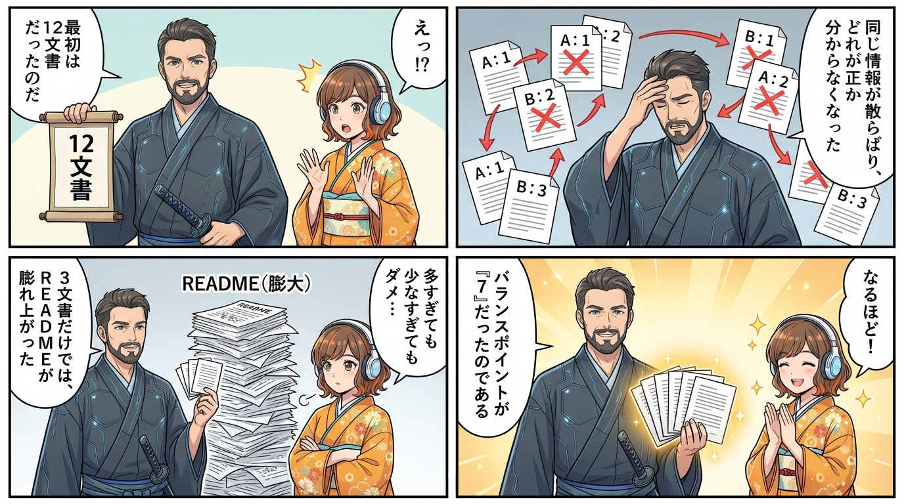
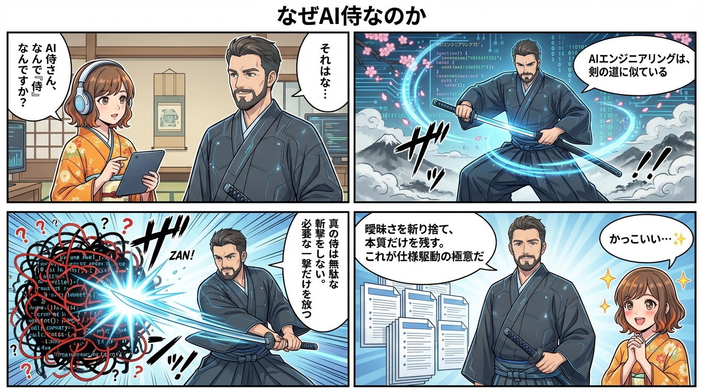
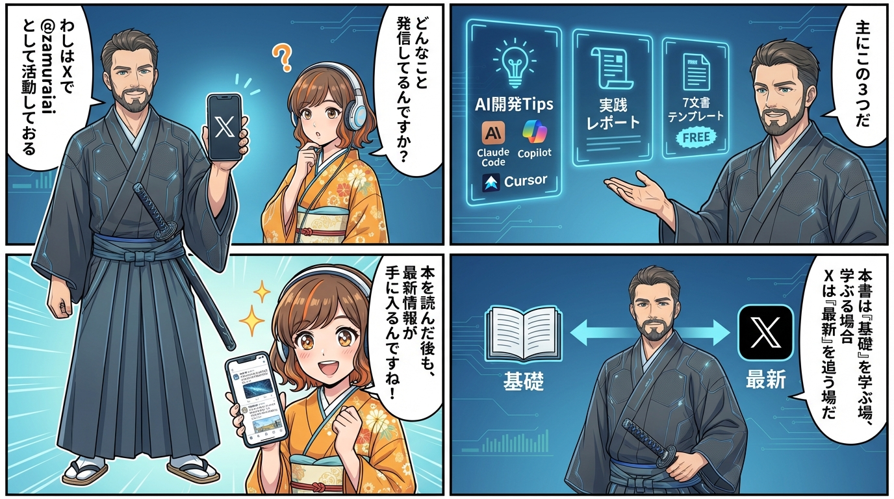

---

# 🍵 AI侍と町娘の茶話 - 7文書誕生秘話

---

## 著者の裏話：なぜ「7」という数なのか

試行錯誤の末、**情報の重複を避けつつ、必要な情報が欠けない**バランスポイントが「7」だったのです。

なお、7文書はあくまで**プロジェクト開始時点での最小限セット**です。プロジェクトが進むにつれて、運用手順書やトラブルシューティングガイドなど、文書は必然的に増えていきます。大切なのは、最初から大量の文書を用意しようとするのではなく、**まず7文書で土台を固め、必要に応じて拡張していく**というアプローチです。

---

## なぜ「AI侍」なのか

**曖昧さを斬り捨て、本質だけを残す**——これがAI仕様駆動開発の極意です。

---

## Xでの活動について

AI侍は X（旧Twitter）で [@zamuraiai](https://twitter.com/zamuraiai) として活動しています。本書は「基礎」を学ぶ場、Xは「最新」を追う場です。AI開発の世界は日進月歩——本書で土台を固めたら、ぜひXで最新情報もチェックしてみてください。

---
