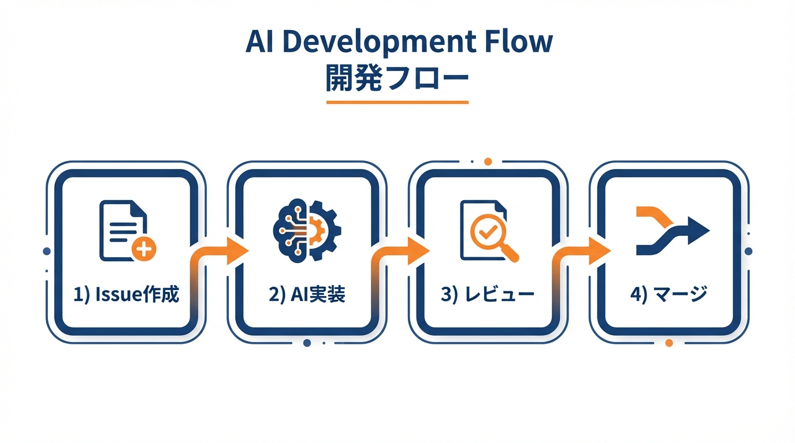

# 第7章　日々の開発フロー：AIに"タスク"を渡す前にやること

## この章で学ぶこと

- Issueベースのスコープ絞り込み
- **Issue = AIへのコンテキスト選択**という考え方
- AIに渡す前の3つの確認ポイント
- 70%完成度でのPR運用の具体的な流れ

---

## Issueベースの開発フロー全体像



### フローの概要

```
1. Issueを作成（スコープを絞る）
   ↓
2. 3つの確認（仕様・設計・テスト）
   ↓
3. AIにタスクを渡す
   ↓
4. 70%完成度でPRを作成
   ↓
5. レビュー→修正→マージ
   ↓
6. 指摘をナレッジ化
```

このフローを回すことで、AIの出力品質は継続的に向上します。

---

## ステップ1：Issueを作成する

### なぜIssueから始めるのか

「ログイン機能を作って」とAIに直接指示するのではなく、**まずIssueを作る**。

これには3つの理由があります。

1. **スコープが明確になる**：何を作る/作らないが記録される
2. **追跡可能になる**：後から「なぜこう実装したか」がわかる
3. **AIへの入力になる**：Issueそのものがコンテキストになる

### 良いIssueの構造

```markdown
## Issue #42: [機能名の動詞形]

### 背景
[なぜこの機能が必要か、1〜2文で]

### 受け入れ基準
- [ ] [具体的な動作1]
- [ ] [具体的な動作2]
- [ ] [具体的な動作3]

### 技術的制約
- [使用すべきライブラリ/パターン]
- [既存コードとの接続点]
- [パフォーマンス要件]

### スコープ外
- [明示的に今回やらないこと]

### 関連文書
- [ARCHITECTURE.md#認証](../docs/ARCHITECTURE.md#認証)
- [DOMAIN.md#ユーザー](../docs/DOMAIN.md#ユーザー)
```

### 具体例：ログイン機能

```markdown
## Issue #42: ログインAPIエンドポイントの実装

### 背景
ユーザーがメールアドレスとパスワードでログインできるようにする。
セキュリティ要件としてブルートフォース対策を含む。

### 受け入れ基準
- [ ] POST /api/v1/auth/login でログインできる
- [ ] 成功時はJWTトークン（アクセス/リフレッシュ）を返す
- [ ] パスワード誤り5回でアカウントを15分ロック
- [ ] ログイン試行を監査ログに記録

### 技術的制約
- JWT署名はRS256（既存の鍵ペアを使用）
- リフレッシュトークンはRedisに保存
- パスワード検証はArgon2id
- レート制限はRedisのスライディングウィンドウ

### スコープ外
- パスワードリセット（Issue #43）
- OAuth/ソーシャルログイン（Issue #44）
- MFA（Issue #45）

### 関連文書
- [ARCHITECTURE.md#認証フロー](../docs/ARCHITECTURE.md#認証フロー)
- [DOMAIN.md#認証ルール](../docs/DOMAIN.md#認証ルール)
```

### 悪いIssueの例と改善

良いIssueの例を見ましたが、「悪いIssue」を知ることも重要です。実際にAIの出力が乱れた例を紹介します。

#### 受け入れ基準が曖昧なIssue

```markdown
## Issue #99: ユーザー管理機能の改善

### 背景
ユーザー管理画面が使いにくいので改善したい。

### 受け入れ基準
- [ ] UIを改善する
- [ ] パフォーマンスを向上させる
- [ ] エラーハンドリングを追加する
```

このIssueでは、AIは「UIを改善する」の意味を推測するしかありません。結果、デザイナーの意図とは違うレイアウト変更をしたり、不要な機能を追加したりします。「テーブルのソート機能を追加する」「ローディング表示を0.5秒以内にする」のように、**検証可能な基準**を書く必要があります。

#### 技術的制約が欠落したIssue

```markdown
## Issue #100: メール送信機能を追加

### 受け入れ基準
- [ ] ユーザー登録時にメールを送信する
```

技術的制約がないため、AIは自由にメール送信ライブラリを選びます。プロジェクトで使っているSendGridではなく、別のサービスを使った実装が出てくるかもしれません。また、既存のメール送信基盤があることを知らずに、一から実装することもあります。

#### スコープ外が不明確なIssue

```markdown
## Issue #101: 検索機能を実装

### 受け入れ基準
- [ ] 商品を検索できる
```

スコープ外が書かれていないと、AIは「全文検索も必要？」「ファセット検索は？」「オートコンプリートは？」と拡大解釈しがちです。本来はシンプルなキーワード検索だけでよかったのに、Elasticsearchを使った本格的な検索基盤を提案されることがあります。

---

## Issue = AIへのコンテキスト選択

### 全7文書を毎回読む必要はない

ここで重要な概念を紹介します。

**Issue作成とは、「AIに何を読ませるか」を選択する行為**です。

プロジェクトには7文書（MASTER、PROJECT、ARCHITECTURE、DOMAIN、PATTERNS、TESTING、DEPLOYMENT）があり、さらに開発が進むとADR、ナレッジ、詳細仕様など、文書は増えていきます。

しかし、**すべてのタスクで全文書を読む必要はありません**。

- ログイン機能の実装 → ARCHITECTURE（認証フロー）、DOMAIN（認証ルール）を読めばよい
- CSSの修正 → PATTERNSのスタイリング規約だけで十分
- デプロイ設定の変更 → DEPLOYMENTのみ

Issueの「関連文書」セクションは、**AIに「このタスクではこれだけ読めばよい」と指示する場所**なのです。

### タスク種別ごとの推奨参照文書

以下の表を参考に、タスク種別に応じた文書を選択してください。

| タスク種別 | 必須参照 | 推奨参照 | 通常不要 |
|-----------|---------|---------|---------|
| 新機能追加 | MASTER, ARCHITECTURE, DOMAIN | PATTERNS, TESTING | DEPLOYMENT |
| バグ修正 | 関連Issue, PATTERNS | TESTING | DOMAIN全体 |
| リファクタリング | ARCHITECTURE, PATTERNS | TESTING | DOMAIN |
| インフラ変更 | MASTER, DEPLOYMENT | ARCHITECTURE | DOMAIN |
| ドキュメント更新 | MASTER | 対象文書 | その他 |

**ポイント**：
- 「必須参照」はIssueに必ずリンクを記載
- 「通常不要」は明示的に「スコープ外」に記載することで、AIの無駄な参照を防ぐ

### 関連Issueの参照

過去の類似Issueも重要なコンテキストです。

```markdown
### 関連Issue
- #123 ログイン機能の基本実装（参考：認証フローの詳細）
- #145 認証エラーハンドリング（参考：エラーレスポンス形式）
```

関連Issueを参照することで：
- **過去の設計判断**を引き継げる
- **同じ失敗**を繰り返さない
- **一貫した実装**が得られる

### スコープ外の明示

「読まなくてよい文書」を明示することも重要です。

```markdown
### スコープ外（今回は参照不要）
- DEPLOYMENT.md（インフラ変更なし）
- GLOSSARY.md（新用語の追加なし）
- PROJECT.md（ビジネス要件に変更なし）
```

これにより、AIは**必要なコンテキストだけに集中**できます。

### 「読まなくてよい」の判断基準

「スコープ外」に何を書くべきか、迷うことがあります。以下の判断基準を参考にしてください。

「このタスクの実装中に、その文書を参照する場面があるか？」を問いかけます。

- DEPLOYMENT.md：「このコードはどうデプロイされるか」を意識する必要があるか？→ 通常のバックエンド実装なら不要
- PROJECT.md：「なぜこの機能が必要か」を確認する必要があるか？→ 要件が明確なら不要
- DOMAIN.md：「このビジネスルールに従うべきか」を確認する必要があるか？→ 技術的なリファクタリングなら不要

逆に、「必要かもしれない」と思ったら**スコープ外に入れない**ことが重要です。AIが必要な情報を見つけられないほうが、余計な情報を読むよりも問題が大きいからです。

注意点として、過剰にコンテキストを絞りすぎると、AIが既存のパターンを無視した実装をすることがあります。迷ったら「PATTERNS.mdは常に参照」としておくと、一貫性のある実装が得られます。

---

## ステップ2：3つの確認ポイント

Issueを作成したら、AIに渡す前に**3つの確認**を行います。

### 確認1：仕様の粒度

**受け入れ基準が具体的に書けているか？**

```markdown
❌ 曖昧な受け入れ基準
- [ ] ログインできる
- [ ] エラーハンドリングする

✅ 具体的な受け入れ基準
- [ ] POST /api/v1/auth/login でログインできる
- [ ] メール/パスワードが正しければ200とトークンを返す
- [ ] メールが存在しなければ401とエラーメッセージを返す
- [ ] パスワードが間違っていれば401とエラーメッセージを返す
```

確認の問い：**「これを読んだ人が、テストケースを書けるか？」**

### 確認2：設計の粒度

**アーキテクチャ制約が明示されているか？**

```markdown
❌ 制約が不明確
- 認証を実装する

✅ 制約が明確
- JWT署名はRS256
- 既存のauthServiceを拡張
- エラーレスポンスはsrc/errors/auth.tsの形式
```

確認の問い：**「どこに・どう実装すべきか、迷う余地がないか？」**

### 確認3：テストの粒度

**テストが仕様を「代替」していないか？**

これは重要なポイントです。

```markdown
❌ テストが仕様の代替になっている
「テストコード見ればわかるでしょ」
→ テストを読まないと要件がわからない

✅ 仕様が先、テストは検証
1. 仕様（Issue）：「パスワード誤り5回でロック」
2. テスト：その仕様をコードで検証
```

確認の問い：**「仕様を読まずにテストだけ見て、正しさを判断できるか？」**

→ できてしまうなら、仕様が足りない。

#### 「仕様が先」を実践する難しさ

「仕様が先、テストは検証」という考え方は、TDD（テスト駆動開発）に慣れた人には違和感があるかもしれません。TDDでは「テストを先に書く」ことで要件を明確にするアプローチを取るからです。

しかし、AI仕様駆動開発で「仕様が先」と言っているのは、**人間が書くべき仕様の話**です。テストコードではなく、自然言語で書かれた仕様（Issue、受け入れ基準、DOMAIN.mdのルールなど）が先に存在すべきという意味です。

実際のワークフローでは、こう考えてください。

1. **人間が仕様を書く**：「パスワード誤り5回でロック」（Issueの受け入れ基準）
2. **AIがテストを生成**：仕様に基づいたテストコード
3. **AIが実装を生成**：テストを通す実装コード

この順序であれば、テストは「仕様の検証」として機能します。一方、テストコードだけを見て「これが仕様だ」と言われても、AIは文脈がわかりません。「なぜ5回なのか」「15分ロックの根拠は？」といった背景情報はテストコードには書かれていないからです。

TDDの「テストファースト」とAI仕様駆動開発の「仕様ファースト」は矛盾しません。人間が仕様を書き、AIがテストと実装を生成する。この分担がポイントです。

---

## ステップ3：AIにタスクを渡す

### プロンプトの構造

```markdown
## タスク
Issue #42 を実装してください。

## コンテキスト
- Issue: [IssueのURL or 内容をコピー]
- 関連文書:
  - docs/ARCHITECTURE.md
  - docs/DOMAIN.md
  - docs/PATTERNS.md

## 制約
- 既存の認証サービス（src/services/auth/）を拡張する形で実装
- 新規ファイルは src/services/auth/login.ts に作成
- テストは src/services/auth/__tests__/login.test.ts に作成

## 出力
1. 実装コード
2. テストコード
3. 影響を受ける既存ファイルの変更点
```

### AIコーディングツールを使う場合

Claude Code、GitHub Copilot、Cursorなど、いずれのツールでもIssueの内容をそのまま渡せます。

```bash
# Claude Codeの例
claude "Issue #42 を実装して。docs/配下の仕様に従って。"

# GitHub Copilot（チャット）の例
# @workspace Issue #42 を実装して。docs/配下の仕様に従って。
```

7文書がリポジトリにあれば、AIツールは自動的に参照します。

---

## ステップ4：70%完成度でPRを作成

### 完璧を求めない

AIが生成したコードを見て、「ここが微妙だな」と思うことがあるでしょう。

**そこで止まらないでください。**

70%の完成度でPRを出す理由：

1. **レビューで具体的な指摘を得られる**
2. **指摘内容がAIへの次の入力になる**
3. **完璧を目指す時間より、反復の方が速い**

### PRの書き方

```markdown
## PR #42: ログインAPIエンドポイントの実装

### 概要
Issue #42 の実装です。

### 変更内容
- `src/services/auth/login.ts`: ログインサービスを追加
- `src/api/routes/auth.ts`: ログインエンドポイントを追加
- `src/services/auth/__tests__/login.test.ts`: テストを追加

### 確認ポイント
- [ ] JWT署名がRS256になっているか
- [ ] ブルートフォース対策が正しく動作するか
- [ ] エラーレスポンスの形式が統一されているか

### 今後の対応（レビュー後）
- エッジケースの追加テスト
- パフォーマンス最適化（必要に応じて）

### 関連
- Closes #42
```

---

## ステップ5：レビュー→修正→マージ

### レビュー指摘をAIに渡す

レビューコメントは、**AIへの次の入力として最適**です。

```markdown
## レビュー指摘
「validateCredentials関数、バリデーションとDB問い合わせが混ざってる。分離して。」

## AIへの指示
上記のレビュー指摘に対応してください。
validateCredentials関数を以下のように分割してください：
1. validateLoginInput: 入力値のバリデーション
2. findUserByEmail: ユーザー検索
3. verifyPassword: パスワード検証

それぞれ単一責任になるよう実装してください。
```

レビュー指摘には**具体的な問題と期待される解決方向**が含まれているため、AIは的確に修正できます。

### 反復の効果

```
1回目のPR → レビュー指摘5件
  ↓ AIで修正
2回目 → レビュー指摘2件
  ↓ AIで修正
3回目 → LGTM
```

反復するたびに、**スコープがさらに狭まる**ため、AIの出力精度は上がります。

---

## ステップ6：指摘をナレッジ化

### 繰り返される指摘を記録する

レビューで同じ指摘が何度も出る場合、それは**PATTERNS.mdに蓄積すべき知識**です。

```markdown
## よくある指摘と対応

### 関数の責務分離
❌ 1つの関数で複数のことをする
✅ 単一責任の関数に分割する

例：
- validateAndSave → validate + save
- fetchAndTransform → fetch + transform

### エラーレスポンスの統一
❌ throw new Error('message')
✅ return err(new SpecificError(details))

### テストの粒度
❌ 1つのテストで複数のケースをテスト
✅ 1テスト1ケース（Arrange-Act-Assert）
```

### 自動チェックへの昇格

何度も指摘されるパターンは、**自動チェックに組み込む**ことを検討します。

- ESLintカスタムルール
- pre-commitフック
- サブエージェントによるレビュー

これにより、「指摘される前に防ぐ」サイクルが回り始めます。

---

## 章末チェックリスト

- [ ] 次のタスクをIssueとして作成する
- [ ] Issueに「受け入れ基準」「技術的制約」「スコープ外」を含める
- [ ] **タスク種別に応じた必須参照文書を選択する**
- [ ] **関連Issueをリンクする**
- [ ] **読む必要のない文書を「スコープ外」に明記する**
- [ ] AIに渡す前に3つの確認（仕様・設計・テスト）を行う
- [ ] 70%完成度でPRを出す心構えを持つ
- [ ] レビュー指摘はAIへの入力として活用する
- [ ] 繰り返される指摘はPATTERNS.mdに記録する

---

## 次章への橋渡し

この章では、日々の開発フローを学びました。

次章では、**文書追加の意思決定**——「この情報はどの文書に置くべきか」という判断基準を解説します。
