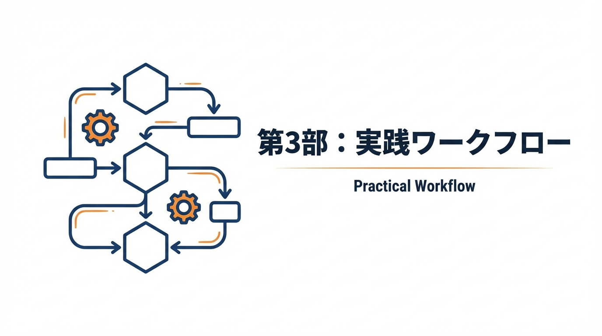

**［第3部］** 理論から実践へ。新規プロジェクトでの始め方、既存プロジェクトへの導入、日々の開発フロー、文書追加の判断基準、変更時の影響度評価まで。明日から使える具体的なワークフローを解説します。

---

# 第8章　導入手順：既存プロジェクト／新規プロジェクト

## この章で学ぶこと

- 新規プロジェクトでの7文書構成の始め方
- 既存プロジェクトへの段階的な導入方法
- 「最初から完璧」を捨てる実践的アプローチ

---

## 新規プロジェクト：docs構造を作り、最初の7文書を生成する

新規プロジェクトでは、**コードを1行も書く前に、まず7文書の構造を作ります**。

なぜ最初にドキュメントなのか。第1部で見たように、AIは「何を作るか」が曖昧なまま指示を受けると、推測で補完して意図しない実装をします。7文書を先に用意することで、AIに「この仕様に従って実装して」と明確な指示を出せるようになります。

また、プロジェクト開始時が最も構造を整えやすいタイミングです。既存コードがない状態なら、理想的なディレクトリ構成を自由に決められます。後からドキュメントを追加するより、最初から「ドキュメントありき」で始める方が定着しやすいのです。

最初の7文書は完璧である必要はありません。「TODO」や「未定」と書いておき、プロジェクトが進むにつれて埋めていきます。大切なのは**構造が最初から存在すること**です。

### ステップ1：ディレクトリ構造の作成

まず、番号付きディレクトリ構造を作成します。番号付けにより、ファイルが増えても整理しやすくなります。

```bash
# ディレクトリ構造を作成
mkdir -p docs/{00-planning,01-context,02-design,03-implementation,04-quality,05-operations,06-reference,07-project-management,08-knowledge}

# 7文書を作成
touch docs/MASTER.md
touch docs/01-context/PROJECT.md
touch docs/02-design/ARCHITECTURE.md
touch docs/02-design/DOMAIN.md
touch docs/03-implementation/PATTERNS.md
touch docs/04-quality/TESTING.md
touch docs/05-operations/DEPLOYMENT.md
```

作成される構造：

```text
docs/
├── MASTER.md                      # 索引・ナビゲーション
├── 00-planning/                   # 企画段階の文書
├── 01-context/
│   └── PROJECT.md                 # ビジョン・要件
├── 02-design/
│   ├── ARCHITECTURE.md            # システム設計
│   └── DOMAIN.md                  # ビジネスロジック
├── 03-implementation/
│   └── PATTERNS.md                # 実装パターン
├── 04-quality/
│   └── TESTING.md                 # テスト戦略
├── 05-operations/
│   └── DEPLOYMENT.md              # 運用手順
├── 06-reference/                  # API仕様・外部参照
├── 07-project-management/         # 進捗・チケット管理
└── 08-knowledge/                  # ナレッジ・ADR
```

### ステップ1.5：AIエージェント設定ファイルの作成（任意）

多くのAIコーディングツールは、リポジトリルートの設定ファイルを自動で読み込みます。

| ツール | 設定ファイル |
|--------|-------------|
| Claude Code | `CLAUDE.md` |
| GitHub Copilot, Cursor, Codex等 | `AGENTS.md` |

7文書構成と連携させる最小限の設定例：

```markdown
# CLAUDE.md（または AGENTS.md）

このリポジトリでは docs/ 配下の7文書に仕様が記載されています。
実装前に必ず docs/MASTER.md を読んでください。
```

> **Note**: 詳細は「付録：AIエージェント設定ファイル一覧」を参照してください。

### ステップ2：MASTER.mdを最初に書く

MASTER.mdは他の文書へのナビゲーションです。最初に骨格を作ります。

```markdown
---
title: MASTER.md
version: 0.1.0
status: draft
owner: "@your-name"
created: 2026-01-01
updated: 2026-01-01
---

# プロジェクト名

## 概要
[1〜2文でプロジェクトの目的を記述]

## 技術スタック
- 言語：[未定]
- フレームワーク：[未定]
- データベース：[未定]

## 文書索引
| 文書 | 状態 | 説明 |
|------|------|------|
| [PROJECT.md](./01-context/PROJECT.md) | draft | ビジョン・要件 |
| [ARCHITECTURE.md](./02-design/ARCHITECTURE.md) | draft | システム設計 |
| [DOMAIN.md](./02-design/DOMAIN.md) | draft | ビジネスロジック |
| [PATTERNS.md](./03-implementation/PATTERNS.md) | draft | 実装パターン |
| [TESTING.md](./04-quality/TESTING.md) | draft | テスト戦略 |
| [DEPLOYMENT.md](./05-operations/DEPLOYMENT.md) | draft | 運用手順 |

## ディレクトリ構造
```text
（プロジェクト構造が決まり次第記述）
```
```

### ステップ3：PROJECT.mdでビジョンを固める

技術的な詳細より先に、「何を作るのか」「誰のためか」を明確にします。

```markdown
---
title: PROJECT.md
version: 0.1.0
status: draft
owner: "@your-name"
created: 2026-01-01
updated: 2026-01-01
---

# PROJECT.md

## ビジョン
[このプロジェクトが実現したい世界を1〜2文で]

## 解決する課題
[ユーザーが抱える具体的な問題]

## ターゲットユーザー
- ペルソナ1：[具体的な人物像]
- ペルソナ2：[具体的な人物像]

## 主要機能（MVP）
1. [機能A]：[説明]
2. [機能B]：[説明]
3. [機能C]：[説明]

## スコープ外（MVPでは作らないもの）
- [機能X]：[理由]
- [機能Y]：[理由]
```

### ステップ4：残りの文書は「最小限」で開始

最初から完璧な文書を作る必要はありません。各文書は**見出しだけ** でも構いません。

```markdown
---
title: ARCHITECTURE.md
version: 0.1.0
status: draft
owner: "@your-name"
created: 2026-01-01
updated: 2026-01-01
---

# ARCHITECTURE.md

## システム構成
（設計が進んだら記述）

## 技術スタック
（決定次第記述）

## コンポーネント設計
（実装開始時に記述）
```

**大事なのは「場所を確保すること」** です。

---

## 既存プロジェクト：既存設計を"吸い上げ"て、欠けた文書を補完する

### ステップ1：現状把握

既存プロジェクトには、散在した情報がすでにあります。まずそれを洗い出します。

```markdown
## 既存情報の棚卸し

### README.md
- [ ] プロジェクト概要 → MASTER.mdに転記
- [ ] セットアップ手順 → DEPLOYMENT.mdに転記

### 既存ドキュメント
- [ ] API仕様書 → ARCHITECTURE.mdに転記
- [ ] ER図 → DOMAIN.mdに転記
- [ ] テスト手順 → TESTING.mdに転記

### コード内コメント
- [ ] 重要なビジネスロジック → DOMAIN.mdに転記
- [ ] 設計意図のコメント → ARCHITECTURE.mdに転記

### チャットログ・議事録
- [ ] 技術選定の経緯 → ARCHITECTURE.md（ADR）に転記
- [ ] 要件の合意事項 → PROJECT.mdに転記
```

### ステップ2：優先順位をつける

すべてを一度にやろうとしないでください。以下の優先順位で進めます。

| 優先度 | 文書 | 理由 |
|--------|------|------|
| 1 | MASTER.md | 他の文書への入り口 |
| 2 | PATTERNS.md | 日々の開発で最も参照される |
| 3 | ARCHITECTURE.md | 新規実装時に必須 |
| 4 | DOMAIN.md | ビジネスロジックの誤解を防ぐ |
| 5 | TESTING.md | 品質基準を統一 |
| 6 | PROJECT.md | 長期的な方向性 |
| 7 | DEPLOYMENT.md | 運用が安定してから |

#### なぜこの順番なのか

この優先順位には理由があります。

MASTER.mdを最初に作るのは、これがAIにとって「地図」になるからです。MASTER.mdがあれば、AIは「他にどんな文書があるか」「自分が知らない情報はどこを見ればよいか」を把握できます。たとえ他の文書が空でも、「ARCHITECTURE.mdという文書が存在する」という情報自体に価値があります。

次にPATTERNS.mdを優先するのは、日々の開発で最も頻繁に参照されるからです。「変数名の命名規則は？」「エラーハンドリングはどう書く？」といった質問は、毎日のように発生します。PATTERNS.mdがあれば、AIは一貫したコードを生成できます。

ARCHITECTURE.mdを3番目にしたのは、新機能の実装時に必須だからです。「このAPIはどのレイヤーに置く？」「DBへのアクセスはどこで行う？」といった判断に必要です。

PROJECT.mdを後回しにしているのは意外に思われるかもしれません。しかし、既存プロジェクトでは「何を作るか」はすでにコードとして存在しています。まずは「どう作るか」の知識を整理し、「何のために作ったか」は余裕ができてから遡って記録すれば十分です。

### ステップ3：AIに「吸い上げ」を手伝わせる

既存コードから情報を抽出するのは、AIが得意な作業です。

```markdown
## プロンプト例：コードから設計意図を抽出

以下のコードを分析して、ARCHITECTURE.mdに記載すべき設計方針を抽出してください。

[コードを貼り付け]

以下の観点で整理してください：
- レイヤー構成
- 依存関係の方向
- エラーハンドリングのパターン
- 使用しているデザインパターン
```

```markdown
## プロンプト例：テストからテスト戦略を抽出

以下のテストコードを分析して、TESTING.mdに記載すべきテスト方針を抽出してください。

[テストコードを貼り付け]

以下の観点で整理してください：
- テストの種類（Unit/Integration/E2E）
- モック戦略
- テストデータの管理方法
- アサーションのパターン
```

#### 抽出がうまくいかないケース

AIによる抽出がうまくいかないケースもあります。代表的なパターンと対策を紹介します。

##### コードにコメントがほとんどない場合

コメントがないコードからは、「なぜそうしたか」の情報が抽出できません。この場合、gitログを活用します。

```markdown
## プロンプト例：gitログから設計意図を推測

以下のコミット履歴を分析して、設計の変遷と意図を推測してください。

[git log --oneline --since="6 months ago" の出力を貼り付け]
```

##### 設計意図が口頭伝承になっている場合

長く運用されているプロジェクトでは、重要な決定が「暗黙知」になっていることがあります。この場合、関係者へのヒアリングが必要です。ただし、いきなり「設計思想を教えてください」と聞いても答えにくいものです。

効果的なのは、AIが生成した「たたき台」を見せて「ここ違いますか？」と確認する方法です。人は白紙から説明するより、間違いを指摘するほうが簡単です。

```markdown
## ヒアリング用たたき台の作成

以下のコードを分析して、「おそらくこういう設計意図だろう」という仮説を5つ挙げてください。
仮説は「〜のために、〜という設計にしている」という形式で書いてください。

[コードを貼り付け]
```

このたたき台を関係者に見せ、「合っている/違う」を確認することで、暗黙知を効率的に文書化できます。

### ステップ4：段階的に育てる

最初は「現状を記録した」だけの文書でOKです。

その後、以下のタイミングで文書を育てていきます：

- **新機能追加時**：PROJECT.mdに機能を追記、ARCHITECTURE.mdに設計を追記
- **バグ修正時**：DOMAIN.mdにルールを明確化、PATTERNS.mdにアンチパターンを追記
- **レビュー指摘時**：PATTERNS.mdにパターンを蓄積
- **障害発生時**：DEPLOYMENT.mdにRunbookを追加

---

## 「最初から完璧」を捨てる

### パレートの法則を適用する

文書の80%の価値は、20%の労力で生み出せます。

| 完成度 | 得られる価値 | 必要な労力 |
|--------|------------|-----------|
| 20% | 骨格だけでもAIは参照できる | 1時間 |
| 50% | 日常の開発で十分使える | 3時間 |
| 80% | ほぼ完璧、例外対応も記載 | 1日 |
| 100% | 完璧（ただし陳腐化が早い） | 1週間 |

**狙うべきは50%の完成度** です。

### ドラフト→レビュー→更新の反復

完璧を目指すより、**反復で育てる**ほうが効率的です。

```
ドラフト（30分）
  ↓
実際に使ってみる
  ↓
「これが足りない」と気づく
  ↓
更新（15分）
  ↓
また使ってみる
  ↓
...
```

この反復を3回繰り返せば、使い物になる文書が完成します。

### 完璧主義を手放すコツ

「最初から完璧を捨てる」と言っても、エンジニアにとっては心理的に難しいものです。コードには厳密さを求めるのに、ドキュメントだけ「雑でいい」と言われても違和感があります。

ここで大切なのは、**ドキュメントの目的を再認識する**ことです。ドキュメントの目的は「完璧な仕様書を作ること」ではなく、「AIと人間が同じ理解を持つこと」です。AIが正しく動作するために必要な最低限の情報があれば、それで十分なのです。

また、「不完全なドキュメント」と「ドキュメントがない」では、天と地ほどの差があります。50%の完成度でも、AIの出力精度は劇的に改善します。0%から50%への改善効果は、50%から100%への改善効果よりもはるかに大きいのです。

もう一つのコツは、**「書く」ではなく「記録する」と考える**ことです。完璧な文章を書こうとするから手が止まります。「今わかっていることを箇条書きで記録しておく」と考えれば、ハードルは下がります。箇条書きでも、AIは十分に理解できます。

### 「最小限で始める」テンプレート

各文書の最小限バージョンを示します。

```markdown
# ARCHITECTURE.md（最小限版）

## 技術スタック
- Backend: Node.js + Express
- Database: PostgreSQL
- Cache: Redis

## レイヤー構成
API → Service → Repository → Database

## 最重要ルール
- Service層にビジネスロジックを集約
- Repositoryは純粋なデータアクセスのみ
- 直接SQLは書かない（ORMを使用）
```

これだけあれば、AIは「Serviceにロジックを書く」「Repositoryは薄く保つ」という判断ができます。

---

## 章末チェックリスト

### 新規プロジェクトの場合

- [ ] 番号付きディレクトリ構造（00〜08）と7つの文書を作成した
- [ ] MASTER.mdに概要と文書索引を書いた
- [ ] PROJECT.mdにビジョンとMVP機能を書いた
- [ ] 他の文書は見出しだけでも作成した

### 既存プロジェクトの場合

- [ ] 既存情報の棚卸しを行った
- [ ] 優先順位に基づいて、まずMASTER.mdを作成した
- [ ] 次にPATTERNS.md（またはARCHITECTURE.md）を作成した
- [ ] 残りは「今後育てる」と割り切った

---

## 🥷 AI侍道場 - 最初の一歩を踏み出す勇気


---

### 🗡️ AI侍の秘伝書

導入のハードルを下げ、最初の一歩を踏み出す3つの極意。

#### 秘伝その1：3文書から始めよ

7文書すべてを一度に作ろうとするな。まずは最小構成の3つだけ作れ。

- ✅ **MASTER.md**（30分）
  - プロジェクト名、技術スタック、ディレクトリ構造だけ書け
  - 完璧でなくてよい、「地図」があれば十分

- ✅ **ARCHITECTURE.md**（1時間）
  - 主要な技術選定とバージョンを書け
  - なぜその技術を選んだか、1〜2行でいい

- ✅ **PATTERNS.md**（30分）
  - 最近レビューで指摘されたことを3つ書け
  - これだけで同じ指摘は減る

合計2時間で、AIが動き出せる環境が整う。

#### 秘伝その2：既存プロジェクトは「棚卸し」から

既存プロジェクトでは、いきなり文書を作るな。まず**棚卸し**せよ。

**Step 1：情報を集める**（1時間）
- README、Wiki、過去のIssue、チャットログを読む
- 「暗黙のルール」をリストアップする

**Step 2：優先順位をつける**（30分）
- 「AIが最も困りそうなこと」を3つ選ぶ
- 例：認証方式、エラーハンドリング、コーディング規約

**Step 3：その3つだけ文書化**（1時間）
- 該当する文書（大抵はARCHITECTUREかPATTERNS）に追記

合計2.5時間で、「AIがもっとも困る部分」を潰せる。

#### 秘伝その3：「育てる」ことを前提にせよ

最初から完璧な文書は存在しない。**レビュー指摘→文書追記**のサイクルを回せ。

```text
1. AIに実装させる
2. レビューで指摘が出る
3. 指摘内容を該当文書に追記
4. 次回から同じ指摘は出ない
```

このサイクルを10回回せば、プロジェクト固有の「仕様OS」が育つ。

---
