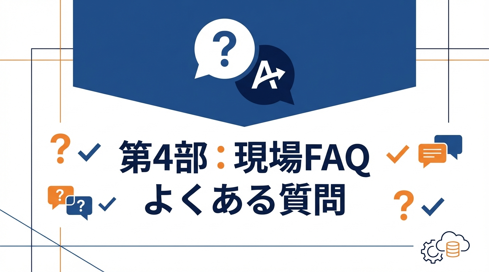

# 第4部　現場で揉めるポイントへの回答



「結局エンジニアが書くのでは？」「品質は大丈夫？」「責任は誰が取る？」——導入時に必ず出る疑問に答えます。懐疑派を納得させる論理と、実装を自動化するツール活用法を解説。

---

# 第10章　「それ、結局エンジニアが全部書くのでは？」への答え

## この章で学ぶこと

- 人間とAIの役割分担の再設計
- 「書く」から「編集する」へのシフト
- 80%できたら修正指示にする戦略

---

## よくある誤解

### 「仕様書を書く時間でコードが書ける」

AI仕様駆動開発を説明すると、こんな反応が返ってきます。

- 「仕様書を書く時間があったら、コードを書いた方が早い」
- 「結局、人間が全部考えるなら、AIいらなくない？」
- 「二度手間じゃん」

この反応は理解できます。しかし、**前提が間違っています**。

### 本当の比較対象

```
❌ 誤った比較
仕様を書く時間 vs コードを書く時間

✅ 正しい比較
仕様を書く時間 + AI実装 vs コードを書く時間 + デバッグ + リファクタ + 手戻り
```

実際の開発では、最初のコード作成は全体の一部に過ぎません。

- バグ修正
- レビュー対応
- リファクタリング
- 仕様変更への対応
- ドキュメント整備

これらを含めた**総工数** で比較すると、仕様駆動のアプローチが優位になります。

### 従来アプローチの隠れたコスト

「コードを書く時間」だけを見ていると、隠れたコストが見えません。複数の開発現場での観察から、エンジニアの作業時間は概ね以下のような傾向があります（プロジェクトの特性により大きく異なります）。

- **コードを書く時間**：約20%
- **コードを読む時間**：約40%
- **デバッグ・調査の時間**：約25%
- **コミュニケーションの時間**：約15%

つまり、コードを書いている時間は全体の2割程度です。残りの8割は「すでにあるコードの理解」と「問題の特定」に費やされています。

AI仕様駆動開発では、この構成が変わります。仕様が明確であれば、AIが生成したコードの意図は理解しやすくなります。また、仕様に沿ってテストが自動生成されるため、デバッグ時間も短縮されます。「仕様を書く時間」は増えますが、「読む時間」「デバッグ時間」が大幅に減るのです。

---

## 役割分担の再設計

### 従来の役割分担

```
人間：
- 要件定義
- 設計
- コーディング
- テスト作成
- デバッグ
- ドキュメント作成

AI：
- コード補完（数行レベル）
```

### 新しい役割分担

```
人間：
- 仕様の定義（What/Why）
- 設計判断（How）
- レビューと検証
- ナレッジの蓄積

AI：
- コード生成
- テスト生成
- ドキュメント生成
- リファクタリング実行
- エラーの修正
```

### 人間がやるべきこと

| 領域 | 人間の責務 | AIが代替できない理由 |
|------|----------|-------------------|
| 要件定義 | ビジネス価値の判断 | ユーザーのニーズは人間しか理解できない |
| 設計判断 | トレードオフの決定 | 「何を優先するか」は文脈依存 |
| レビュー | 品質の最終判断 | 「正しい」の定義は人間が持つ |
| 合意形成 | ステークホルダーとの調整 | 人間関係の構築は人間の仕事 |

### AIがやるべきこと

| 領域 | AIの責務 | 人間より優れている理由 |
|------|---------|---------------------|
| コード生成 | パターンの組み立て | 既知パターンの再現は高速 |
| テスト作成 | 網羅的なケース生成 | 漏れなくケースを列挙 |
| リファクタ | 一貫した変換 | 機械的な作業は得意 |
| ドキュメント | 構造化された記述 | 決まった形式への変換は確実 |

### 境界が曖昧な作業をどう扱うか

上の表では明確に分かれていますが、実際には「人間とAI、どちらがやるべきか」が曖昧な作業があります。

**コードレビュー**：人間とAIの両方が担当します。AIは「PATTERNS.mdに沿っているか」「型エラーがないか」といった機械的なチェックを担当し、人間は「この設計で本当によいか」「ビジネス要件を満たしているか」という判断を担当します。まずAIにレビューさせ、機械的な指摘を潰してから人間がレビューすると効率的です。

**テスト設計**：テスト戦略（何をテストするか）は人間が決め、テストケースの実装はAIが担当します。「境界値をテストすべき」と人間が決めれば、具体的な境界値のテストコードはAIが生成できます。

**バグの調査**：原因の仮説立ては人間が行い、仮説の検証（ログの解析、コードの追跡）はAIが得意です。「このあたりが怪しい」と人間が当たりをつけ、「この関数の呼び出し元をすべて調べて」とAIに指示するのが効率的です。

**アーキテクチャの検討**：複数の選択肢を洗い出すのはAIが得意ですが、最終的な判断は人間が行います。「認証方式の選択肢を3つ挙げて、それぞれのメリット・デメリットを整理して」と指示し、その情報をもとに人間が決定します。

---

## 「書く」から「編集する」へ

### パラダイムシフト

従来：**「人間が書く」**
```
人間 → [コード] → 完成
```

新しいアプローチ：**「AIが書き、人間が編集する」**
```
人間 → [仕様] → AI → [80%のコード] → 人間が編集 → 完成
```

### 編集の方が効率的な理由

1. **ゼロからより、修正の方が認知負荷が低い**
   - 白紙から書くのは難しい
   - 既存のものを直すのは比較的簡単

2. **問題点が見えやすい**
   - 動くコードを見れば、改善点がわかる
   - 抽象的な議論より、具体的なコードで議論

3. **コミュニケーションコストが下がる**
   - 「こう直して」の方が「こう書いて」より伝わりやすい

### 編集指示の例

```markdown
## AIが生成したコード
```typescript
async function validateUser(email: string, password: string) {
  const user = await db.user.findByEmail(email);
  if (!user) throw new Error('User not found');
  if (!await bcrypt.compare(password, user.password)) {
    throw new Error('Invalid password');
  }
  return user;
}
```

## 編集指示
1. エラーをthrowではなくResult型で返して
2. 関数を「ユーザー検索」と「パスワード検証」に分割して
3. 型定義を追加して
```

この指示で、AIは的確に修正できます。

### 効果的な編集指示のコツ

編集指示を出すときの実践的なコツを紹介します。

#### 「なぜ」を添える

「Result型で返して」だけでなく、「エラーをthrowすると呼び出し元でtry-catchが必要になり、エラーハンドリングが煩雑になるため、Result型で返して」と理由を添えると、AIはより適切なコードを生成します。理由がわかれば、指示していない箇所でも同じ方針を適用してくれます。

#### 具体例を示す

「関数を分割して」より、「findUserByEmailとverifyPasswordに分割して」のように、具体的な関数名まで指定する方が確実です。AIは指示を解釈する余地が減り、期待通りの結果が得られやすくなります。

#### 一度に多くを求めない

修正指示は3つ程度に抑えます。多すぎると、AIが一部の指示を見落としたり、相互に矛盾する変更を加えたりすることがあります。大きな修正が必要な場合は、複数回に分けて指示を出します。

#### 修正後の確認ポイントを伝える

「分割した後、両方の関数にユニットテストがあることを確認して」のように、修正後に何をチェックすべきかを伝えると、AIは自己検証してから出力します。

---

## 80%できたら修正指示にする

### 80%ルール

AIが生成したコードが**80%程度の完成度** に達したら、そこから先は**修正指示** で進めます。

```
0% → [AIに生成させる] → 80%
80% → [修正指示] → 90%
90% → [微調整] → 100%
```

### なぜ80%か

- **80%までは高速**：AIはパターン適用が得意
- **80%以降は難しい**：細かい調整は人間の判断が必要
- **100%を目指すと時間がかかる**：完璧を求めると効率が落ちる

### 80%の判断基準

| 観点 | 80%到達の目安 |
|------|-------------|
| 機能 | 主要機能が動く |
| 構造 | 適切なファイル・関数分割 |
| テスト | 主要ケースがパス |
| エラー処理 | 基本的なエラーをハンドリング |

| 観点 | 残り20%（人間が仕上げる） |
|------|------------------------|
| エッジケース | 細かい境界条件 |
| パフォーマンス | 最適化 |
| UX | 細かいメッセージやタイミング |
| 運用考慮 | ログ、モニタリング |

---

## 具体的なワークフロー

### ステップ1：初回生成（0%→60%）

```markdown
## AIへの指示
Issue #42 を実装してください。
docs/配下の仕様に従ってください。
```

### ステップ2：初回レビュー（60%→80%）

```markdown
## AIが生成したコードを確認
- ✅ 基本的な機能は動く
- ✅ ファイル構成は適切
- ❌ エラーハンドリングが不十分
- ❌ 一部の関数が複雑すぎる
```

### ステップ3：修正指示（80%→90%）

```markdown
## 修正指示
1. validateAndSave関数を、validate関数とsave関数に分割して
2. エラーをResult型で返すように変更して
3. 入力バリデーションのエラーメッセージをi18n対応して
```

### ステップ4：微調整（90%→100%）

```markdown
## 最終調整
1. ログレベルをdebug→infoに変更
2. タイムアウト値を定数化
3. コメントを追加
```

---

## よくある反論への回答

### 「仕様を書くスキルが必要じゃないか」

**回答**：そのスキルこそがエンジニアの本質的な価値です。

コードを書く能力は自動化されていきますが、「何を作るべきか」を判断する能力は自動化できません。仕様を書くスキルを磨くことは、エンジニアとしてのキャリアを強化します。

### 「AIが間違えたら結局直すんだろ」

**回答**：その通りです。だからこそ「編集」という視点が重要です。

AIが間違えることを前提に、修正しやすい形で出力させる。完璧を期待せず、80%で修正に切り替える。これが現実的なアプローチです。

### 「ジュニアが育たないのでは」

**回答**：むしろ育ちやすくなります。

従来：コードを書いて覚える（時間がかかる）
新しいアプローチ：コードを読んで、直して覚える（早い）

AIが生成したコードをレビューし、修正指示を出す過程で、コードの品質について深く学べます。

---

## 章末チェックリスト

- [ ] 自分の業務を「人間がやるべき」「AIがやるべき」に分類する
- [ ] 次のタスクで「生成→編集」のフローを試す
- [ ] 80%到達の判断基準を明文化する
- [ ] 修正指示のテンプレートを作る

---

## 次章への橋渡し

この章では、人間とAIの役割分担を整理しました。

次章では、**品質・セキュリティ・責任の所在**——「AIが書いたコードの責任は誰が取るのか」という問いに答えます。
