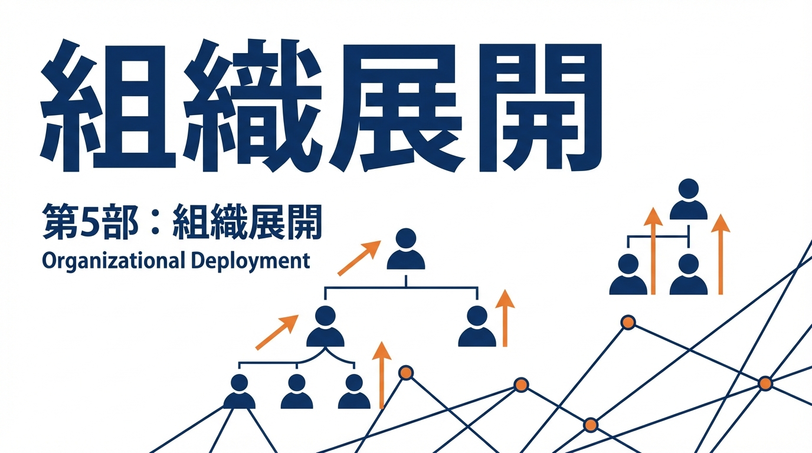

**［第5部］** 個人からチームへ、チームから組織へ。レビューの重心を「コード」から「仕様」に移し、ナレッジを蓄積する仕組みを構築します。AI仕様駆動開発を組織の標準にするためのロードマップを示します。

---

# 第13章　チーム標準化：レビューの中心を「コード」から「仕様」へ

## この章で学ぶこと

- 仕様レビュー→タスク→実装レビューの順序
- 「MASTERが更新されていないPRは受け付けない」ルール
- チーム全体での運用定着

---

## なぜレビューが重要なのか

コードレビューは、ソフトウェア開発において**品質を担保する最後の砦**です。

レビューには複数の目的があります。

- **バグの早期発見**：本番環境に出る前に問題を発見できる
- **知識の共有**：チームメンバー間でコードの理解が広がる
- **設計の改善**：第三者の視点で設計上の問題に気づける
- **標準化の維持**：コーディング規約やパターンの一貫性を保つ

しかし、レビューには課題もあります。レビュアーの負担が大きく、レビューが形骸化しがちです。「LGTM（Looks Good To Me＝問題なさそう）」と一言だけで承認されるレビューを見たことがある人も多いでしょう。

AI仕様駆動開発では、この課題に対して**レビューの対象を変える**ことで対処します。コードだけでなく「仕様」をレビューすることで、より本質的な問題を早期に発見できるようになります。

---

## レビューの順序を変える

### 従来のレビューフロー

```
実装 → コードレビュー → 修正 → マージ
         ↑
    「これ、仕様と違うよね？」
    「そもそもこの仕様でいいの？」
```

コードを書いてからレビューすると、**根本的な指摘が後から出てきます**。

その結果：
- 大幅な手戻り
- モチベーションの低下
- 時間の浪費

### 新しいレビューフロー

```
仕様レビュー → タスク化 → 実装 → 実装レビュー → マージ
     ↑                           ↑
「この仕様でいい？」          「仕様通りに書けてる？」
```

仕様を先にレビューすることで：
- 根本的な問題を早期発見
- 実装レビューは「仕様通りか」に集中
- 手戻りが最小化

---

## 仕様レビューの実践

### 仕様レビューの対象

| 対象 | レビュー観点 |
|------|------------|
| Issue | 受け入れ基準は具体的か、スコープは適切か |
| 文書変更 | 影響度は正しいか、関連文書は更新されているか |
| ADR | 決定理由は妥当か、代替案は検討されているか |

### 仕様レビューのチェックリスト

```markdown
## 仕様レビューチェックリスト

### Issue
- [ ] 受け入れ基準が具体的で検証可能か
- [ ] 技術的制約が明示されているか
- [ ] スコープ外が明確か
- [ ] 関連文書へのリンクがあるか

### 文書変更
- [ ] 影響度（LOW/MEDIUM/HIGH）が正しく評価されているか
- [ ] Frontmatter（version, updated）が更新されているか
- [ ] MASTER.mdの索引が更新されているか
- [ ] 他の文書との矛盾がないか

### ADR
- [ ] 決定の背景が理解できるか
- [ ] 代替案が検討されているか
- [ ] 却下理由が妥当か
- [ ] 将来の参照に十分な情報があるか
```

### 仕様レビューのタイミング

```
Issue作成 → 仕様レビュー → 承認 → 実装開始
                ↑
            このタイミング
```

実装を始める**前** にレビューを完了させます。

#### 仕様レビューの工数感

「仕様レビューを追加すると、工数が増えるのでは？」という懸念があります。実際のところ、仕様レビューにかかる時間は以下の程度です。

- **Issueのレビュー**：5〜15分
- **文書変更のレビュー**：10〜30分
- **ADRのレビュー**：15〜30分

一見すると「追加の工数」に見えますが、これは「コードレビューで発生していた仕様議論」が前倒しになっただけです。

あるチームで計測した結果、仕様レビューを導入する前はコードレビューに平均2.5時間かかっていました。導入後はコードレビューが平均1時間に短縮され、仕様レビュー（平均30分）を加えても合計1.5時間で済むようになりました。トータルでは40%の時間削減です。

さらに重要なのは、「根本的なやり直し」がなくなったことです。仕様レビュー前は月に2〜3回「これ、そもそも設計からやり直し」という事態が発生していましたが、導入後はほぼゼロになりました。

---

## 「MASTERが更新されていないPRは受け付けない」ルール

### なぜこのルールが必要か

7文書構成の中心はMASTER.mdです。

MASTER.mdが最新でないと：
- AIが古い情報を参照する
- チームメンバーが情報を見つけられない
- 文書が形骸化する

### ルールの実装

#### GitHub Actionsでの自動チェック

```yaml
# .github/workflows/docs-check.yml
name: Documentation Check

on:
  pull_request:
    paths:
      - 'docs/**'
      - 'src/**'

jobs:
  check-master:
    runs-on: ubuntu-latest
    steps:
      - uses: actions/checkout@v4
        with:
          fetch-depth: 0

      - name: Check MASTER.md updated
        run: |
          # docs/配下が変更されている場合、MASTER.mdも変更されているか確認
          DOCS_CHANGED=$(git diff --name-only origin/${{ github.base_ref }} | grep '^docs/' | wc -l)
          MASTER_CHANGED=$(git diff --name-only origin/${{ github.base_ref }} | grep '^docs/MASTER.md' | wc -l)

          if [ "$DOCS_CHANGED" -gt 0 ] && [ "$MASTER_CHANGED" -eq 0 ]; then
            echo "::error::docs/ was changed but MASTER.md was not updated"
            echo "Please update MASTER.md to reflect the changes"
            exit 1
          fi

      - name: Validate Frontmatter
        run: |
          node scripts/validate-frontmatter.js docs/*.md
```

#### PRテンプレートでの確認

```markdown
<!-- .github/pull_request_template.md -->

## チェックリスト

### コード変更時
- [ ] 関連するテストを追加・更新した
- [ ] 既存のテストがすべてパスする

### 文書変更時
- [ ] MASTER.mdの索引を更新した
- [ ] Frontmatter（version, updated）を更新した
- [ ] 影響度を評価した（LOW/MEDIUM/HIGH）

### すべてのPR
- [ ] 関連するIssueをリンクした
- [ ] レビュワーを適切に設定した
```

#### チェックが形骸化するパターン

チェックリストやルールを導入しても、時間が経つと形骸化するケースがあります。典型的なパターンと対策を紹介します。

##### パターン1：全部チェックする習慣

チェックボックスを確認せずに全部チェックしてしまうケースです。「レビュワーがチェックするだろう」という意識が原因です。対策として、CIで自動検証できる項目は自動化し、チェックリストは「人間の判断が必要な項目」だけに絞ります。

##### パターン2：例外の常態化

「今回は急ぎだから」「この変更は軽微だから」と例外を認め続けると、ルールが有名無実化します。対策として、例外を認める条件を明文化し、例外を使った場合は記録に残します。例外が月3回を超えたら、ルール自体を見直すトリガーにします。

##### パターン3：更新されない文書

MASTER.mdの更新がPRの通過条件になっていても、「更新しました」と最小限の変更だけして通過するケースがあります。対策として、文書の変更内容もレビュー対象に含め、「変更の意図が伝わる更新になっているか」を確認します。

形骸化の根本原因は、ルールの目的が共有されていないことです。「なぜこのルールがあるのか」をチームで定期的に確認する場を設けましょう。

---

## チーム全体での運用定着

### 段階的な導入

一度にすべてを導入しようとすると失敗します。段階的に進めましょう。

#### Phase 1：MASTER.mdだけ始める（1週間）

- MASTER.mdを作成
- 「MASTER.mdを見れば、プロジェクトの全体像がわかる」状態を作る
- まずは1人が主導して更新

#### Phase 2：Issueテンプレートを導入（2週間）

- 受け入れ基準・技術的制約・スコープ外のテンプレート
- 新規Issueはテンプレートに従う
- 仕様レビューの習慣化

#### Phase 3：残りの文書を整備（1ヶ月）

- ARCHITECTURE.md、PATTERNS.mdを優先
- 既存の暗黙知を文書化
- レビューで「PATTERNS.md参照」と言えるようにする

#### Phase 4：自動チェックを導入（1ヶ月）

- CI/CDに文書チェックを追加
- pre-commitフックの設定
- 違反時はマージブロック

### 抵抗への対処

#### 「ドキュメント書く時間がない」

**回答**：最初は時間がかかりますが、長期的には時間を節約します。

- 同じ質問に何度も答える時間が減る
- レビューでの根本的な指摘が減る
- 新メンバーのオンボーディングが速くなる

数値で示す：「過去1ヶ月で、仕様確認のやり取りに何時間かかったか」

#### 「形骸化するだけ」

**回答**：だから自動チェックを入れます。

- 更新されていないPRはマージできない
- 形骸化したら即座に検知される
- 「更新しないとマージできない」が習慣になる

#### 「既存プロジェクトには適用できない」

**回答**：一度に全部やる必要はありません。

- まずMASTER.mdだけ
- 新機能から7文書構成を適用
- 既存部分は触るときに少しずつ文書化

#### 段階的導入の成功事例

あるスタートアップ（エンジニア4名）での導入事例を紹介します。

最初の1週間は、リーダーが1人でMASTER.mdを作成しました。既存のSlackやNotionに散らばった情報を集め、「プロジェクトの全体像がわかる1ページ」を作りました。この時点では他のメンバーには「参照してね」と伝えるだけで、更新義務は課しませんでした。

2週目からIssueテンプレートを導入しました。最初は「テンプレートに沿って書くのが面倒」という声がありましたが、3週目には「受け入れ基準が明確だと実装が楽」という声に変わりました。仕様レビューも「Issueを書いた時点でSlackに投げる」という軽い運用から始めました。

1ヶ月目の終わりにPATTERNS.mdを整備しました。このとき、過去1ヶ月のコードレビューで繰り返し指摘されていた内容をリストアップし、「これはPATTERNS.mdに書いておこう」という形で文書化しました。「レビューで言われる前にPATTERNS.mdを読む」という習慣が生まれました。

2ヶ月目にCIチェックを導入し、3ヶ月目には「仕様レビューなしのPRは受け付けない」という運用が自然に定着しました。導入前と比べて、PRの平均レビュー往復回数は3.2回から1.8回に減少し、「仕様の認識違い」による手戻りは月平均5件からほぼゼロになりました。

---

## 定着の指標

### 定量指標

| 指標 | 目標 | 測定方法 |
|------|------|---------|
| 仕様レビュー実施率 | 100% | Issueのレビューコメント数 |
| MASTER.md更新率 | 100% | docs変更時のMASTER更新率 |
| PRの平均レビュー回数 | 2回以下 | PRの往復回数 |
| 仕様起因の手戻り | 20%減 | 根本的変更を求めるコメント数 |

### 定性指標

- 「あの仕様どこ？」という質問が減る
- 新メンバーが自力でキャッチアップできる
- レビューが「仕様通りか」に集中する

---

## 章末チェックリスト

- [ ] 仕様レビュー→実装→コードレビューの順序を決める
- [ ] Issueテンプレートを作成する
- [ ] PRテンプレートにチェックリストを追加する
- [ ] CI/CDに文書チェックを追加する
- [ ] 段階的導入の計画を立てる

---

## 次章への橋渡し

この章では、チームでの標準化について学びました。

次章では、**ロードマップとナレッジ蓄積**——成長フェーズで追加すべき文書と、属人性を排除した知識の蓄積について解説します。

---

## 🥷 AI侍道場 - チームで統一する技術

【AI侍】「この章で学んだ『標準化』——それは**全員が同じ地図を持つこと**である」

【DJ町娘】「AI侍さん、1人で仕様駆動開発やるのと、チームでやるのって、何が違うんですか？」

【AI侍】「**『合意』が必要になる**。1人なら自分で決められるが、チームでは全員が納得しなければならぬ」

【DJ町娘】「合意...確かに、みんながバラバラだと困りますね」

【AI侍】「そうだ。だからこそ、**標準を決める**。Issueテンプレート、PRテンプレート、CI/CD——これらを統一すれば、全員が同じ方向を向く」

【DJ町娘】「テンプレートがあれば、誰でも同じように書けますね」

【AI侍】「うむ。標準化とは『縛ること』ではない。**『迷わせないこと』**である」

---

### 🗡️ AI侍の秘伝書

チーム標準化を成功させる3つの極意を授ける。

#### 秘伝その1：「段階的導入」で抵抗を減らせ

いきなり全部を変えるな。**小さく始めよ**。

**Phase 1：テンプレート導入**（1週間）
- Issueテンプレートを作る
- PRテンプレートを作る
- 「これ使ってみて」と軽く提案

**Phase 2：CI自動化**（2週間）
- Frontmatterチェック
- リンク切れチェック
- 「自動で確認できるようにしました」

**Phase 3：文書整備**（1ヶ月）
- MASTER.mdを整備
- PATTERNS.mdを育てる
- 「レビュー指摘を文書に追記しました」

段階的に進めれば、抵抗は少ない。

#### 秘伝その2：「仕様レビュー → 実装」の順序を守らせよ

チーム標準化で最も大事なのは、**順序を守ること**だ。

```text
❌ 悪い順序：
実装 → PR → レビューで仕様指摘 → 作り直し

✅ 良い順序：
仕様（Issue）→ 仕様レビュー → 実装 → コードレビュー
```

この順序を守らせるために：
- PRテンプレートに「関連Issue」を必須にする
- CIでIssueリンクをチェックする
- Issueなしで実装したら、レビューで必ず指摘

**順序を守らせる仕組み**を作れ。

#### 秘伝その3：成果を可視化せよ

「仕様駆動、やった方がいいよね」——これでは動かぬ。**数字で示せ**。

測定すべき指標：
- PRレビュー時間の削減（例：平均2時間 → 30分）
- レビューコメント数の削減（例：平均10個 → 3個）
- 仕様起因の手戻り削減（例：20%減）

数字が改善すれば、全員が納得する。

---

### 🎧 DJ町娘のまとめ

【DJ町娘】「なるほど！つまり、**チーム標準化は『全員が同じ地図を持つこと』**なんですね。段階的に導入して、順序を守らせて、成果を数字で示す——これで全員が納得して動ける✨」

【AI侍】「見事なまとめである。次章では、ロードマップとナレッジ蓄積——プロジェクトが成長した後の文書管理を学ぶ。これが最終章である」

【DJ町娘】「最後まで頑張ります🎧」

---
