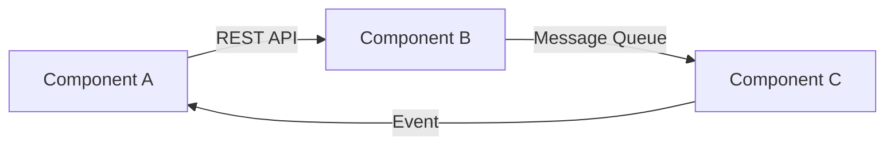

# ARCHITECTURE.md - システムアーキテクチャ設計書

## 1. アーキテクチャ概要

### システム概要
[システムの全体的な説明と目的]

### アーキテクチャスタイル
- **採用パターン**: [Microservices/Monolithic/Serverless等]
- **設計原則**: [DDD/Clean Architecture/Hexagonal等]
- **通信方式**: [REST/GraphQL/gRPC等]

## 2. システム構成図

### 全体アーキテクチャ
```
[アーキテクチャ図をASCIIアートまたはMermaidで記述]
```

### レイヤー構成
```
┌─────────────────────────────────────┐
│     Presentation Layer              │
├─────────────────────────────────────┤
│     Application Layer               │
├─────────────────────────────────────┤
│     Domain Layer                    │
├─────────────────────────────────────┤
│     Infrastructure Layer            │
└─────────────────────────────────────┘
```

## 3. コンポーネント設計

### 主要コンポーネント
| コンポーネント名 | 責務 | 技術スタック | インターフェース |
|---|---|---|---|
| [コンポーネント1] | [責務] | [技術] | [API/イベント] |
| [コンポーネント2] | [責務] | [技術] | [API/イベント] |

### コンポーネント間通信


## 4. データアーキテクチャ

### データストア設計
| データストア | 種類 | 用途 | 選定理由 |
|---|---|---|---|
| [DB名] | [RDB/NoSQL/Cache] | [用途] | [理由] |

### データフロー
```
[データの流れを図示]
```

### データ同期戦略
- **同期方式**: [同期/非同期]
- **整合性モデル**: [強整合性/結果整合性]
- **レプリケーション**: [戦略]

## 5. インフラストラクチャ

### デプロイメント構成
```yaml
環境:
  開発:
    - サーバー数: [数]
    - 構成: [構成詳細]
  ステージング:
    - サーバー数: [数]
    - 構成: [構成詳細]
  本番:
    - サーバー数: [数]
    - 構成: [構成詳細]
```

### スケーリング戦略
- **水平スケーリング**: [戦略]
- **垂直スケーリング**: [戦略]
- **自動スケーリング**: [条件とルール]

## 6. セキュリティアーキテクチャ

### セキュリティレイヤー
1. **ネットワークセキュリティ**
   - [対策1]
   - [対策2]

2. **アプリケーションセキュリティ**
   - [対策1]
   - [対策2]

3. **データセキュリティ**
   - [対策1]
   - [対策2]

### 認証・認可
- **認証方式**: [JWT/OAuth2/SAML等]
- **認可モデル**: [RBAC/ABAC等]
- **セッション管理**: [戦略]

## 7. 非機能要件の実現

### パフォーマンス
- **目標レスポンスタイム**: [値]
- **最適化戦略**: [戦略]
- **キャッシング**: [戦略]

### 可用性
- **目標SLA**: [値]
- **冗長化**: [戦略]
- **障害復旧**: [RTO/RPO]

### 監視・ログ
- **監視ツール**: [ツール名]
- **メトリクス**: [収集項目]
- **ログ集約**: [戦略]

## 8. 技術スタック

> **重要**: AIには学習データのカットオフがあるため、バージョンを明記することで正しい書き方を指示できます。

### 技術選定一覧

| レイヤー | 技術 | バージョン | 選定理由 | ADR |
|---------|------|-----------|---------|-----|
| Language | TypeScript | [x.x.x] | 型安全性 | - |
| Frontend | [Framework] | [x.x.x] | [理由] | ADR-00X |
| State | [Library] | [x.x.x] | [理由] | - |
| Backend | [Framework] | [x.x.x] | [理由] | ADR-00X |
| Database | [DB] | [x.x] | [理由] | ADR-00X |
| ORM | [Library] | [x.x.x] | [理由] | - |
| Cache | [Tool] | [x.x] | [理由] | - |
| Cloud | [Provider] | - | [理由] | - |
| Container | [Tool] | [x.x] | [理由] | - |
| CI/CD | [Tool] | - | [理由] | - |

### バージョン管理方針

- **メジャーバージョン**: ADR作成必須
- **マイナーバージョン**: 互換性確認後に更新
- **パッチバージョン**: セキュリティ修正時に即時適用

### 詳細

#### フロントエンド
- **フレームワーク**: [React/Vue/Angular等]
- **状態管理**: [Redux/MobX等]
- **UIライブラリ**: [Material-UI等]

#### バックエンド
- **言語**: [言語]
- **フレームワーク**: [フレームワーク]
- **APIゲートウェイ**: [ツール]

#### インフラ
- **クラウド**: [AWS/Azure/GCP]
- **コンテナ**: [Docker/Kubernetes]
- **CI/CD**: [Jenkins/GitHub Actions等]

## 9. 設計判断記録（ADR）

> ADR（Architecture Decision Record）は、技術選定や設計判断の理由を記録するものです。
> AIが技術選定の背景を理解し、一貫した設計提案ができるようになります。

### ADR一覧

| ADR | タイトル | ステータス | 決定日 |
|-----|---------|----------|--------|
| ADR-001 | [技術選定タイトル] | 承認済み | YYYY-MM-DD |
| ADR-002 | [技術選定タイトル] | 承認済み | YYYY-MM-DD |

### ADRテンプレート

```markdown
## ADR-00X: [技術名]の選定

### ステータス
承認済み / 検討中 / 廃止

### コンテキスト
[なぜこの決定が必要になったのか]

### 決定
[何を選んだのか、バージョンを含めて明記]

### バージョン選定理由
- **なぜこのバージョンか**: [具体的な理由]
- **AIカットオフ対策**: [このバージョンはAIの知識範囲内か、注意点は何か]
- **非推奨API回避**: [避けるべき古いAPIパターン]
- **LTS/サポート期間**: [サポート終了予定]

### 代替技術との比較
| 技術 | 採用/却下 | 理由 |
|------|----------|------|
| [代替1] | 却下 | [理由] |
| [代替2] | 却下 | [理由] |

### 影響
- **ポジティブ**: [良い影響]
- **ネガティブ**: [考慮すべき制約]

### AIへの指示
[この技術を使う際に、AIが守るべきルール]

### 関連
- 関連ADR: ADR-00Y
- 公式ドキュメント: [URL]
```

### ADR記述例

```markdown
## ADR-001: PostgreSQL 17.xの採用

### ステータス
承認済み

### コンテキスト
信頼性が高く、複雑なクエリに対応でき、JSONデータも扱えるデータベースが必要。

### 決定
PostgreSQL 17.xを採用する。

### バージョン選定理由
- **なぜ17.xか**: インクリメンタルバックアップ対応、JSONパス強化、パフォーマンス改善
- **AIカットオフ対策**: 2024年9月リリースのため、主要AIは学習済み
- **非推奨API回避**: 特になし
- **LTS/サポート期間**: 2029年11月まで

### 代替技術との比較
| 技術 | 採用/却下 | 理由 |
|------|----------|------|
| MySQL 8.4 | 却下 | JSON機能がPostgreSQLより弱い |
| MongoDB 8 | 却下 | トランザクション要件に不適合 |

### 影響
- **ポジティブ**: ACID準拠、JSON対応、拡張性
- **ネガティブ**: 運用コストがNoSQLより高い

### AIへの指示
- インデックス設計時はEXPLAIN ANALYZEで確認すること
- JSON型はjsonbを使用すること

### 関連
- 公式ドキュメント: https://www.postgresql.org/docs/17/
```

## 10. 開発ガイドライン

### コーディング規約
- [規約へのリンク]

### API設計原則
- [原則1]
- [原則2]

### テスト戦略
- **単体テスト**: [カバレッジ目標]
- **統合テスト**: [戦略]
- **E2Eテスト**: [戦略]

## 11. 将来の拡張性

### 拡張ポイント
- [拡張可能な箇所1]
- [拡張可能な箇所2]

### 技術的負債の管理
- [管理戦略]

### ロードマップ
| フェーズ | 時期 | 追加機能/改善 |
|---|---|---|
| Phase 1 | [時期] | [内容] |
| Phase 2 | [時期] | [内容] |