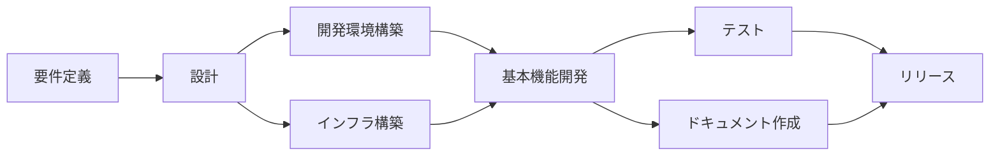

# ROADMAP.md - プロジェクトロードマップ

## 1. プロジェクト概要

### ビジョン
[プロジェクトの長期的なビジョン]

### ミッション
[プロジェクトのミッション]

### 期間
- **開始日**: [YYYY-MM-DD]
- **完了予定日**: [YYYY-MM-DD]
- **総期間**: [X]ヶ月

## 2. マイルストーン

### Phase 1: 基盤構築（[期間]）
**目標**: システムの基盤となるアーキテクチャとコア機能の実装

#### マイルストーン
| 項目 | 期限 | ステータス | 成果物 |
|---|---|---|---|
| M1.1: 技術選定完了 | [日付] | ✅ 完了 | 技術スタック文書 |
| M1.2: 基本設計完了 | [日付] | 🔄 進行中 | アーキテクチャ設計書 |
| M1.3: 開発環境構築 | [日付] | ⏳ 予定 | 開発環境 |
| M1.4: CI/CD構築 | [日付] | ⏳ 予定 | パイプライン |

#### 主要タスク
- [ ] データベース設計
- [ ] API基本設計
- [ ] 認証システム実装
- [ ] 基本的なCRUD機能

### Phase 2: コア機能開発（[期間]）
**目標**: MVPに必要な主要機能の実装

#### マイルストーン
| 項目 | 期限 | ステータス | 成果物 |
|---|---|---|---|
| M2.1: ユーザー管理機能 | [日付] | ⏳ 予定 | ユーザー管理システム |
| M2.2: メイン機能実装 | [日付] | ⏳ 予定 | コア機能 |
| M2.3: 統合テスト完了 | [日付] | ⏳ 予定 | テストレポート |
| M2.4: α版リリース | [日付] | ⏳ 予定 | α版 |

### Phase 3: 品質向上と拡張（[期間]）
**目標**: 品質改善と追加機能の実装

#### マイルストーン
| 項目 | 期限 | ステータス | 成果物 |
|---|---|---|---|
| M3.1: パフォーマンス最適化 | [日付] | ⏳ 予定 | 最適化版 |
| M3.2: セキュリティ強化 | [日付] | ⏳ 予定 | セキュリティレポート |
| M3.3: UI/UX改善 | [日付] | ⏳ 予定 | 改善版UI |
| M3.4: β版リリース | [日付] | ⏳ 予定 | β版 |

### Phase 4: リリース準備（[期間]）
**目標**: 本番リリースの準備と実施

#### マイルストーン
| 項目 | 期限 | ステータス | 成果物 |
|---|---|---|---|
| M4.1: 最終テスト | [日付] | ⏳ 予定 | 最終テストレポート |
| M4.2: ドキュメント完成 | [日付] | ⏳ 予定 | 完全なドキュメント |
| M4.3: 本番環境構築 | [日付] | ⏳ 予定 | 本番環境 |
| M4.4: 正式リリース | [日付] | ⏳ 予定 | v1.0.0 |

## 3. リリース計画

### バージョンロードマップ
```
v0.1.0 (Alpha) - [日付]
├── 基本機能実装
├── 内部テスト開始
└── フィードバック収集

v0.5.0 (Beta) - [日付]
├── 主要機能完成
├── 限定公開テスト
└── バグ修正

v1.0.0 (GA) - [日付]
├── 正式リリース
├── 全機能利用可能
└── SLA保証開始

v1.1.0 - [日付]
├── 機能追加
├── パフォーマンス改善
└── UX向上

v2.0.0 - [日付]
├── メジャーアップデート
├── 新アーキテクチャ
└── 大規模機能追加
```

## 4. リソース計画

### チーム構成
| フェーズ | 開発者 | デザイナー | QA | DevOps | 合計 |
|---|---|---|---|---|---|
| Phase 1 | 3 | 1 | 1 | 1 | 6 |
| Phase 2 | 5 | 2 | 2 | 1 | 10 |
| Phase 3 | 4 | 2 | 3 | 2 | 11 |
| Phase 4 | 3 | 1 | 2 | 2 | 8 |

### 予算配分
| カテゴリ | Phase 1 | Phase 2 | Phase 3 | Phase 4 | 合計 |
|---|---|---|---|---|---|
| 人件費 | [金額] | [金額] | [金額] | [金額] | [金額] |
| インフラ | [金額] | [金額] | [金額] | [金額] | [金額] |
| ツール/ライセンス | [金額] | [金額] | [金額] | [金額] | [金額] |
| その他 | [金額] | [金額] | [金額] | [金額] | [金額] |

## 5. 依存関係とクリティカルパス

### 主要な依存関係


### クリティカルパス
1. 要件定義完了
2. データベース設計完了
3. API基本実装完了
4. 認証システム実装完了
5. コア機能実装完了
6. 統合テスト完了
7. 本番環境構築完了
8. リリース

## 6. リスクと対策

### 主要リスク
| リスク | 影響 | 確率 | 対策 |
|---|---|---|---|
| 技術的課題 | 高 | 中 | 早期のPoC実施 |
| リソース不足 | 高 | 低 | バッファ期間の確保 |
| 要件変更 | 中 | 高 | アジャイル開発の採用 |
| 外部依存の遅延 | 中 | 中 | 代替案の準備 |

## 7. 成功指標（KPI）

### プロジェクトKPI
| 指標 | 目標値 | 測定頻度 |
|---|---|---|
| スケジュール遵守率 | 90%以上 | 週次 |
| 予算執行率 | 予算内 | 月次 |
| 品質指標（バグ密度） | 1件/KLOC以下 | スプリント毎 |
| チーム生産性 | 計画の80%以上 | スプリント毎 |

### ビジネスKPI
| 指標 | 目標値 | 測定開始 |
|---|---|---|
| ユーザー満足度 | 4.0以上/5.0 | β版から |
| システム稼働率 | 99.9% | 本番リリース後 |
| レスポンスタイム | 200ms以下 | α版から |
| 同時接続数 | 1000以上 | 本番リリース後 |

## 8. コミュニケーション計画

### 定例会議
| 会議名 | 頻度 | 参加者 | 目的 |
|---|---|---|---|
| デイリースクラム | 毎日 | 開発チーム | 進捗共有 |
| スプリントレビュー | 2週毎 | 全員 | 成果確認 |
| ステアリング会議 | 月次 | ステークホルダー | 意思決定 |
| リスク評価会議 | 隔週 | PM、TL | リスク管理 |

### レポート
| レポート名 | 頻度 | 配布先 | 内容 |
|---|---|---|---|
| 進捗レポート | 週次 | ステークホルダー | 進捗状況 |
| 品質レポート | スプリント毎 | チーム | テスト結果 |
| リスクレポート | 月次 | 経営層 | リスク状況 |

## 9. 変更管理

### 変更要求プロセス
1. 変更要求の提出
2. 影響分析の実施
3. ステークホルダー承認
4. ロードマップ更新
5. チームへの周知

### 変更履歴
| 日付 | バージョン | 変更内容 | 承認者 |
|---|---|---|---|
| [日付] | 1.0 | 初版作成 | [名前] |
| [日付] | 1.1 | Phase2の期間延長 | [名前] |