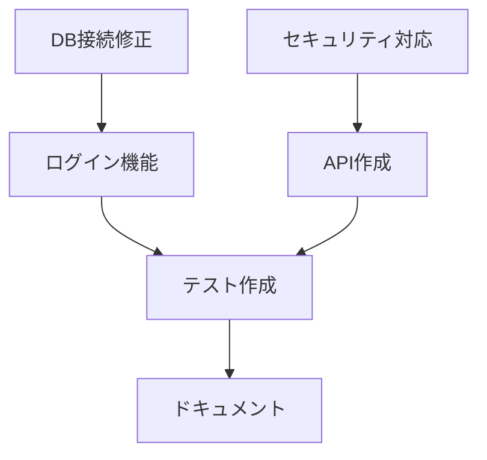

# TASKS.md - タスク管理

## 1. 現在のスプリント

### スプリント情報
- **スプリント番号**: Sprint [X]
- **期間**: [YYYY-MM-DD] 〜 [YYYY-MM-DD]
- **スプリントゴール**: [具体的な目標]
- **ベロシティ目標**: [ポイント]

### 進捗サマリー
| メトリクス | 値 | 目標 | ステータス |
|---|---|---|---|
| 完了ストーリーポイント | [X] | [Y] | 🟢 順調 |
| 完了タスク数 | [X] | [Y] | 🟡 注意 |
| バグ発生数 | [X] | <[Y] | 🔴 要対応 |
| コードカバレッジ | [X]% | >[Y]% | 🟢 順調 |

## 2. エピック管理

### アクティブなエピック
| ID | エピック名 | 進捗 | 完了予定 | オーナー |
|---|---|---|---|---|
| E001 | ユーザー認証システム | 75% | Sprint 5 | [@user1] |
| E002 | 決済機能実装 | 30% | Sprint 7 | [@user2] |
| E003 | 管理画面開発 | 10% | Sprint 9 | [@user3] |

## 3. 現在のタスク

### 🔴 優先度: Critical
| ID | タスク名 | 担当者 | ステータス | 期限 | ブロッカー |
|---|---|---|---|---|---|
| T101 | 本番環境のDB接続エラー修正 | [@dev1] | 🔄 作業中 | 今日 | なし |
| T102 | セキュリティ脆弱性対応 | [@dev2] | ⏳ 待機中 | 明日 | レビュー待ち |

### 🟠 優先度: High
| ID | タスク名 | 担当者 | ステータス | 期限 | 見積(h) | 実績(h) |
|---|---|---|---|---|---|---|
| T201 | ログイン機能実装 | [@dev3] | 🔄 作業中 | [日付] | 8 | 6 |
| T202 | APIエンドポイント作成 | [@dev4] | ✅ 完了 | [日付] | 5 | 4 |
| T203 | ユニットテスト作成 | [@dev5] | 📋 計画済 | [日付] | 3 | - |

### 🟡 優先度: Medium
| ID | タスク名 | 担当者 | ステータス | 期限 | 見積(h) | 実績(h) |
|---|---|---|---|---|---|---|
| T301 | ドキュメント更新 | [@dev6] | 📋 計画済 | [日付] | 2 | - |
| T302 | コードリファクタリング | [@dev7] | ⏸️ 保留 | [日付] | 4 | - |

### 🟢 優先度: Low
| ID | タスク名 | 担当者 | ステータス | 期限 | 見積(h) |
|---|---|---|---|---|---|
| T401 | UIの微調整 | 未割当 | 📥 バックログ | [日付] | 2 |
| T402 | テストデータ準備 | 未割当 | 📥 バックログ | [日付] | 1 |

## 4. タスクステータス定義

### ステータスワークフロー
```
📥 バックログ → 📋 計画済 → 🔄 作業中 → 👀 レビュー中 → ✅ 完了
                     ↓
                  ⏸️ 保留
                     ↓
                  ⏳ 待機中（ブロッカーあり）
```

### ステータス説明
| ステータス | 説明 | 次のアクション |
|---|---|---|
| 📥 バックログ | 未計画のタスク | 優先順位付けとスプリント計画 |
| 📋 計画済 | スプリントに割り当て済み | 担当者アサインと開始 |
| 🔄 作業中 | アクティブに作業中 | 完了またはブロッカー報告 |
| 👀 レビュー中 | コードレビューまたはQA中 | フィードバック対応 |
| ✅ 完了 | タスク完了、デプロイ済み | - |
| ⏸️ 保留 | 一時的に停止 | 再開条件の確認 |
| ⏳ 待機中 | ブロッカーで停止中 | ブロッカー解消 |

## 5. ブロッカーと課題

### 現在のブロッカー
| ID | 説明 | 影響タスク | 担当者 | 対応状況 | 解決予定 |
|---|---|---|---|---|---|
| B001 | 外部API仕様未確定 | T102, T203 | [@pm1] | 確認中 | [日付] |
| B002 | テスト環境障害 | T301 | [@devops1] | 対応中 | 今日 |

### 技術的負債
| ID | 項目 | 影響度 | 優先度 | 対応予定 |
|---|---|---|---|---|
| TD001 | レガシーコードのリファクタリング | 高 | 中 | Sprint 6 |
| TD002 | テストカバレッジ向上 | 中 | 高 | Sprint 5 |
| TD003 | ドキュメント整備 | 低 | 低 | Sprint 8 |

## 6. チーム生産性メトリクス

### ベロシティトレンド
```
Sprint 1: ████████████████████ 20pt
Sprint 2: ████████████████████████ 24pt
Sprint 3: ██████████████████ 18pt
Sprint 4: ████████████████████████████ 28pt (現在)
```

### バーンダウンチャート
```
理想: ----
実績: ████

100 |█
 80 |██----
 60 |███  ----
 40 |█████   ----
 20 |███████    ----
  0 |_____________----
    Day 1  3  5  7  9
```

## 7. 完了の定義（Definition of Done）

### 開発タスク
- [ ] コード実装完了
- [ ] ユニットテスト作成（カバレッジ80%以上）
- [ ] コードレビュー承認
- [ ] ドキュメント更新
- [ ] 統合テスト合格
- [ ] ステージング環境でのテスト完了

### バグ修正
- [ ] 根本原因の特定
- [ ] 修正実装
- [ ] 回帰テスト作成
- [ ] 修正確認テスト合格
- [ ] リリースノート更新

## 8. タスク見積もりガイドライン

### ストーリーポイント基準
| ポイント | 複雑度 | 例 |
|---|---|---|
| 1 | 非常に簡単 | テキスト修正、設定変更 |
| 2 | 簡単 | 単純なバグ修正、小規模な機能追加 |
| 3 | 普通 | 標準的な機能実装、API追加 |
| 5 | やや複雑 | 複数コンポーネントの変更 |
| 8 | 複雑 | 新規サブシステム、大規模リファクタリング |
| 13 | 非常に複雑 | アーキテクチャ変更、技術的チャレンジ |

### 時間見積もりの考慮事項
- 実装時間
- テスト作成時間
- コードレビュー対応時間
- ドキュメント作成時間
- 不確実性バッファ（20-30%）

## 9. レトロスペクティブアクションアイテム

### 前回のアクションアイテム
| アクション | 担当者 | 期限 | ステータス |
|---|---|---|---|
| CI/CDパイプライン改善 | [@devops1] | Sprint 4 | ✅ 完了 |
| デイリースクラム時間短縮 | 全員 | 継続 | 🔄 実施中 |
| ペアプログラミング導入 | [@lead1] | Sprint 5 | 📋 計画済 |

## 10. 次スプリント準備

### バックログリファインメント
| 日時 | 参加者 | アジェンダ |
|---|---|---|
| [日付] 14:00-16:00 | 開発チーム | ストーリー見積もり |
| [日付] 10:00-11:00 | PO、SM | 優先順位調整 |

### スプリント計画候補
| ストーリー | 見積もり | 優先度 | 準備状況 |
|---|---|---|---|
| 決済機能UI実装 | 8pt | High | ✅ Ready |
| 通知システム構築 | 5pt | Medium | ⚠️ 要詳細化 |
| レポート機能 | 13pt | Low | ❌ 未準備 |

## 11. タスク依存関係



## 12. リソース配分

### 現在の割り当て
| メンバー | 現在のタスク | 負荷 | 次の予定 |
|---|---|---|---|
| [@dev1] | T101 | 100% | T201 |
| [@dev2] | T102 | 80% | T203 |
| [@dev3] | T201 | 60% | T301 |
| [@dev4] | - | 0% | T302 |

### スキルマトリクス
| メンバー | Backend | Frontend | DB | DevOps |
|---|---|---|---|---|
| [@dev1] | ⭐⭐⭐⭐⭐ | ⭐⭐ | ⭐⭐⭐⭐ | ⭐⭐⭐ |
| [@dev2] | ⭐⭐⭐ | ⭐⭐⭐⭐ | ⭐⭐ | ⭐⭐ |
| [@dev3] | ⭐⭐⭐⭐ | ⭐⭐⭐ | ⭐⭐⭐ | ⭐⭐⭐⭐ |
| [@dev4] | ⭐⭐ | ⭐⭐⭐⭐⭐ | ⭐ | ⭐⭐ |