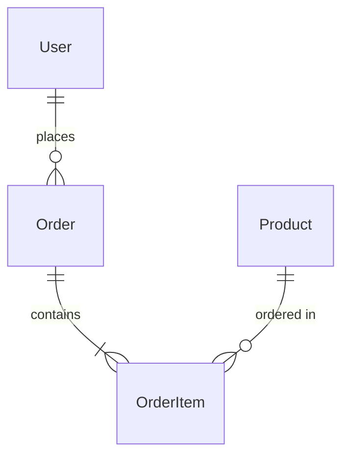

# DATABASE.md - データベース設計書

## 1. データベース概要

### データベース構成
- **DBMS**: [PostgreSQL/MySQL/MongoDB等]
- **バージョン**: [バージョン番号]
- **文字コード**: [UTF-8等]
- **照合順序**: [照合順序]

### データベース一覧
| DB名 | 用途 | 種別 | サイズ見込み |
|---|---|---|---|
| [DB名1] | [用途] | [Master/Replica] | [サイズ] |
| [DB名2] | [用途] | [Master/Replica] | [サイズ] |

## 2. テーブル設計

### ER図


### テーブル定義

#### users テーブル
| カラム名 | データ型 | NULL | キー | デフォルト | 説明 |
|---|---|---|---|---|---|
| id | UUID | NO | PK | gen_random_uuid() | ユーザーID |
| email | VARCHAR(255) | NO | UQ | - | メールアドレス |
| username | VARCHAR(100) | NO | UQ | - | ユーザー名 |
| password_hash | VARCHAR(255) | NO | - | - | パスワードハッシュ |
| status | ENUM | NO | - | 'active' | ステータス |
| created_at | TIMESTAMP | NO | - | CURRENT_TIMESTAMP | 作成日時 |
| updated_at | TIMESTAMP | NO | - | CURRENT_TIMESTAMP | 更新日時 |

**インデックス**:
- `idx_users_email` (email)
- `idx_users_status` (status)
- `idx_users_created_at` (created_at)

#### orders テーブル
| カラム名 | データ型 | NULL | キー | デフォルト | 説明 |
|---|---|---|---|---|---|
| id | UUID | NO | PK | gen_random_uuid() | 注文ID |
| user_id | UUID | NO | FK | - | ユーザーID |
| order_number | VARCHAR(20) | NO | UQ | - | 注文番号 |
| total_amount | DECIMAL(10,2) | NO | - | 0.00 | 合計金額 |
| status | ENUM | NO | - | 'pending' | 注文ステータス |
| ordered_at | TIMESTAMP | NO | - | CURRENT_TIMESTAMP | 注文日時 |

**インデックス**:
- `idx_orders_user_id` (user_id)
- `idx_orders_status` (status)
- `idx_orders_ordered_at` (ordered_at)

## 3. リレーション設計

### 外部キー制約
| テーブル | カラム | 参照テーブル | 参照カラム | ON DELETE | ON UPDATE |
|---|---|---|---|---|---|
| orders | user_id | users | id | RESTRICT | CASCADE |
| order_items | order_id | orders | id | CASCADE | CASCADE |
| order_items | product_id | products | id | RESTRICT | CASCADE |

### カーディナリティ
- User : Order = 1 : N
- Order : OrderItem = 1 : N
- Product : OrderItem = 1 : N

## 4. インデックス戦略

### インデックス設計方針
- 検索頻度の高いカラムにインデックスを作成
- 複合インデックスは左端のカラムから利用
- カーディナリティの高いカラムを優先

### パフォーマンスインデックス
| インデックス名 | テーブル | カラム | 種別 | 用途 |
|---|---|---|---|---|
| idx_compound_1 | orders | (user_id, status, ordered_at) | BTREE | 複合検索用 |
| idx_fulltext_1 | products | (name, description) | FULLTEXT | 全文検索用 |

## 5. パーティショニング

### パーティション戦略
| テーブル | パーティション方式 | パーティションキー | 分割数 |
|---|---|---|---|
| orders | RANGE | ordered_at | 月単位 |
| logs | HASH | id | 10 |

### パーティション管理
```sql
-- 月次パーティション作成例
CREATE TABLE orders_2024_01 PARTITION OF orders
FOR VALUES FROM ('2024-01-01') TO ('2024-02-01');
```

## 6. データ型の選定理由

### 主キーの選定
- **UUID**: グローバルな一意性、分散システム対応
- **BIGINT**: パフォーマンス重視、連番管理

### 日時型の選定
- **TIMESTAMP**: タイムゾーン対応
- **DATETIME**: タイムゾーン非依存

## 7. 制約とバリデーション

### CHECK制約
```sql
ALTER TABLE products ADD CONSTRAINT chk_price 
CHECK (price >= 0);

ALTER TABLE orders ADD CONSTRAINT chk_total 
CHECK (total_amount >= 0);
```

### UNIQUE制約
- users.email: メールアドレスの一意性
- orders.order_number: 注文番号の一意性

## 8. ビュー設計

### マテリアライズドビュー
```sql
CREATE MATERIALIZED VIEW user_order_summary AS
SELECT 
    u.id as user_id,
    COUNT(o.id) as order_count,
    SUM(o.total_amount) as total_spent
FROM users u
LEFT JOIN orders o ON u.id = o.user_id
GROUP BY u.id;
```

### 通常ビュー
| ビュー名 | 用途 | 更新頻度 |
|---|---|---|
| active_users | アクティブユーザー一覧 | リアルタイム |
| monthly_sales | 月次売上集計 | 日次 |

## 9. ストアドプロシージャ/関数

### 主要な関数
```sql
CREATE FUNCTION calculate_order_total(order_id UUID)
RETURNS DECIMAL(10,2) AS $$
BEGIN
    -- 注文合計計算ロジック
END;
$$ LANGUAGE plpgsql;
```

## 10. バックアップ・リカバリ

### バックアップ戦略
- **フルバックアップ**: 週次（日曜日深夜）
- **差分バックアップ**: 日次
- **トランザクションログ**: 継続的

### リカバリ要件
- **RTO**: 4時間以内
- **RPO**: 1時間以内

## 11. 最適化とメンテナンス

### 定期メンテナンス
| 作業 | 頻度 | 実行時間 | 影響 |
|---|---|---|---|
| VACUUM | 日次 | 02:00 | 最小 |
| ANALYZE | 週次 | 日曜03:00 | 最小 |
| REINDEX | 月次 | 第1日曜04:00 | 中 |

### クエリ最適化
- 実行計画の定期レビュー
- スロークエリの監視と改善
- インデックスの使用状況分析

## 12. セキュリティ

### アクセス制御
- 最小権限の原則
- ロール別アクセス権限
- 監査ログの有効化

### データ暗号化
- 保存時暗号化: TDE有効
- 転送時暗号化: SSL/TLS必須
- カラムレベル暗号化: 機密データ対象