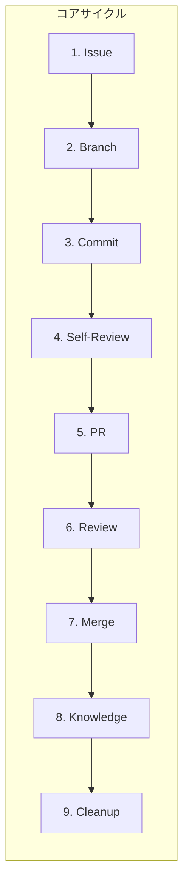

# AI駆動 Git Workflow

AI開発ツール（Claude Code、GitHub Copilot、Cursor）に最適化されたGit Flowベースのワークフローです。

## なぜAI駆動Git Workflowか

従来のGit Workflowに **セルフレビュー（PR作成前）** と **ナレッジ体系化（マージ後）** を組み込むことで、AIツールの力を最大限に活用します。

**従来のワークフロー**:
```
Issue → Branch → Commit → PR → Review → Merge
```

**AI駆動Git Workflow**:
```
Issue → Branch → Commit → Self-Review → PR → Review → Merge → Knowledge → Cleanup
```

### 3つの革新ポイント

| ポイント | 従来 | AI駆動 |
|---------|------|--------|
| **セルフレビュー** | 手動/省略されがち | AIツールが5観点で自動チェック |
| **ナレッジ体系化** | 属人的なメモ | GitHub Discussionsに体系的蓄積 |
| **ドキュメント参照** | 開発者依存 | コミットメッセージにdoc参照を含める |

---

## コアサイクル（9ステップ）



### 各ステップの概要

| # | ステップ | 目的 | AIツール活用 |
|---|---------|------|-------------|
| 1 | **Issue作成** | 作業の起点を明確化 | Issue本文の自動生成 |
| 2 | **Branch作成** | 作業を分離 | - |
| 3 | **Commit** | 変更を記録 | コード生成、doc参照の自動挿入 |
| 4 | **Self-Review** | 品質を事前確保 | 5観点の自動チェック |
| 5 | **PR作成** | レビュー依頼 | PR本文の自動生成 |
| 6 | **Review対応** | 指摘への対応 | 修正提案の自動生成 |
| 7 | **Merge** | 統合 | - |
| 8 | **Knowledge** | 知見を蓄積 | ナレッジの自動抽出 |
| 9 | **Cleanup** | 次の準備 | 次タスクの提案 |

---

## ブランチ戦略（Git Flow準拠）

```
main/master    ← 本番リリース（常時デプロイ可能）
  ↑
develop       ← 開発統合（次期リリース候補）
  ↑
feature/*     ← 機能開発（Issueベース）
hotfix/*      ← 緊急修正（mainから分岐）
release/*     ← リリース準備（developから分岐）
```

### ブランチ命名規則

| タイプ | パターン | 例 |
|-------|---------|-----|
| 機能開発 | `feature/{issue-num}-{description}` | `feature/123-user-auth` |
| 緊急修正 | `hotfix/{issue-num}-{description}` | `hotfix/456-security-patch` |
| リリース | `release/{version}` | `release/1.2.0` |

---

## 詳細ステップ

### ステップ1: Issue作成

**原則**: 全ての作業は必ずIssueから開始

```bash
# GitHub CLIでIssue作成
gh issue create \
  --title "feat: ユーザー認証機能を実装" \
  --body "## 概要
[実装内容の説明]

## 受入基準
- [ ] 基準1
- [ ] 基準2" \
  --label "enhancement"
```

**AIツールへのプロンプト例**:
```
「ユーザー認証機能のIssueを作成してください。
受入基準、技術的な考慮事項、関連ドキュメントへの参照を含めてください。」
```

### ステップ2: Branch作成

```bash
git checkout develop
git pull origin develop
git checkout -b "feature/123-user-auth"
```

### ステップ3: Commit（ドキュメント参照付き）

**重要**: コミットメッセージに参照したドキュメントを含める

```bash
git commit -m "feat: ユーザー認証機能を実装

- JWTベースの認証ミドルウェアを追加
- ログイン/ログアウトAPIを実装

参照:
- docs-template/MASTER.md:29 (認証方式)
- docs-template/03-implementation/PATTERNS.md:145 (エラーハンドリング)

Closes #123"
```

### ステップ4: Self-Review（セルフレビュー）

**目的**: PRレビュー時の単純な指摘を事前に防ぐ

#### 5つの観点

| 観点 | チェック内容 |
|------|-------------|
| 1. コーディング規約 | マジックナンバー、型安全性、命名規則 |
| 2. 仕様との整合性 | PROJECT.md、ARCHITECTURE.md、DOMAIN.mdとの整合 |
| 3. テスト充実度 | カバレッジ80%+、エッジケース、エラーハンドリング |
| 4. パフォーマンス・セキュリティ | N+1問題、入力サニタイズ、認証・認可 |
| 5. ドキュメント更新 | README、API仕様書の更新要否 |

#### AIツールへのプロンプト例

```
「以下の観点で、今回のコミット内容をレビューしてください：

1. コーディング規約（docs-template/MASTER.md、docs-template/03-implementation/PATTERNS.md）
2. 仕様との整合性（docs-template/01-context/PROJECT.md、docs-template/02-design/ARCHITECTURE.md、docs-template/02-design/DOMAIN.md）
3. テスト充実度（docs-template/04-quality/TESTING.md）
4. パフォーマンスとセキュリティ
5. ドキュメント更新の必要性

各観点について、問題点と改善提案を具体的に指摘してください。」
```

#### セルフレビュー結果のPR記載例

```markdown
## セルフレビュー結果

### 1. コーディング規約
- ✅ マジックナンバー: 全て定数化済み
- ✅ 型安全性: any型使用なし

### 2. 仕様との整合性
- ✅ PROJECT.md#3.2の要件を全て実装

### 3. テスト充実度
- ✅ カバレッジ: 85.3%

### 4. パフォーマンス・セキュリティ
- ✅ N+1クエリ: 問題なし

### 5. ドキュメント更新
- ✅ README.md: 認証セクションを追加
```

### ステップ5: PR作成

```bash
gh pr create \
  --base develop \
  --title "feat: ユーザー認証機能を実装" \
  --body "## 概要
...

## セルフレビュー結果
[上記の結果を記載]

Closes #123"
```

### ステップ6: Review対応

**重要**: レビュー指摘には**必ずスレッド形式で返信**

#### 良いコメントの例

```markdown
@reviewer-name 様

ご指摘ありがとうございます。修正いたしました。

## 修正内容
- `validateToken` 関数のエラーハンドリングを改善
- カスタムエラークラス `TokenExpiredError` を導入

## 変更箇所
- src/middleware/auth.ts:45-67

## 修正の理由
期限切れと不正トークンを区別することで、クライアント側で
適切なエラーメッセージを表示できるようにしました。

ご確認のほど、よろしくお願いいたします。
```

### ステップ7: Merge

```bash
# Squash mergeでマージ（履歴を整理）
gh pr merge --squash --delete-branch
```

### ステップ8: Knowledge（ナレッジ体系化）

**目的**: 開発で得た知見をチーム資産として蓄積

#### 記録対象

- レビュー指摘と対応方法
- 技術的困難の解決策
- 新技術・ライブラリの導入知見
- パフォーマンス改善の手法
- セキュリティ対策の実装

#### AIツールへのプロンプト例

```
「今回のIssue #123とPR #456の内容を分析し、
GitHub Discussionsに登録すべきナレッジを抽出してください。

以下を含めてMarkdownを生成してください：
1. タイトル: 問題を端的に表現
2. カテゴリ: トラブルシューティング/ベストプラクティス/技術選定 など
3. 問題の概要
4. 解決方法（コード例含む）
5. 学んだこと」
```

#### GitHub Discussionsへの登録

```bash
gh discussion create \
  --category "ベストプラクティス" \
  --title "[JWT認証] トークンリフレッシュのエラーハンドリング" \
  --body-file knowledge.md
```

### ステップ9: Cleanup

```bash
git checkout develop
git pull origin develop
git branch -d "feature/123-user-auth"
```

---

## ベストプラクティス

### Issue駆動開発

- 全ての作業はIssueから開始
- Issue番号をブランチ名・コミットメッセージに含める
- Issueテンプレートで情報を標準化

### 小さく頻繁なコミット

- 機能単位で小さくコミット
- 変更理由を明確に記載
- 参照ドキュメントを含める

### AIツールの積極活用

- コード生成だけでなくレビューにも活用
- MASTER.md等のドキュメントを常に参照させる
- セルフレビューとナレッジ抽出を自動化

### PRサイズの管理

- 1つのPRは1つの機能に集中
- 変更ファイル数は10ファイル以内推奨
- 大きな変更は複数Issue/PRに分割

---

## 関連ドキュメント

### テンプレート（実際のプロジェクトで使用）

- [git-workflow.md](../docs-template/05-operations/deployment/git-workflow.md) - 詳細ワークフロー
- [self-review.md](../docs-template/05-operations/deployment/self-review.md) - セルフレビュー詳細
- [knowledge-management.md](../docs-template/05-operations/deployment/knowledge-management.md) - ナレッジ体系化詳細
- [automated-code-review.md](../docs-template/05-operations/deployment/automated-code-review.md) - 自動コードレビュー

### 関連概念

- [AI Spec Driven Development](./AI_SPEC_DRIVEN_DEVELOPMENT.md) - 7文書構造の概念
- [Operational Guide](./OPERATIONAL_GUIDE.md) - AIエージェント向け運用ガイド

---

## まとめ

AI駆動Git Workflowは以下を実現します：

1. **効率的な開発** - AIツールで開発速度を向上
2. **高品質なコード** - セルフレビューで品質を事前確保
3. **組織的な知見蓄積** - ナレッジ体系化でチーム全体のスキルアップ
4. **透明性の高いプロセス** - Issue駆動でトレーサビリティを確保
5. **継続的改善** - フィードバックループでプロセスを進化

ワークフローは形式ではなく、チームの生産性向上と品質確保のための手段です。状況に応じて柔軟に調整してください。
